# Architecture Documentation

## Module Dependency Graph

```mermaid
graph TB
    subgraph adodbapitest["Adodbapitest"]
        C__Users_willh__mcp_servers_coderef_mcp__venv_Lib_site_packages_adodbapi_test_adodbapitest_py_40_randomstring[randomstring]
        C__Users_willh__mcp_servers_coderef_mcp__venv_Lib_site_packages_adodbapi_test_adodbapitest_py_47_setUp[setUp]
        C__Users_willh__mcp_servers_coderef_mcp__venv_Lib_site_packages_adodbapi_test_adodbapitest_py_50_getEngine[getEngine]
        C__Users_willh__mcp_servers_coderef_mcp__venv_Lib_site_packages_adodbapi_test_adodbapitest_py_53_getConnection[getConnection]
        C__Users_willh__mcp_servers_coderef_mcp__venv_Lib_site_packages_adodbapi_test_adodbapitest_py_56_getCursor[getCursor]
    end
    subgraph dbapi20["Dbapi20"]
        C__Users_willh__mcp_servers_coderef_mcp__venv_Lib_site_packages_adodbapi_test_dbapi20_py_124_executeDDL1[executeDDL1]
        C__Users_willh__mcp_servers_coderef_mcp__venv_Lib_site_packages_adodbapi_test_dbapi20_py_127_executeDDL2[executeDDL2]
        C__Users_willh__mcp_servers_coderef_mcp__venv_Lib_site_packages_adodbapi_test_dbapi20_py_130_setUp[setUp]
        C__Users_willh__mcp_servers_coderef_mcp__venv_Lib_site_packages_adodbapi_test_dbapi20_py_136_tearDown[tearDown]
        C__Users_willh__mcp_servers_coderef_mcp__venv_Lib_site_packages_adodbapi_test_dbapi20_py_158__connect[_connect]
    end
    subgraph is64bit["Is64Bit"]
        C__Users_willh__mcp_servers_coderef_mcp__venv_Lib_site_packages_adodbapi_test_is64bit_py_6_Python[Python]
        C__Users_willh__mcp_servers_coderef_mcp__venv_Lib_site_packages_adodbapi_test_is64bit_py_10_os[os]
        C__Users_willh__mcp_servers_coderef_mcp__venv_Lib_site_packages_adodbapi_is64bit_py_6_Python[Python]
        C__Users_willh__mcp_servers_coderef_mcp__venv_Lib_site_packages_adodbapi_is64bit_py_10_os[os]
    end
    subgraph setuptestframework["Setuptestframework"]
        C__Users_willh__mcp_servers_coderef_mcp__venv_Lib_site_packages_adodbapi_test_setuptestframework_py_10_maketemp[maketemp]
        C__Users_willh__mcp_servers_coderef_mcp__venv_Lib_site_packages_adodbapi_test_setuptestframework_py_20__cleanup_function[_cleanup_function]
        C__Users_willh__mcp_servers_coderef_mcp__venv_Lib_site_packages_adodbapi_test_setuptestframework_py_32_getcleanupfunction[getcleanupfunction]
        C__Users_willh__mcp_servers_coderef_mcp__venv_Lib_site_packages_adodbapi_test_setuptestframework_py_36_find_ado_path[find_ado_path]
        C__Users_willh__mcp_servers_coderef_mcp__venv_Lib_site_packages_adodbapi_test_setuptestframework_py_43_makeadopackage[makeadopackage]
    end
    subgraph test_adodbapi_dbapi20["Test Adodbapi Dbapi20"]
        C__Users_willh__mcp_servers_coderef_mcp__venv_Lib_site_packages_adodbapi_test_test_adodbapi_dbapi20_py_93___init__[__init__]
        C__Users_willh__mcp_servers_coderef_mcp__venv_Lib_site_packages_adodbapi_test_test_adodbapi_dbapi20_py_96_getTestMethodName[getTestMethodName]
        C__Users_willh__mcp_servers_coderef_mcp__venv_Lib_site_packages_adodbapi_test_test_adodbapi_dbapi20_py_99_setUp[setUp]
        C__Users_willh__mcp_servers_coderef_mcp__venv_Lib_site_packages_adodbapi_test_test_adodbapi_dbapi20_py_131_tearDown[tearDown]
        C__Users_willh__mcp_servers_coderef_mcp__venv_Lib_site_packages_adodbapi_test_test_adodbapi_dbapi20_py_142_help_nextset_setUp[help_nextset_setUp]
    end
    subgraph tryconnection["Tryconnection"]
        C__Users_willh__mcp_servers_coderef_mcp__venv_Lib_site_packages_adodbapi_test_tryconnection_py_1_try_connection[try_connection]
        C__Users_willh__mcp_servers_coderef_mcp__venv_Lib_site_packages_adodbapi_test_tryconnection_py_21_try_operation_with_expected_exception[try_operation_with_expected_exception]
    end
    subgraph adodbapi["Adodbapi"]
        C__Users_willh__mcp_servers_coderef_mcp__venv_Lib_site_packages_adodbapi_adodbapi_py_58_getIndexedValue[getIndexedValue]
        C__Users_willh__mcp_servers_coderef_mcp__venv_Lib_site_packages_adodbapi_adodbapi_py_66_make_COM_connecter[make_COM_connecter]
        C__Users_willh__mcp_servers_coderef_mcp__venv_Lib_site_packages_adodbapi_adodbapi_py_77_connect[connect]
        C__Users_willh__mcp_servers_coderef_mcp__venv_Lib_site_packages_adodbapi_adodbapi_py_120_format_parameters[format_parameters]
        C__Users_willh__mcp_servers_coderef_mcp__venv_Lib_site_packages_adodbapi_adodbapi_py_158__configure_parameter[_configure_parameter]
    end
    subgraph ado_consts["Ado Consts"]
        C__Users_willh__mcp_servers_coderef_mcp__venv_Lib_site_packages_adodbapi_ado_consts_py_47_ado_direction_name[ado_direction_name]
        C__Users_willh__mcp_servers_coderef_mcp__venv_Lib_site_packages_adodbapi_ado_consts_py_170_ado_type_name[ado_type_name]
    end
    subgraph apibase["Apibase"]
        C__Users_willh__mcp_servers_coderef_mcp__venv_Lib_site_packages_adodbapi_apibase_py_24_standardErrorHandler[standardErrorHandler]
        C__Users_willh__mcp_servers_coderef_mcp__venv_Lib_site_packages_adodbapi_apibase_py_115_Date[Date]
        C__Users_willh__mcp_servers_coderef_mcp__venv_Lib_site_packages_adodbapi_apibase_py_119_Time[Time]
        C__Users_willh__mcp_servers_coderef_mcp__venv_Lib_site_packages_adodbapi_apibase_py_123_Timestamp[Timestamp]
        C__Users_willh__mcp_servers_coderef_mcp__venv_Lib_site_packages_adodbapi_apibase_py_127_DateFromTicks[DateFromTicks]
    end
    subgraph process_connect_string["Process Connect String"]
        C__Users_willh__mcp_servers_coderef_mcp__venv_Lib_site_packages_adodbapi_process_connect_string_py_6_macro_call[macro_call]
        C__Users_willh__mcp_servers_coderef_mcp__venv_Lib_site_packages_adodbapi_process_connect_string_py_78_process[process]
    end
    C__Users_willh__mcp_servers_coderef_mcp__venv_Lib_site_packages_adodbapi_schema_table_py_6_names["Schema Table"]
    C__Users_willh__mcp_servers_coderef_mcp__venv_Lib_site_packages_adodbapi_setup_py_41_setup_package["Setup"]
    subgraph __init__["  Init  "]
        C__Users_willh__mcp_servers_coderef_mcp__venv_Lib_site_packages_adodbapi___init___py_41_Binary[Binary]
        C__Users_willh__mcp_servers_coderef_mcp__venv_Lib_site_packages_adodbapi___init___py_46_Date[Date]
        C__Users_willh__mcp_servers_coderef_mcp__venv_Lib_site_packages_adodbapi___init___py_51_Time[Time]
        C__Users_willh__mcp_servers_coderef_mcp__venv_Lib_site_packages_adodbapi___init___py_56_Timestamp[Timestamp]
        C__Users_willh__mcp_servers_coderef_mcp__venv_Lib_site_packages_adodbapi___init___py_61_DateFromTicks[DateFromTicks]
    end
    subgraph test_cases["Test Cases"]
        C__Users_willh__mcp_servers_coderef_mcp__venv_Lib_site_packages_annotated_types_test_cases_py_25_cases[cases]
        C__Users_willh__mcp_servers_coderef_mcp__venv_Lib_site_packages_annotated_types_test_cases_py_148___iter__[__iter__]
        C__Users_willh__mcp_servers_coderef_mcp__venv_Lib_site_packages_annotated_types_test_cases_py_15_Case[Case]
        C__Users_willh__mcp_servers_coderef_mcp__venv_Lib_site_packages_annotated_types_test_cases_py_147_MyCustomGroupedMetadata[MyCustomGroupedMetadata]
    end
    subgraph _eventloop[" Eventloop"]
        C__Users_willh__mcp_servers_coderef_mcp__venv_Lib_site_packages_anyio_abc__eventloop_py_59_run[run]
        C__Users_willh__mcp_servers_coderef_mcp__venv_Lib_site_packages_anyio_abc__eventloop_py_81_current_token[current_token]
        C__Users_willh__mcp_servers_coderef_mcp__venv_Lib_site_packages_anyio_abc__eventloop_py_91_current_time[current_time]
        C__Users_willh__mcp_servers_coderef_mcp__venv_Lib_site_packages_anyio_abc__eventloop_py_100_cancelled_exception_class[cancelled_exception_class]
        C__Users_willh__mcp_servers_coderef_mcp__venv_Lib_site_packages_anyio_abc__eventloop_py_105_checkpoint[checkpoint]
    end
    subgraph _resources[" Resources"]
        C__Users_willh__mcp_servers_coderef_mcp__venv_Lib_site_packages_anyio_abc__resources_py_20___aenter__[__aenter__]
        C__Users_willh__mcp_servers_coderef_mcp__venv_Lib_site_packages_anyio_abc__resources_py_23___aexit__[__aexit__]
        C__Users_willh__mcp_servers_coderef_mcp__venv_Lib_site_packages_anyio_abc__resources_py_32_aclose[aclose]
        C__Users_willh__mcp_servers_coderef_mcp__venv_Lib_site_packages_anyio_abc__resources_py_10_AsyncResource[AsyncResource]
        C__Users_willh__mcp_servers_coderef_mcp__venv_Lib_site_packages_anyio__core__resources_py_7_aclose_forcefully[aclose_forcefully]
    end
    subgraph _sockets[" Sockets"]
        C__Users_willh__mcp_servers_coderef_mcp__venv_Lib_site_packages_anyio_abc__sockets_py_36__validate_socket[_validate_socket]
        C__Users_willh__mcp_servers_coderef_mcp__venv_Lib_site_packages_anyio_abc__sockets_py_148_extra_attributes[extra_attributes]
        C__Users_willh__mcp_servers_coderef_mcp__venv_Lib_site_packages_anyio_abc__sockets_py_180__raw_socket[_raw_socket]
        C__Users_willh__mcp_servers_coderef_mcp__venv_Lib_site_packages_anyio_abc__sockets_py_192_from_socket[from_socket]
        C__Users_willh__mcp_servers_coderef_mcp__venv_Lib_site_packages_anyio_abc__sockets_py_209_from_socket[from_socket]
    end
    subgraph _streams[" Streams"]
        C__Users_willh__mcp_servers_coderef_mcp__venv_Lib_site_packages_anyio_abc__streams_py_36___aiter__[__aiter__]
        C__Users_willh__mcp_servers_coderef_mcp__venv_Lib_site_packages_anyio_abc__streams_py_39___anext__[__anext__]
        C__Users_willh__mcp_servers_coderef_mcp__venv_Lib_site_packages_anyio_abc__streams_py_46_receive[receive]
        C__Users_willh__mcp_servers_coderef_mcp__venv_Lib_site_packages_anyio_abc__streams_py_69_send[send]
        C__Users_willh__mcp_servers_coderef_mcp__venv_Lib_site_packages_anyio_abc__streams_py_115_send_eof[send_eof]
    end
    subgraph _subprocesses[" Subprocesses"]
        C__Users_willh__mcp_servers_coderef_mcp__venv_Lib_site_packages_anyio_abc__subprocesses_py_14_wait[wait]
        C__Users_willh__mcp_servers_coderef_mcp__venv_Lib_site_packages_anyio_abc__subprocesses_py_22_terminate[terminate]
        C__Users_willh__mcp_servers_coderef_mcp__venv_Lib_site_packages_anyio_abc__subprocesses_py_33_kill[kill]
        C__Users_willh__mcp_servers_coderef_mcp__venv_Lib_site_packages_anyio_abc__subprocesses_py_44_send_signal[send_signal]
        C__Users_willh__mcp_servers_coderef_mcp__venv_Lib_site_packages_anyio_abc__subprocesses_py_55_pid[pid]
    end
    subgraph _tasks[" Tasks"]
        C__Users_willh__mcp_servers_coderef_mcp__venv_Lib_site_packages_anyio_abc__tasks_py_29_started[started]
        C__Users_willh__mcp_servers_coderef_mcp__venv_Lib_site_packages_anyio_abc__tasks_py_32_started[started]
        C__Users_willh__mcp_servers_coderef_mcp__venv_Lib_site_packages_anyio_abc__tasks_py_34_started[started]
        C__Users_willh__mcp_servers_coderef_mcp__venv_Lib_site_packages_anyio_abc__tasks_py_59_start_soon[start_soon]
        C__Users_willh__mcp_servers_coderef_mcp__venv_Lib_site_packages_anyio_abc__tasks_py_76_start[start]
    end
```

## Metrics

- **Total Files:** 19092
- **Total Elements:** 19092
- **Graph Density:** 0.0 (lower = better modularity)
- **Circular Dependencies:** 0 ✅
- **Isolated Nodes:** 20 (constants, types)

## Code Patterns

### Handler Functions

- `handle_query_elements` in `tool_handlers.py`
- `handle_analyze_impact` in `tool_handlers.py`
- `handle_validate_references` in `tool_handlers.py`
- `handle_batch_validate` in `tool_handlers.py`
- `handle_generate_docs` in `tool_handlers.py`
- `handle_audit` in `tool_handlers.py`
- `handle_nl_query` in `tool_handlers.py`
- `handle_scan_realtime` in `tool_handlers.py`

### Common Decorators

- `@Fn` (58 uses)
- `@pytest.mark.asyncio` (58 uses)
- `@pytest.fixture` (16 uses)
- `@C` (14 uses)
- `@dataclass` (12 uses)
- `@F` (11 uses)
- `@staticmethod` (7 uses)
- `@M` (5 uses)
- `@Type` (3 uses)
- `@InvalidType` (3 uses)

### Error Types

- `RuntimeError`
- `ValueError`
- `AssertionError`
- `OSError`
- `ServiceUnavailableError`
- `FileNotFoundError`

*Generated: 2025-12-23T17:48:20.559461*