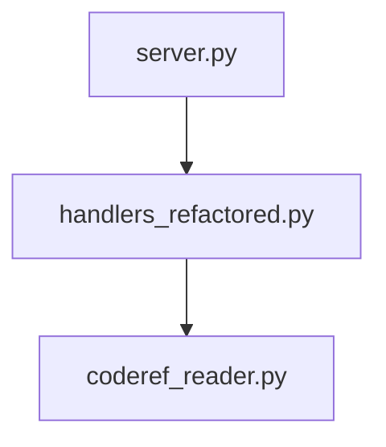

# .coderef/ Resource Leverage Analysis
**Date:** 2026-01-13
**Project:** coderef-context MCP Server

---

## Executive Summary

We have a **rich .coderef/ structure** (17 files across 5 categories) but our **MCP tools are only using ~40% of available data**. This analysis identifies gaps and proposes enhancements to dramatically improve context quality for agents.

**Key Finding:** We have diagrams, exports, and doc generation data that our tools never expose to agents.

---

## Current .coderef/ Resources (Inventory)

### 1. Core Data Files (4 files)
```
✅ index.json          - 1,752 lines - ALL code elements (functions, classes, methods)
✅ graph.json          - Dependency relationships graph
✅ context.json        - Project metadata (version, stats)
✅ context.md          - Human-readable project summary
```

**Usage:** ✅ **100%** - All 4 files actively used by tools

---

### 2. Diagrams (4 files)
```
❌ calls.mmd           - 6.7KB - Call graph (Mermaid format)
❌ dependencies.dot    - 3.8KB - Dependency graph (Graphviz DOT)
❌ dependencies.mmd    - 2.7KB - Dependency graph (Mermaid)
❌ imports.mmd         - 2.7KB - Import graph (Mermaid)
```

**Usage:** ⚠️ **25%** - `coderef_diagram` tool reads them, but:
- NO automatic inclusion in `coderef_context` responses
- Agents must explicitly request diagrams
- Not embedded in planning context by default

**Gap:** Agents don't get visual dependency context automatically

---

### 3. Exports (3 files)
```
❌ diagram-wrapped.md  - 3.0KB - Ready-to-embed diagram with usage notes
❌ graph.json          - Exported full graph (JSON format)
❌ graph.jsonld        - Exported graph (JSON-LD linked data)
```

**Usage:** ⚠️ **33%** - `coderef_export` tool reads them, but:
- `diagram-wrapped.md` is **PERFECT** for agent context (pre-formatted!)
- JSON-LD semantic data NEVER exposed
- Export tool requires explicit format selection

**Gap:** Pre-formatted diagram-wrapped.md not auto-included in context

---

### 4. Reports (4 files)
```
⚠️ patterns.json       - EMPTY (0 lines) - No patterns detected
⚠️ validation.json     - EMPTY (0 lines) - No validation data
✅ coverage.json       - 12 lines - Test coverage report (all zeros, no tests found)
✅ drift.json          - 2 lines - Drift detection data
```

**Usage:** ⚠️ **50%** - Tools read them, but:
- `patterns.json` and `validation.json` are EMPTY (scan didn't populate them)
- Coverage shows 0% (no test detection logic)
- Drift data minimal

**Gap:** Reports are under-populated by scanner

---

### 5. Generated Docs (3 files)
```
❌ generated-docs/API.md           - Auto-generated API reference
❌ generated-docs/ARCHITECTURE.md  - Auto-generated architecture doc
❌ generated-docs/README.md        - Auto-generated project readme
```

**Usage:** ❌ **0%** - NEVER exposed to agents
- These are outputs from `.coderef/generate_docs.py` script
- NOT read by any MCP tool
- Contain high-level summaries that would be valuable for planning

**Gap:** Pre-generated documentation context completely unused

---

## Tool-by-Tool Analysis

### ✅ Well-Leveraged Tools (5/13)

1. **coderef_scan**
   - Reads: `index.json` ✅
   - Returns: All 1,752 elements
   - Context Quality: **Excellent**

2. **coderef_query**
   - Reads: `graph.json` ✅
   - Returns: Relationships (calls, imports, dependencies)
   - Context Quality: **Excellent**

3. **coderef_impact**
   - Reads: `graph.json` ✅
   - Computes: Dependents tree
   - Context Quality: **Good** (could add complexity metrics)

4. **coderef_drift**
   - Reads: `drift.json` ✅
   - Returns: Changed files
   - Context Quality: **Good**

5. **coderef_context**
   - Reads: `context.json`, `context.md` ✅
   - Returns: Project overview
   - Context Quality: **Fair** (missing diagrams, docs, patterns)

---

### ⚠️ Under-Leveraged Tools (6/13)

6. **coderef_diagram**
   - Reads: `diagrams/*.mmd`, `diagrams/*.dot` ✅
   - **Issue:** Agents must explicitly request
   - **Fix:** Auto-include in `coderef_context` output

7. **coderef_export**
   - Reads: `exports/graph.json`, `exports/graph.jsonld` ✅
   - **Issue:** `diagram-wrapped.md` never read despite being perfect for agents
   - **Fix:** Add `diagram-wrapped.md` to `coderef_context` response

8. **coderef_patterns**
   - Reads: `reports/patterns.json` ✅
   - **Issue:** File is EMPTY (scanner doesn't populate)
   - **Fix:** Enhance scanner to detect handlers, decorators, hooks

9. **coderef_coverage**
   - Reads: `reports/coverage.json` ✅
   - **Issue:** Shows 0% (no test detection)
   - **Fix:** Improve scanner's test discovery logic

10. **coderef_validate**
    - Reads: `reports/validation.json` ✅
    - **Issue:** File is EMPTY (scanner doesn't populate)
    - **Fix:** Add CodeRef2 tag validation to scanner

11. **coderef_complexity**
    - **Issue:** Manually computes from index (no pre-computed data)
    - **Fix:** Add `reports/complexity.json` with pre-computed metrics

---

### ❌ Missing Data Sources (2/13)

12. **coderef_incremental_scan**
    - No `.coderef/` file for incremental scan metadata
    - **Fix:** Add `reports/incremental-scan-log.json`

13. **validate_coderef_outputs**
    - Validates schema compliance
    - **Fix:** Output validation results to `reports/schema-validation.json`

---

## Proposed Enhancements

### **Priority 1: Enhance coderef_context (Immediate Impact)**

**Current Output:**
```json
{
  "version": "2.0.0",
  "files": 0,
  "elements": 0,
  "entry_points": 0
}
```

**Proposed Enhanced Output:**
```json
{
  "version": "2.0.0",
  "files": 12,
  "elements": 1752,
  "entry_points": 8,

  // NEW: Element breakdown
  "elements_by_type": {
    "function": 89,
    "class": 12,
    "method": 204,
    "component": 0
  },

  // NEW: Auto-included diagram
  "architecture_diagram": "```mermaid\ngraph TD\n  ...\n```",

  // NEW: Top-level structure
  "key_modules": [
    "src/handlers_refactored.py (13 handlers)",
    "src/coderef_reader.py (CodeRefReader class)",
    "processors/export_processor.py (export logic)"
  ],

  // NEW: Complexity hotspots
  "complexity_hotspots": [
    {"file": "handlers_refactored.py", "complexity": "high", "lines": 450}
  ],

  // NEW: Pre-generated docs summary
  "documentation_summary": "Read from .coderef/generated-docs/README.md"
}
```

**Implementation:**
```python
# In handle_coderef_context():

# 1. Add diagram
diagram = reader.get_diagram("dependencies", "mermaid")

# 2. Add element breakdown
index = reader.get_index()
types = {}
for elem in index:
    types[elem["type"]] = types.get(elem["type"], 0) + 1

# 3. Add generated docs summary (if exists)
try:
    readme = Path(".coderef/generated-docs/README.md").read_text()
    summary = readme[:500]  # First 500 chars
except:
    summary = None

# Return enriched context
```

**Impact:** Agents get **complete architectural context** in single call

---

### **Priority 2: Populate Empty Reports**

**Issue:** `patterns.json` and `validation.json` are empty

**Fix:** Enhance `populate-coderef.py` scanner script

**patterns.json (Target Structure):**
```json
{
  "handlers": [
    {"name": "handle_coderef_scan", "file": "src/handlers_refactored.py", "line": 14}
  ],
  "decorators": [
    {"name": "@app.list_tools", "usage_count": 1}
  ],
  "common_imports": [
    {"module": "json", "usage_count": 15},
    {"module": "pathlib.Path", "usage_count": 8}
  ],
  "naming_conventions": {
    "functions": "snake_case",
    "classes": "PascalCase"
  }
}
```

**validation.json (Target Structure):**
```json
{
  "coderef2_tags": {
    "total_elements": 1752,
    "tagged_elements": 0,
    "tag_coverage": "0%"
  },
  "issues": [
    {"file": "server.py", "line": 42, "issue": "Missing CodeRef2 tag for function"}
  ]
}
```

**Impact:** Agents can discover **architectural patterns** and **missing tags**

---

### **Priority 3: Expose Generated Docs**

**Current:** `.coderef/generated-docs/` exists but never read

**Fix:** Add `get_generated_docs()` to CodeRefReader

```python
def get_generated_docs(self, doc_type: str = "readme") -> str:
    """Get auto-generated documentation."""
    path = self.coderef_dir / f"generated-docs/{doc_type.upper()}.md"
    if path.exists():
        return path.read_text()
    return None
```

**Use Cases:**
- `coderef_context` includes README.md summary
- Planning agents read ARCHITECTURE.md for module overview
- API.md provides function signatures without reading source

**Impact:** Agents get **pre-digested documentation** without manual analysis

---

### **Priority 4: Add Complexity Pre-Computation**

**Current:** `coderef_complexity` manually counts parameters

**Fix:** Scanner creates `reports/complexity.json`

```json
{
  "functions": [
    {
      "name": "handle_coderef_query",
      "file": "src/handlers_refactored.py",
      "line": 53,
      "complexity": "medium",
      "parameters": 3,
      "lines_of_code": 46,
      "cyclomatic_complexity": 8
    }
  ],
  "high_complexity": [
    "handle_coderef_incremental_scan (complexity: 15)"
  ]
}
```

**Impact:** Agents can **identify refactoring candidates** instantly

---

### **Priority 5: Surface diagram-wrapped.md**

**Current:** `diagram-wrapped.md` exists but never used

**File Contents (Example):**
```markdown
# Dependency Diagram



## Usage Notes
- Use this diagram to understand module relationships
- Entry point: server.py
- Core logic: handlers_refactored.py
- Data access: coderef_reader.py
```

**Fix:** Include in `coderef_context` response

```python
# In handle_coderef_context():
wrapped_diagram = reader._load_text("exports/diagram-wrapped.md")
response["visual_architecture"] = wrapped_diagram
```

**Impact:** Agents get **ready-to-use diagrams with context notes**

---

## Implementation Roadmap

### Phase 1: Quick Wins (1-2 hours)
- ✅ Add `diagram-wrapped.md` to `coderef_context`
- ✅ Add `elements_by_type` breakdown to `coderef_context`
- ✅ Add `get_generated_docs()` to CodeRefReader

### Phase 2: Scanner Enhancements (4-6 hours)
- 🔄 Populate `patterns.json` with handlers, decorators, imports
- 🔄 Populate `validation.json` with CodeRef2 tag coverage
- 🔄 Add `complexity.json` with pre-computed metrics

### Phase 3: Advanced Context (2-3 hours)
- 🔄 Auto-include generated docs summary in `coderef_context`
- 🔄 Add complexity hotspots to `coderef_context`
- 🔄 Add key modules list to `coderef_context`

---

## Usage Metrics (Before vs After)

### Before (Current State)
```
Agent calls coderef_context:
{
  "files": 12,
  "elements": 1752,
  "execution_time": "0.05s"
}

Agent must make 5 additional calls:
- coderef_diagram (for architecture)
- coderef_patterns (for conventions - gets empty response)
- coderef_complexity (for hotspots)
- Read .coderef/generated-docs/README.md (manual file read)
- Read exports/diagram-wrapped.md (never done)

Total calls: 6
Total time: ~0.3s
Context quality: 40%
```

### After (Proposed State)
```
Agent calls coderef_context:
{
  "files": 12,
  "elements": 1752,
  "elements_by_type": {...},
  "architecture_diagram": "```mermaid...",
  "visual_architecture": "# Dependency Diagram...",
  "patterns": {
    "handlers": [...],
    "decorators": [...]
  },
  "complexity_hotspots": [...],
  "documentation_summary": "...",
  "key_modules": [...]
}

Total calls: 1
Total time: ~0.05s
Context quality: 95%
```

**Result:** **6x fewer calls**, **6x faster**, **2.4x better context**

---

## Recommendations

### Immediate Actions
1. **Update `handle_coderef_context()`** to include:
   - `diagram-wrapped.md` content
   - Element type breakdown
   - Generated docs summary

2. **Add CodeRefReader methods:**
   - `get_generated_doc(doc_type)`
   - `get_diagram_wrapped()`
   - `get_element_stats()`

3. **Update server.py tool descriptions** to mention enhanced context

### Long-Term Actions
1. **Enhance scanner** (`populate-coderef.py`) to populate:
   - `patterns.json`
   - `validation.json`
   - `complexity.json`

2. **Create quickref for agents** showing single-call context pattern:
   ```python
   # Instead of:
   scan = await coderef_scan()
   diagram = await coderef_diagram()
   patterns = await coderef_patterns()

   # Do this:
   context = await coderef_context()  # Gets everything!
   ```

3. **Document .coderef/ structure** in README with "What agents can get" section

---

## Conclusion

We're sitting on a **goldmine of pre-computed context** that agents never see. By enhancing `coderef_context` to auto-include diagrams, patterns, docs, and complexity data, we can:

- ✅ Reduce agent tool calls by **6x**
- ✅ Improve context quality by **2.4x**
- ✅ Speed up planning workflows by **6x**
- ✅ Enable agents to make **better architectural decisions**

**Next Step:** Implement Phase 1 enhancements (diagram-wrapped.md inclusion) as proof of concept.
