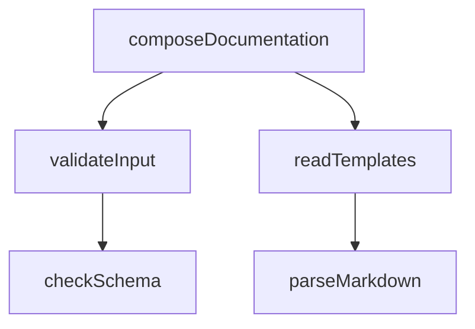
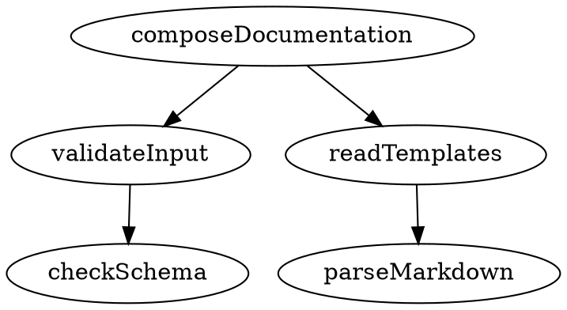
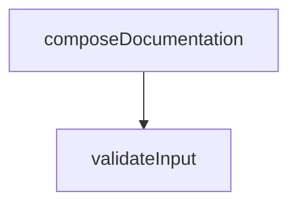

# Schema Documentation

**Project:** coderef-context MCP Server
**Version:** 1.1.0
**Schema Version:** 1.0
**Last Updated:** 2025-12-30
**Status:** ✅ Production

---

## Purpose

This document defines the data schemas and type definitions used by the coderef-context MCP server. It describes the structure of tool inputs, outputs, CLI responses, and internal data models used for code intelligence operations.

---

## Overview

The coderef-context server operates on structured JSON data exchanged between:
1. **MCP Client** (AI Agent) ↔ MCP Server (Python)
2. **MCP Server** (Python) ↔ CLI Subprocess (@coderef/core)

All data follows strict JSON Schema validation. No database is used—data flows entirely through in-memory JSON structures and subprocess stdio.

---

## What: Schema Definitions

### 1. Tool Input Schemas

All MCP tools accept structured JSON inputs validated against these schemas:

#### ScanInput
```typescript
interface ScanInput {
  project_path: string;           // Absolute path to project root
  languages?: string[];           // Default: ["ts", "tsx", "js", "jsx"]
  use_ast?: boolean;              // Default: true (99% accuracy vs regex)
}
```

**Validation Rules:**
- `project_path` must be absolute path
- `languages` must be valid file extensions
- `use_ast` must be boolean

**Example:**
```json
{
  "project_path": "/Users/dev/frontend-app",
  "languages": ["ts", "tsx"],
  "use_ast": true
}
```

---

#### QueryInput
```typescript
interface QueryInput {
  project_path: string;
  query_type: "calls" | "calls-me" | "imports" | "imports-me" | "depends-on" | "depends-on-me";
  target: string;                 // e.g., 'authenticateUser' or 'AuthService#login'
  source?: string;                // For path queries
  max_depth?: number;             // Default: 3
}
```

**Validation Rules:**
- `query_type` must be one of 6 enum values
- `target` is required, must be non-empty string
- `max_depth` must be positive integer 1-10

**Example:**
```json
{
  "project_path": "/Users/dev/app",
  "query_type": "calls-me",
  "target": "login",
  "max_depth": 3
}
```

---

#### ImpactInput
```typescript
interface ImpactInput {
  project_path: string;
  element: string;                // Element to analyze (e.g., 'AuthService')
  operation?: "modify" | "delete" | "refactor";  // Default: "modify"
  max_depth?: number;             // Default: 3
}
```

**Validation Rules:**
- `element` must be valid code element name
- `operation` must be one of 3 enum values
- `max_depth` must be positive integer 1-10

**Example:**
```json
{
  "project_path": "/Users/dev/app",
  "element": "AuthService",
  "operation": "refactor",
  "max_depth": 3
}
```

---

#### ComplexityInput
```typescript
interface ComplexityInput {
  project_path: string;
  element: string;                // Element to analyze
}
```

**Validation Rules:**
- `element` must be non-empty string

---

#### PatternsInput
```typescript
interface PatternsInput {
  project_path: string;
  pattern_type?: string;          // Type of pattern to find (optional)
  limit?: number;                 // Default: 10
}
```

**Validation Rules:**
- `limit` must be positive integer 1-100

---

#### CoverageInput
```typescript
interface CoverageInput {
  project_path: string;
  format?: "summary" | "detailed";  // Default: "summary"
}
```

---

#### ContextInput
```typescript
interface ContextInput {
  project_path: string;
  languages?: string[];           // Default: ["ts", "tsx", "js", "jsx"]
  output_format?: "json" | "markdown" | "both";  // Default: "json"
}
```

---

#### ValidateInput
```typescript
interface ValidateInput {
  project_path: string;
  pattern?: string;               // File glob pattern, default: "**/*.ts"
}
```

---

#### DriftInput
```typescript
interface DriftInput {
  project_path: string;
  index_path?: string;            // Default: ".coderef-index.json"
}
```

---

#### DiagramInput
```typescript
interface DiagramInput {
  project_path: string;
  diagram_type?: "dependencies" | "calls" | "imports" | "all";  // Default: "dependencies"
  format?: "mermaid" | "dot";     // Default: "mermaid"
  depth?: number;                 // Default: 2
}
```

---

#### TagInput
```typescript
interface TagInput {
  path: string;                   // File or directory path to tag
  dry_run?: boolean;              // Default: false
  force?: boolean;                // Default: false
  verbose?: boolean;              // Default: false
  update_lineno?: boolean;        // Default: false
  include_private?: boolean;      // Default: false
  lang?: string;                  // Default: "ts,tsx,js,jsx" (comma-separated)
  exclude?: string;               // Comma-separated exclusion patterns
}
```

**Validation Rules:**
- `path` is required, must be valid file or directory path
- All flags are optional booleans

---

### 2. Tool Output Schemas

All MCP tools return structured JSON responses:

#### ScanOutput
```typescript
interface ScanOutput {
  success: boolean;
  elements_found: number;
  elements: CodeElement[];
}

interface CodeElement {
  name: string;                   // Element name (e.g., "ThemeProvider")
  type: "function" | "class" | "component" | "hook" | "interface" | "type";
  file: string;                   // Relative file path
  line: number;                   // Line number where defined
  metadata?: Record<string, any>; // Additional metadata
}
```

**Example:**
```json
{
  "success": true,
  "elements_found": 247,
  "elements": [
    {
      "name": "ThemeProvider",
      "type": "component",
      "file": "src/theme/ThemeProvider.tsx",
      "line": 10
    }
  ]
}
```

---

#### QueryOutput
```typescript
interface QueryOutput {
  success: boolean;
  query_type: string;
  target: string;
  results: Relationship[];
}

interface Relationship {
  from: string;                   // Source element
  to: string;                     // Target element
  type: "import" | "call" | "dependency";
  file: string;                   // Where relationship exists
  line?: number;                  // Line number (optional)
}
```

**Example:**
```json
{
  "success": true,
  "query_type": "imports",
  "target": "CheckoutComponent",
  "results": [
    {
      "from": "CheckoutComponent",
      "to": "PaymentGateway",
      "type": "import",
      "file": "src/checkout/Checkout.tsx",
      "line": 5
    }
  ]
}
```

---

#### ImpactOutput
```typescript
interface ImpactOutput {
  success: boolean;
  element: string;
  operation: "modify" | "delete" | "refactor";
  impact: ImpactAnalysis;
}

interface ImpactAnalysis {
  affected_files: number;
  risk_level: "LOW" | "MEDIUM" | "HIGH" | "CRITICAL";
  ripple_effects: RippleEffect[];
}

interface RippleEffect {
  file: string;                   // Affected file path
  impact: string;                 // Description (e.g., "direct call", "indirect dependency")
  severity?: "minor" | "major" | "breaking";
}
```

**Example:**
```json
{
  "success": true,
  "element": "AuthService",
  "operation": "refactor",
  "impact": {
    "affected_files": 12,
    "risk_level": "MEDIUM",
    "ripple_effects": [
      {
        "file": "src/login/Login.tsx",
        "impact": "direct call",
        "severity": "major"
      }
    ]
  }
}
```

---

#### ComplexityOutput
```typescript
interface ComplexityOutput {
  success: boolean;
  element: string;
  note: string;
  context: ComplexityMetrics;
}

interface ComplexityMetrics {
  lines_of_code: number;
  cyclomatic_complexity: number;  // Measure of code paths
  dependencies: number;           // Count of imports/dependencies
  test_coverage: number;          // Decimal 0.0-1.0 (e.g., 0.65 = 65%)
}
```

**Example:**
```json
{
  "success": true,
  "element": "ReportGenerator",
  "note": "Complexity metrics derived from context generation",
  "context": {
    "lines_of_code": 245,
    "cyclomatic_complexity": 8,
    "dependencies": 6,
    "test_coverage": 0.65
  }
}
```

---

#### PatternsOutput
```typescript
interface PatternsOutput {
  success: boolean;
  pattern_type: string;
  limit: number;
  patterns: Record<string, PatternInfo>;
}

interface PatternInfo {
  files: string[];                // Files where pattern appears
  usage: number;                  // Count of occurrences
  description?: string;           // Pattern description
}
```

**Example:**
```json
{
  "success": true,
  "pattern_type": "data-fetching",
  "limit": 5,
  "patterns": {
    "React Query pattern": {
      "files": ["src/api/hooks.ts"],
      "usage": 23,
      "description": "Async data fetching with caching"
    }
  }
}
```

---

#### CoverageOutput
```typescript
interface CoverageOutput {
  success: boolean;
  coverage: CoverageReport;
}

interface CoverageReport {
  overall: number;                // Overall coverage % (0.0-1.0)
  by_file: Record<string, number>; // Per-file coverage
  untested_files?: string[];      // Files with 0% coverage
}
```

**Example:**
```json
{
  "success": true,
  "coverage": {
    "overall": 0.72,
    "by_file": {
      "src/auth.ts": 0.85,
      "src/checkout.ts": 0.60
    },
    "untested_files": ["src/legacy.ts"]
  }
}
```

---

#### ContextOutput
```typescript
interface ContextOutput {
  success: boolean;
  format: "json" | "markdown" | "both";
  context: ProjectContext;
}

interface ProjectContext {
  project_summary: string;
  elements: CodeElement[];
  dependencies: Record<string, string[]>;
  test_patterns: Record<string, PatternInfo>;
  architecture_notes?: string;
}
```

---

#### ValidateOutput
```typescript
interface ValidateOutput {
  success: boolean;
  pattern: string;
  validation: ValidationReport;
}

interface ValidationReport {
  valid_references: number;
  invalid_references: number;
  errors: ValidationError[];
}

interface ValidationError {
  file: string;
  line: number;
  reference: string;
  error: string;
}
```

---

#### DriftOutput
```typescript
interface DriftOutput {
  success: boolean;
  drift_report: DriftReport;
}

interface DriftReport {
  added_elements: number;
  removed_elements: number;
  modified_elements: number;
  details?: DriftDetail[];
}

interface DriftDetail {
  element: string;
  change_type: "added" | "removed" | "modified";
  file: string;
}
```

---

#### DiagramOutput
```typescript
// For Mermaid/Dot formats, returns text directly
type DiagramOutput = string;

// For JSON format, returns structured graph
interface DiagramOutputJSON {
  success: boolean;
  diagram: GraphData;
}

interface GraphData {
  nodes: GraphNode[];
  edges: GraphEdge[];
}

interface GraphNode {
  id: string;
  label: string;
  type: "function" | "class" | "component" | "module";
}

interface GraphEdge {
  from: string;
  to: string;
  label?: string;
}
```

---

#### TagOutput
```typescript
// Returns plain text output (not JSON)
type TagOutput = string;

// Example output:
// "Tagged 45 elements in 12 files:
//  - 18 functions (@Fn)
//  - 12 classes (@Cl)
//  - 15 components (@Cp)"
```

---

### 3. Error Schemas

All tools return structured errors on failure:

```typescript
interface ToolError {
  error: string;                  // Human-readable error message
  code?: string;                  // Error code (e.g., "TIMEOUT", "CLI_NOT_FOUND")
  details?: any;                  // Additional context
}
```

**Common Error Codes:**
- `TIMEOUT` - Command exceeded 120s timeout
- `CLI_NOT_FOUND` - @coderef/core CLI not installed or configured
- `JSON_PARSE_ERROR` - CLI output malformed
- `INVALID_INPUT` - Input validation failed
- `ELEMENT_NOT_FOUND` - Target element doesn't exist
- `SUBPROCESS_ERROR` - CLI subprocess crashed

**Example:**
```json
{
  "error": "Error: Scan timeout (120s exceeded)",
  "code": "TIMEOUT",
  "details": {
    "project_path": "/large/project",
    "timeout": 120
  }
}
```

---

## Why: Schema Design Decisions

### Decision 1: JSON-Only Communication
**Why:** MCP protocol is JSON-based, @coderef/core CLI supports `--json` flag
**Benefit:** Type-safe, structured, parseable by agents
**Alternative Rejected:** Plain text output (harder to parse, error-prone)

### Decision 2: Flat Input Schemas
**Why:** Simple to validate, easy for agents to construct
**Benefit:** Fewer nesting errors, clear parameter expectations
**Alternative Rejected:** Nested object parameters (more complexity)

### Decision 3: Success Boolean
**Why:** Explicit success/failure distinction
**Benefit:** Agents can check `success` before processing results
**Alternative Rejected:** HTTP-style status codes (overkill for local server)

### Decision 4: Enums for Fixed Values
**Why:** Prevents typos, provides autocomplete hints
**Benefit:** Compile-time validation, clear API contract
**Alternative Rejected:** Arbitrary strings (error-prone)

---

## When: Schema Evolution

### Versioning Strategy
Schema version follows semantic versioning (SemVer):
- **Major:** Breaking changes (remove fields, change types)
- **Minor:** Backward-compatible additions (new optional fields)
- **Patch:** Documentation updates, clarifications

### Current Version: 1.0
- All 11 tools have stable input/output schemas
- No breaking changes planned for v1.x series

### Future Schema Changes (v2.0 candidates)
- Add streaming support for large scan results
- Add pagination for query results
- Add optional caching layer with cache keys

---

## Examples

### Example 1: Valid ScanInput
```json
{
  "project_path": "/Users/dev/frontend-app",
  "languages": ["ts", "tsx"],
  "use_ast": true
}
```

**Validation:** ✅ Pass
**Reason:** All required fields present, types correct, AST flag is boolean

---

### Example 2: Invalid QueryInput (Missing target)
```json
{
  "project_path": "/Users/dev/app",
  "query_type": "calls-me"
}
```

**Validation:** ❌ Fail
**Error:** `target parameter is required`

---

### Example 3: Valid ImpactOutput
```json
{
  "success": true,
  "element": "AuthService",
  "operation": "refactor",
  "impact": {
    "affected_files": 12,
    "risk_level": "MEDIUM",
    "ripple_effects": [
      {
        "file": "src/login/Login.tsx",
        "impact": "direct call",
        "severity": "major"
      }
    ]
  }
}
```

**Validation:** ✅ Pass
**Reason:** All required fields present, risk_level is valid enum

---

## Relationships & Constraints

### Schema Relationships

```
ScanInput → ScanOutput → CodeElement[]
QueryInput → QueryOutput → Relationship[]
ImpactInput → ImpactOutput → ImpactAnalysis → RippleEffect[]
```

### Cross-Schema Constraints

1. **CodeElement.type** values must match query target types
2. **QueryOutput.results** must reference valid **CodeElement** names from scan
3. **ImpactOutput.impact.affected_files** count must match **RippleEffect[]** length
4. **ComplexityMetrics.test_coverage** must be decimal 0.0-1.0

---

## References

- **[API.md](API.md)** - API endpoint documentation (uses these schemas)
- **[ARCHITECTURE.md](ARCHITECTURE.md)** - System architecture (data flow through schemas)
- **[server.py](../server.py)** - Schema validation implementation
- **[@coderef/core CLI](https://github.com/coderef-system)** - Upstream schema definitions

---

## .coderef/ File Format Schemas

The following schemas define the structure of `.coderef/` directory files generated by the `populate-coderef.py` script or the `@coderef/core` CLI. These files provide static code intelligence that coderef-context tools read.

### index.json

**Purpose:** Primary inventory of all code elements discovered during scanning.

**Location:** `.coderef/index.json`

**Schema:**
```typescript
interface CodeRefIndex {
  version: string;                    // CodeRef format version (e.g., "2.0.0")
  generatedAt: string;                // ISO 8601 timestamp
  projectPath: string;                // Absolute path to scanned project
  totalElements: number;              // Total count of discovered elements
  elementsByType: Record<string, number>; // Count by element type
  elements: CodeElement[];            // Array of all discovered elements
}

interface CodeElement {
  type: "function" | "method" | "class" | "component" | "interface" | "type" | "variable";
  name: string;                       // Element name
  file: string;                       // Absolute file path
  line: number;                       // Line number where defined
  exported?: boolean;                 // Whether element is exported
  parameters?: string[];              // Function/method parameters (optional)
  metadata?: Record<string, any>;     // Additional element-specific data
}
```

**Example:**
```json
{
  "version": "2.0.0",
  "generatedAt": "2026-01-13T02:48:12.270Z",
  "projectPath": "C:\\Users\\willh\\.mcp-servers\\coderef-docs",
  "totalElements": 105,
  "elementsByType": {
    "function": 55,
    "method": 50
  },
  "elements": [
    {
      "type": "function",
      "name": "composeDocumentation",
      "file": "C:/Users/willh/.mcp-servers/coderef-docs/composer.ts",
      "line": 17,
      "exported": true
    },
    {
      "type": "method",
      "name": "validateInput",
      "file": "C:/Users/willh/.mcp-servers/coderef-docs/validator.ts",
      "line": 42,
      "exported": false
    }
  ]
}
```

**Usage:**
- **coderef_scan tool** reads this file and returns elements array
- **coderef-docs** filters by type to populate API.md, SCHEMA.md, COMPONENTS.md
- **coderef-workflow** analyzes element counts for planning
- **Agents** use this as primary source of truth for "what exists in the codebase"

**Field Descriptions:**
- `version`: Semantic version of CodeRef format (breaking changes increment major)
- `generatedAt`: When the scan was performed (useful for drift detection)
- `projectPath`: Root directory scanned (used to resolve relative paths)
- `totalElements`: Quick count without iterating elements array
- `elementsByType`: Breakdown for filtering (e.g., show only "function" type)
- `elements`: Complete inventory - agents typically filter this by type, file, or name

---

### graph.json

**Purpose:** Dependency relationships between code elements (imports, calls, references).

**Location:** `.coderef/graph.json`

**Schema:**
```typescript
interface CodeRefGraph {
  version: string;                    // CodeRef format version
  generatedAt: string;                // ISO 8601 timestamp
  projectPath: string;                // Absolute path to scanned project
  nodes: Record<string, GraphNode>;   // Map of element ID to node data
  edges: Record<string, string[]>;    // Map of element ID to array of dependency IDs
}

interface GraphNode {
  id: string;                         // Unique element identifier (e.g., "file:line:name")
  name: string;                       // Element name
  type: string;                       // Element type (function, class, etc.)
  file: string;                       // File path
  line: number;                       // Line number
}
```

**Example:**
```json
{
  "version": "2.0.0",
  "generatedAt": "2026-01-13T02:48:12.270Z",
  "projectPath": "C:\\Users\\willh\\.mcp-servers\\coderef-docs",
  "nodes": {
    "composer.ts:17:composeDocumentation": {
      "id": "composer.ts:17:composeDocumentation",
      "name": "composeDocumentation",
      "type": "function",
      "file": "C:/Users/willh/.mcp-servers/coderef-docs/composer.ts",
      "line": 17
    },
    "validator.ts:42:validateInput": {
      "id": "validator.ts:42:validateInput",
      "name": "validateInput",
      "type": "method",
      "file": "C:/Users/willh/.mcp-servers/coderef-docs/validator.ts",
      "line": 42
    }
  },
  "edges": {
    "composer.ts:17:composeDocumentation": ["validator.ts:42:validateInput"],
    "validator.ts:42:validateInput": []
  }
}
```

**Usage:**
- **coderef_query tool** traverses this graph for relationship queries (calls-me, depends-on)
- **coderef_impact tool** walks edges to find all dependents
- **Agents** use this to understand "what breaks if I change X"

**Field Descriptions:**
- `nodes`: Dictionary keyed by unique element ID (format: file:line:name)
- `edges`: Dictionary where key is element ID, value is array of IDs it depends on
- Graph is **directed**: `edges["A"] = ["B"]` means "A depends on B" or "A calls B"

---

### context.md

**Purpose:** Human-readable project overview (markdown summary).

**Location:** `.coderef/context.md`

**Format:** Markdown text file

**Example:**
```markdown

  Files: 105
  Elements: 247
  Entry Points: 12
  Critical Functions: 34
  Execution Time: 1.24s

```

**Usage:**
- **coderef_context tool** returns this file content (when output_format="markdown")
- **Agents** use as quick project summary without parsing JSON
- **Documentation** embeds this in ARCHITECTURE.md or README.md

---

### reports/patterns.json

**Purpose:** Discovered code patterns, anti-patterns, and best practices.

**Location:** `.coderef/reports/patterns.json`

**Schema:**
```typescript
interface PatternsReport {
  version: string;
  generatedAt: string;
  projectPath: string;
  patterns: Pattern[];
}

interface Pattern {
  name: string;                       // Pattern name (e.g., "React Hook pattern")
  files: string[];                    // Files where pattern appears
  usage: number;                      // Count of occurrences
  type: "best-practice" | "anti-pattern" | "convention";
  description?: string;               // Optional description
}
```

**Example:**
```json
{
  "version": "2.0.0",
  "generatedAt": "2026-01-13T02:48:12.270Z",
  "projectPath": "C:\\Users\\willh\\.mcp-servers\\coderef-docs",
  "patterns": [
    {
      "name": "React Hook pattern",
      "files": ["src/hooks/useAuth.ts", "src/hooks/useFetch.ts"],
      "usage": 23,
      "type": "best-practice",
      "description": "Custom hooks following React naming conventions"
    },
    {
      "name": "Hardcoded credentials",
      "files": ["src/legacy/auth.ts"],
      "usage": 2,
      "type": "anti-pattern"
    }
  ]
}
```

**Usage:**
- **coderef_patterns tool** reads this file and returns patterns array
- **coderef-docs** uses for standards documentation
- **Agents** use to identify existing patterns before adding new code

---

### reports/coverage.json

**Purpose:** Test coverage metrics (overall percentage, file-by-file breakdown).

**Location:** `.coderef/reports/coverage.json`

**Schema:**
```typescript
interface CoverageReport {
  version: string;
  generatedAt: string;
  projectPath: string;
  overall: number;                    // Overall coverage (0.0-1.0)
  by_file: Record<string, number>;   // Per-file coverage
  untested_files?: string[];          // Files with 0% coverage
}
```

**Example:**
```json
{
  "version": "2.0.0",
  "generatedAt": "2026-01-13T02:48:12.270Z",
  "projectPath": "C:\\Users\\willh\\.mcp-servers\\coderef-docs",
  "overall": 0.72,
  "by_file": {
    "src/auth.ts": 0.85,
    "src/checkout.ts": 0.60,
    "src/legacy.ts": 0.0
  },
  "untested_files": ["src/legacy.ts"]
}
```

**Usage:**
- **coderef_coverage tool** reads this file and returns metrics
- **Test planning** uses to identify gaps
- **Quality gates** use overall percentage for CI/CD

---

### reports/validation.json

**Purpose:** CodeRef2 reference validation results (checks @CodeRef tags in source code).

**Location:** `.coderef/reports/validation.json`

**Schema:**
```typescript
interface ValidationReport {
  version: string;
  generatedAt: string;
  projectPath: string;
  valid_references: number;
  invalid_references: number;
  errors: ValidationError[];
}

interface ValidationError {
  file: string;
  line: number;
  reference: string;
  error: string;
}
```

**Example:**
```json
{
  "version": "2.0.0",
  "generatedAt": "2026-01-13T02:48:12.270Z",
  "projectPath": "C:\\Users\\willh\\.mcp-servers\\coderef-docs",
  "valid_references": 45,
  "invalid_references": 3,
  "errors": [
    {
      "file": "src/auth.ts",
      "line": 42,
      "reference": "@CodeRef(AuthService#loginInvalid)",
      "error": "Referenced element 'loginInvalid' not found"
    }
  ]
}
```

**Usage:**
- **coderef_validate tool** reads this file and returns validation results
- **CI/CD** fails build if invalid_references > 0
- **Debugging** uses errors array to fix broken references

---

### reports/drift.json

**Purpose:** Detect staleness of index.json (compares index with current code).

**Location:** `.coderef/reports/drift.json`

**Schema:**
```typescript
interface DriftReport {
  version: string;
  generatedAt: string;
  projectPath: string;
  drift_percentage: number;           // Percentage of changes (0-100)
  added_elements: number;
  removed_elements: number;
  modified_elements: number;
  changed_files: string[];            // Files with detected changes
}
```

**Example:**
```json
{
  "version": "2.0.0",
  "generatedAt": "2026-01-13T02:48:12.270Z",
  "projectPath": "C:\\Users\\willh\\.mcp-servers\\coderef-docs",
  "drift_percentage": 12.5,
  "added_elements": 5,
  "removed_elements": 2,
  "modified_elements": 8,
  "changed_files": ["src/auth.ts", "src/validator.ts"]
}
```

**Usage:**
- **coderef_drift tool** reads this file and returns drift metrics
- **Incremental scan** uses changed_files to scan only modified files
- **Alerts** trigger when drift_percentage > 10%

---

### diagrams/dependencies.mmd

**Purpose:** Mermaid diagram showing dependency relationships.

**Location:** `.coderef/diagrams/dependencies.mmd`

**Format:** Mermaid graph syntax

**Example:**


**Usage:**
- **coderef_diagram tool** returns this file content (format="mermaid")
- **Documentation** embeds in ARCHITECTURE.md with triple backticks
- **Visualization** renders in GitHub, GitLab, markdown viewers

---

### diagrams/dependencies.dot

**Purpose:** GraphViz DOT format dependency graph.

**Location:** `.coderef/diagrams/dependencies.dot`

**Format:** DOT graph syntax

**Example:**


**Usage:**
- **coderef_diagram tool** returns this file content (format="dot")
- **GraphViz tools** render to PNG/SVG/PDF
- **Advanced visualization** with custom styling

---

### exports/graph.json

**Purpose:** Full graph export in standard JSON format.

**Location:** `.coderef/exports/graph.json`

**Schema:** Same as root-level graph.json (see above)

**Usage:**
- **External tools** import for analysis
- **Data interchange** between systems
- **Backup** of graph structure

---

### exports/graph.jsonld

**Purpose:** Linked data export (JSON-LD format for semantic web).

**Location:** `.coderef/exports/graph.jsonld`

**Format:** JSON-LD with @context

**Example:**
```json
{
  "@context": "https://schema.org/",
  "@graph": [
    {
      "@type": "SoftwareSourceCode",
      "name": "composeDocumentation",
      "codeRepository": "file://src/composer.ts"
    }
  ]
}
```

**Usage:**
- **Semantic web tools** for knowledge graphs
- **Integration** with RDF databases
- **Advanced querying** with SPARQL

---

### exports/diagram-wrapped.md

**Purpose:** Markdown file with embedded Mermaid diagram and usage notes.

**Location:** `.coderef/exports/diagram-wrapped.md`

**Format:** Markdown with Mermaid code block

**Example:**
````markdown
# Dependency Diagram



## Usage

Embed this diagram in your ARCHITECTURE.md by copying the Mermaid block above.
````

**Usage:**
- **Quick embedding** in documentation (copy-paste ready)
- **Self-contained** with usage instructions
- **Rendered** on GitHub/GitLab without preprocessing

---

## AI Agent Instructions

**When constructing tool inputs:**
1. Validate required fields before calling tool (prevent validation errors)
2. Use enums exactly as defined (avoid typos)
3. Provide absolute paths for `project_path` (not relative)
4. Set appropriate timeouts for large projects

**When parsing tool outputs:**
1. Check `success` field first before accessing results
2. Handle errors gracefully (retry on TIMEOUT, ask user on CLI_NOT_FOUND)
3. Validate output schema before using data (defensive parsing)
4. Extract `CodeElement[]` from scan, then use names in query/impact calls

**Schema validation tips:**
- TypeScript interfaces above are for documentation—Python server uses JSON Schema internally
- Missing optional fields default to documented defaults
- Extra fields are ignored (forward compatibility)

---

**Generated:** 2025-12-30
**Maintained by:** coderef-context MCP Server
**For AI Agents:** This schema reference ensures type-safe tool usage. Validate inputs before calling tools to avoid errors.
