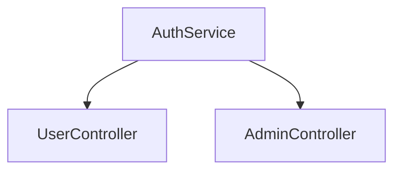
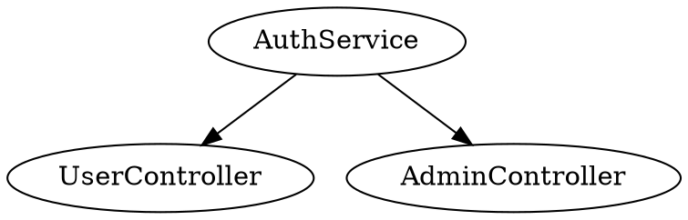

# Data Schema Reference

**[Date]** 2026-01-14 | **[Version]** 2.0.0

## Purpose

This document defines all data models, structures, and schemas used by the CodeRef Context MCP server. It covers internal data structures, `.coderef/` file formats, and MCP tool request/response schemas.

## Overview

The CodeRef Context server works with two primary data sources:
1. **Internal Python Objects**: Classes and data structures in the codebase
2. **External `.coderef/` Files**: Pre-scanned JSON files containing code intelligence

All data flows through the `CodeRefReader` class which provides a unified interface to query code intelligence.

## Core Data Models

### CodeRefReader

**Location**: `src/coderef_reader.py`

**Purpose**: Main data access layer for reading `.coderef/` files

**Schema**:
```python
class CodeRefReader:
    project_path: Path          # Project root directory
    coderef_dir: Path           # .coderef/ directory path
    
    # Methods return:
    get_index() -> List[Dict]   # All scanned elements
    get_graph() -> Dict         # Dependency graph
    get_context(format) -> Any  # Project context (JSON or markdown)
    get_patterns() -> Dict      # Code patterns
    get_coverage() -> Dict      # Test coverage
    get_validation() -> Dict    # Reference validation
    get_drift() -> Dict         # Drift detection
    get_diagram(type, format) -> str  # Diagram data
    get_export(format) -> Any   # Export data
```

**Key Properties**:
- `project_path` (Path): Absolute path to project root
- `coderef_dir` (Path): Path to `.coderef/` directory (project_path / ".coderef")

---

### Element Schema (index.json)

**File**: `.coderef/index.json`

**Format**: JSON array of element objects

**Schema**:
```json
[
  {
    "type": "function" | "class" | "method" | "component" | "hook",
    "name": "string",
    "file": "string (absolute path)",
    "line": "integer",
    "exported": "boolean",
    "parameters": ["string"] (optional),
    "return_type": "string" (optional),
    "visibility": "public" | "private" | "protected" (optional)
  }
]
```

**Example**:
```json
[
  {
    "type": "function",
    "name": "export_coderef",
    "file": "C:/Users/willh/.mcp-servers/coderef-context/processors/export_processor.py",
    "line": 26,
    "exported": false
  },
  {
    "type": "class",
    "name": "CodeRefReader",
    "file": "C:/Users/willh/.mcp-servers/coderef-context/src/coderef_reader.py",
    "line": 14,
    "exported": true
  }
]
```

**Element Types**:
- `function`: Standalone functions
- `class`: Class definitions
- `method`: Class methods
- `component`: React/Vue components (if applicable)
- `hook`: React hooks (if applicable)

---

### Graph Schema (graph.json)

**File**: `.coderef/graph.json`

**Format**: JSON object with nodes and edges

**Schema**:
```json
{
  "nodes": {
    "node_id": {
      "name": "string",
      "type": "string",
      "file": "string",
      "line": "integer"
    }
  },
  "edges": {
    "node_id": ["dependent_node_id", ...]
  }
}
```

**Example**:
```json
{
  "nodes": {
    "auth_service": {
      "name": "AuthService",
      "type": "class",
      "file": "src/auth.ts",
      "line": 10
    },
    "user_controller": {
      "name": "UserController",
      "type": "class",
      "file": "src/controller.ts",
      "line": 5
    }
  },
  "edges": {
    "user_controller": ["auth_service"]
  }
}
```

**Relationship Types**:
- **Dependencies**: What a node depends on (imports, calls)
- **Dependents**: What depends on a node (reverse dependencies)

---

### Context Schema (context.json)

**File**: `.coderef/context.json`

**Format**: JSON object with project metadata

**Schema**:
```json
{
  "version": "string",
  "generatedAt": "ISO 8601 timestamp",
  "projectPath": "string (absolute path)",
  "statistics": {
    "totalElements": "integer",
    "totalFiles": "integer",
    "elementsByType": {
      "function": "integer",
      "class": "integer",
      ...
    },
    "filesByExtension": {
      ".ts": "integer",
      ".py": "integer",
      ...
    }
  },
  "topFiles": [
    {
      "file": "string",
      "elementCount": "integer"
    }
  ]
}
```

**Example**:
```json
{
  "version": "2.0.0",
  "generatedAt": "2026-01-13T02:48:12.367Z",
  "projectPath": "C:\\Users\\willh\\.mcp-servers\\coderef-context",
  "statistics": {
    "totalElements": 250,
    "totalFiles": 15,
    "elementsByType": {
      "function": 120,
      "class": 8,
      "method": 122
    },
    "filesByExtension": {
      ".py": 15
    }
  },
  "topFiles": [
    {
      "file": "server.py",
      "elementCount": 45
    }
  ]
}
```

---

### Patterns Schema (reports/patterns.json)

**File**: `.coderef/reports/patterns.json`

**Format**: JSON object with pattern analysis

**Schema**:
```json
{
  "patterns": [
    {
      "type": "string (pattern name)",
      "count": "integer",
      "files": ["string (file paths)"],
      "description": "string (optional)"
    }
  ],
  "test_gaps": ["string (file paths)"]
}
```

**Example**:
```json
{
  "patterns": [
    {
      "type": "singleton",
      "count": 5,
      "files": ["src/config.ts", "src/logger.ts"],
      "description": "Singleton pattern detected"
    }
  ],
  "test_gaps": ["src/auth.ts", "src/payment.ts"]
}
```

---

### Coverage Schema (reports/coverage.json)

**File**: `.coderef/reports/coverage.json`

**Format**: JSON object with test coverage data

**Schema**:
```json
{
  "overall": "float (0.0-1.0)",
  "by_file": {
    "file_path": "float (0.0-1.0)"
  },
  "by_type": {
    "function": "float",
    "class": "float",
    ...
  }
}
```

**Example**:
```json
{
  "overall": 0.75,
  "by_file": {
    "src/auth.ts": 0.90,
    "src/payment.ts": 0.60
  },
  "by_type": {
    "function": 0.80,
    "class": 0.70
  }
}
```

---

### Validation Schema (reports/validation.json)

**File**: `.coderef/reports/validation.json`

**Format**: JSON object with validation results

**Schema**:
```json
{
  "valid": "boolean",
  "errors": [
    {
      "file": "string",
      "line": "integer",
      "message": "string",
      "severity": "error" | "warning"
    }
  ],
  "warnings": [
    {
      "file": "string",
      "line": "integer",
      "message": "string"
    }
  ]
}
```

---

### Drift Schema (reports/drift.json)

**File**: `.coderef/reports/drift.json`

**Format**: JSON object with drift detection results

**Schema**:
```json
{
  "drift_detected": "boolean",
  "changed_files": ["string (file paths)"],
  "new_files": ["string (file paths)"],
  "deleted_files": ["string (file paths)"],
  "modified_elements": [
    {
      "name": "string",
      "file": "string",
      "change_type": "added" | "modified" | "deleted"
    }
  ]
}
```

---

## MCP Tool Request/Response Schemas

### Request Schema

All MCP tools follow this request pattern:

```json
{
  "name": "tool_name",
  "arguments": {
    "project_path": "string (required, absolute path)",
    "param1": "value1",
    "param2": "value2"
  }
}
```

### Response Schema

**Success Response**:
```json
{
  "success": true,
  "data": { ... },
  "source": "file://.coderef/filename.json" (optional)
}
```

**Error Response**:
```json
{
  "success": false,
  "error": "string (error message)",
  "hint": "string (optional, helpful suggestion)"
}
```

### TextContent Format

MCP tools return `List[TextContent]`:

```python
[
  TextContent(
    type="text",
    text=json.dumps(response_data, indent=2)
  )
]
```

---

## Handler Function Signatures

All handler functions follow this pattern:

```python
async def handle_coderef_<tool_name>(args: dict) -> List[TextContent]:
    """
    Tool description.
    
    Args:
        args: Dictionary with tool parameters
        
    Returns:
        List[TextContent] with JSON response
    """
```

**Handler List**:
- `handle_coderef_scan`
- `handle_coderef_query`
- `handle_coderef_impact`
- `handle_coderef_complexity`
- `handle_coderef_patterns`
- `handle_coderef_coverage`
- `handle_coderef_context`
- `handle_coderef_validate`
- `handle_coderef_drift`
- `handle_coderef_incremental_scan`
- `handle_coderef_diagram`
- `handle_coderef_tag`
- `handle_coderef_export`
- `handle_validate_coderef_outputs`

---

## Export Formats

### JSON Export

**Format**: Raw JSON array of elements

```json
[
  {
    "type": "function",
    "name": "...",
    ...
  }
]
```

### JSON-LD Export

**Format**: JSON-LD (Linked Data) with semantic annotations

```json
{
  "@context": {
    "@vocab": "https://coderef.dev/vocab#"
  },
  "@graph": [
    {
      "@id": "function:export_coderef",
      "@type": "Function",
      "name": "export_coderef",
      ...
    }
  ]
}
```

### Mermaid Export

**Format**: Mermaid diagram syntax



### DOT Export

**Format**: Graphviz DOT format



---

## Data Flow

```
MCP Client Request
    ↓
server.py (call_tool)
    ↓
handlers_refactored.py (handle_*)
    ↓
coderef_reader.py (CodeRefReader)
    ↓
.coderef/*.json (file read)
    ↓
JSON parsing
    ↓
Response formatting
    ↓
MCP Client Response
```

---

## Validation Rules

### Required Files

For basic operation, `.coderef/` must contain:
- `index.json` (required)
- `graph.json` (required)
- `context.json` (required)

### Optional Files

- `reports/patterns.json`
- `reports/coverage.json`
- `reports/validation.json`
- `reports/drift.json`
- `diagrams/*.mermaid` or `diagrams/*.dot`
- `exports/*.json` or `exports/*.jsonld`

### File Validation

Use `validate_coderef_outputs` tool to validate all `.coderef/` files against schemas.

---

**AI Agent Note**: All schemas are JSON-based. Python code uses `Dict[str, Any]` and `List[Dict]` type hints for flexibility. For type safety, consider using Pydantic models in future versions.
