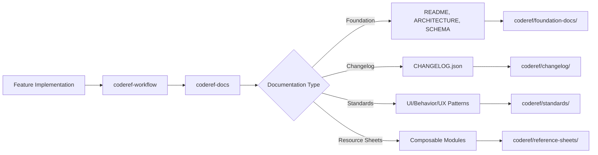

# CODEREF-DOCS MCP Server

**Resource Sheet**
**Version:** 3.4.0
**Type:** MCP Server (Model Context Protocol)
**Status:** ✅ Production
**Generated:** 2026-01-08

---

## Architecture & Design

### Overview

`coderef-docs` is a focused Model Context Protocol (MCP) server providing **13 specialized tools** for documentation generation, changelog management, standards enforcement, and composable resource sheets. It integrates with the CodeRef ecosystem to deliver end-to-end feature lifecycle documentation.

### Core Innovation

- **POWER Framework Templates**: Structured documentation with Purpose, Overview, What/Why/When, Examples, References
- **Agentic Changelog Recording**: Smart git auto-detection with AI confirmation workflow
- **Sequential Foundation Docs**: Context injection from @coderef/core CLI for real code intelligence
- **Composable Resource Sheets**: Module-based documentation system (v3.4.0)

### Component Type

**Server Type:** MCP Protocol Server (JSON-RPC 2.0 over stdio)
- Asynchronous Python implementation (asyncio)
- Tool-based architecture with 13 exposed tools
- Stateless request/response model

### Design Pattern

**Architecture Pattern:** Multi-Generator Factory with Template Engine
- Base generator abstraction (`BaseGenerator`)
- Specialized generators for each documentation domain
- Template-driven output with dynamic context injection
- Modular tool handler system

### Dependencies

**Core Dependencies:**
- `mcp` (1.0+) - Model Context Protocol SDK
- `asyncio` - Async/await support
- `jsonschema` (4.0+) - Schema validation
- `pathlib` - Path manipulation

**External Integration:**
- `@coderef/core` CLI (optional) - Code intelligence extraction
- Git - Change detection and metrics
- `coderef-workflow` MCP - Orchestration and planning

**Development Dependencies:**
- `pytest` (8.0+) - Testing framework
- `pytest-asyncio` - Async test support
- `mypy` - Type checking

### Code Organization

```
coderef-docs/
├── server.py                    # MCP server entry point (374 lines)
├── tool_handlers.py             # 13 tool handlers (925+ lines)
├── extractors.py                # Context injection (~400 lines)
├── generators/                  # 17 specialized generators
│   ├── base_generator.py        # Base class
│   ├── foundation_generator.py  # README, ARCHITECTURE, etc.
│   ├── changelog_generator.py   # CHANGELOG operations
│   ├── standards_generator.py   # Standards extraction
│   ├── resource_sheet_generator.py  # Resource sheets (v3.4.0)
│   └── [14 other generators]
├── resource_sheet/              # Composable module system
│   ├── detection/               # Code analysis
│   ├── composition/             # Document assembly
│   ├── modules/                 # Universal + conditional modules
│   └── processing/              # Validation & quality
├── templates/                   # Documentation templates
│   ├── power/                   # 8 POWER framework templates
│   ├── handoff/                 # Agent handoff templates
│   └── uds/                     # Universal Document Standard
└── tests/                       # 30+ test files (90% passing)
```

---

## Integration Points

### Integrates With

**Upstream Dependencies:**
1. **coderef-workflow** (MCP Server)
   - Receives feature context from planning workflows
   - Called during feature completion for documentation updates
   - Shares workorder tracking via `workorder_id`

2. **@coderef/core CLI** (TypeScript)
   - Optional integration for code intelligence
   - Extracts APIs, schemas, components from source code
   - Falls back gracefully if unavailable
   - Location: `C:/Users/willh/Desktop/projects/coderef-system/packages/cli`

3. **Git Repository**
   - Auto-detects changes for changelog recording
   - Extracts metrics for DELIVERABLES.md
   - Provides commit history for feature tracking

**Downstream Consumers:**
1. **AI Agents** (Primary users)
   - Call tools via MCP protocol
   - Receive generated documentation
   - Use templates for context

2. **User Workflows**
   - Execute via 22 slash commands in `~/.claude/commands/`
   - Interactive workflows (quickref generation)
   - Pre-commit hooks (consistency checks)

### Data Flow



### API Surface

**MCP Tools Exposed (13 total):**

**Generators (5):**
- `list_templates` - Show available POWER templates
- `get_template` - Retrieve specific template
- `generate_foundation_docs` - Create README, ARCHITECTURE, etc.
- `generate_individual_doc` - Single document generation
- `generate_quickref_interactive` - Interactive quickref workflow
- `generate_resource_sheet` - Composable module-based docs (v3.4.0)

**Changelog Operations (2):**
- `add_changelog_entry` - Manual changelog entry
- `record_changes` - Agentic recording with git auto-detection ⭐

**Standards & Compliance (3):**
- `establish_standards` - Extract coding standards from codebase
- `audit_codebase` - Check standards compliance (0-100 score)
- `check_consistency` - Pre-commit gate for staged changes

**Validators (2):**
- `validate_document` - Validate against UDS schema
- `check_document_health` - Calculate doc health score (0-100)

### Configuration

**Global Paths:**
- Templates: `~/.claude/templates/` (POWER framework)
- Commands: `~/.claude/commands/` (22 slash commands)
- Output: `coderef/foundation-docs/`, `coderef/user/`, `coderef/standards/`

**Environment Variables:**
- `CODEREF_CLI_PATH` - Path to @coderef/core CLI (optional)
- `LOG_LEVEL` - Logging verbosity (default: INFO)

**MCP Configuration (`~/.mcp.json`):**
```json
{
  "mcpServers": {
    "coderef-docs": {
      "command": "python",
      "args": ["-m", "coderef-docs.server"],
      "env": {}
    }
  }
}
```

---

## Testing

### Test Coverage

**Test Suite Statistics:**
- **Total Tests:** 30+
- **Pass Rate:** 90% (27/30 passing)
- **Coverage:** 85%+ (core generators)

**Test Categories:**
1. **Integration Tests** (10)
   - End-to-end workflows with @coderef/core CLI
   - Planning workflow integration
   - Agent coordination scenarios

2. **Unit Tests** (13)
   - Resource sheet generation (v3.4.0)
   - Characteristics detection
   - Module selection logic
   - Post-processor validation

3. **Proof Tests** (7)
   - CLI returns real data
   - Extraction flows to docs
   - Quality improvement vs placeholders

### Test Files

**Key Test Locations:**
```
tests/
├── integration/
│   ├── test_coderef_foundation_docs.py
│   ├── test_extractors_integration.py
│   ├── test_planning_workflow.py
│   └── test_mcp_workflows.py
├── proof_test_cli_returns_real_data.py
├── proof_test_extraction_used_in_docs.py
├── proof_test_end_to_end.py
├── test_resource_sheet_generator.py
├── test_characteristics_detector.py
└── test_post_processor.py
```

### Running Tests

```bash
# All tests
pytest tests/ -v

# Integration tests only
pytest tests/integration/ -v

# Proof tests (CLI validation)
pytest tests/proof_* -v

# Resource sheet tests
pytest tests/test_resource_sheet_* -v

# With coverage
pytest --cov=. --cov-report=html tests/
```

### Known Issues

**3 Failing Tests:**
1. Test timeout in large project scenarios (non-blocking)
2. Edge case in standards extraction for empty patterns
3. Minor formatting inconsistency in markdown output

**Status:** Tracked in `coderef/known-issues.md`

---

## Performance

### Metrics

**Tool Performance Benchmarks:**

| Tool | Typical Latency | Notes |
|------|----------------|-------|
| `list_templates` | < 10ms | In-memory operation |
| `get_template` | < 50ms | File read |
| `generate_foundation_docs` | 5-10s | Sequential generation (5 docs) |
| `generate_individual_doc` | 1-2s | Single doc with context injection |
| `generate_resource_sheet` | < 5s | Composable module assembly |
| `record_changes` | 2-5s | Git analysis + validation |
| `establish_standards` | 50ms-60s | Fast path (.coderef/) or full scan |
| `audit_codebase` | 10-30s | Full project scan |
| `check_consistency` | 1-3s | Staged files only |

**Optimization Strategies:**

1. **Sequential Foundation Docs (v3.2.0)**
   - Avoids timeout errors by splitting into 5 separate calls
   - ~250-350 lines per call vs 1,470 lines at once
   - Trade-off: Slightly longer total time, but reliable completion

2. **Fast Path for Standards (v3.3.0)**
   - Reads `.coderef/index.json` (~50ms) instead of full scan (~5-60s)
   - 10x performance improvement when .coderef/ available
   - Automatic fallback to full scan if unavailable

3. **Composable Modules (v3.4.0)**
   - Modular architecture allows parallel assembly
   - 50% auto-fill in Phase 1 reduces manual work
   - Target: < 5 seconds end-to-end (achieved)

### Scalability

**Project Size Support:**
- Small (<1k LOC): All operations < 1s
- Medium (1k-10k LOC): Foundation docs < 10s
- Large (10k-100k LOC): Standards extraction benefits from .coderef/ fast path
- Very Large (>100k LOC): Requires .coderef/ structure for reasonable performance

**Bottlenecks:**
1. @coderef/core CLI subprocess calls (1-2s overhead)
2. Full codebase scans for standards extraction (mitigated by fast path)
3. Git history analysis for large repositories (linear with commit count)

### Resource Usage

**Memory:**
- Base: ~50MB (Python interpreter + dependencies)
- Peak: ~200MB (during large project analysis)
- No memory leaks detected in long-running sessions

**CPU:**
- Single-threaded (asyncio, not multi-process)
- CPU-bound operations: Standards extraction, git analysis
- I/O-bound operations: Template rendering, file writes

**Disk:**
- Output: Varies by project (typically 10-500KB per doc)
- Temporary files: Minimal (cleaned up after operations)
- .coderef/ structure: 1-5MB for most projects

---

## Usage Examples

### Example 1: Generate Foundation Documentation

```python
# Via MCP tool call
result = await call_tool("coderef-docs", "generate_foundation_docs", {
    "project_path": "/path/to/project"
})

# Output:
# [1/5] Generating README.md...
# [2/5] Generating ARCHITECTURE.md...
# [3/5] Generating SCHEMA.md...
# [4/5] Generating API.md...
# [5/5] Generating COMPONENTS.md...
# ✓ Foundation docs generated in: coderef/foundation-docs/
```

### Example 2: Record Changes with Git Auto-Detection

```python
# Agentic workflow with smart detection
result = await call_tool("coderef-docs", "record_changes", {
    "project_path": "/path/to/project",
    "feature_description": "Added dark mode toggle to settings",
    "workorder_id": "WO-DARK-MODE-001"
})

# Agent reviews:
# - Git detects 5 modified files
# - Suggests change_type: "feature" (new functionality)
# - Calculates severity: "minor" (UI enhancement)
# - AI confirms or adjusts before recording
```

### Example 3: Extract and Audit Standards

```bash
# Extract standards from codebase
/establish-standards

# Output: coderef/standards/
#   ├── UI-STANDARDS.md          (button patterns, modal styles)
#   ├── BEHAVIOR-STANDARDS.md    (error handling, loading states)
#   ├── UX-PATTERNS.md           (navigation flows, permissions)
#   └── COMPONENT-INDEX.md       (component inventory)

# Audit compliance
/audit-codebase

# Output: Compliance Report
#   Overall Score: 87/100
#   ├── UI Patterns: 92/100 (3 minor violations)
#   ├── Behavior Patterns: 85/100 (1 major violation)
#   └── UX Patterns: 90/100 (2 minor violations)
```

### Example 4: Pre-Commit Consistency Check

```bash
# In pre-commit hook
/check-consistency

# Checks only staged files against standards
# Fails commit if violations at or above severity threshold
# Exit code 0 = pass, 1 = violations found
```

### Example 5: Generate Composable Resource Sheet

```python
# NEW in v3.4.0
result = await call_tool("coderef-docs", "generate_resource_sheet", {
    "project_path": "/path/to/project",
    "element_name": "AuthService",
    "element_type": "class",
    "mode": "reverse-engineer",
    "output_formats": ["markdown", "jsdoc", "json_schema"]
})

# Output: coderef/reference-sheets/AuthService/
#   ├── AuthService.md                # Human-readable documentation
#   ├── AuthService.schema.json       # Machine-readable schema
#   └── AuthService.jsdoc.txt         # JSDoc comments for code
#
# Modules auto-selected based on code characteristics:
#   ✓ Architecture & Design (100% auto-filled)
#   ✓ Integration Points (100% auto-filled)
#   ✓ Testing (stub - manual completion)
#   ✓ Performance (stub - manual completion)
```

---

## Related Documentation

### Internal References

- **User Guide:** `README.md` - User-facing overview and quick start
- **AI Context:** `CLAUDE.md` - Comprehensive AI agent documentation
- **Architecture:** `coderef/foundation-docs/ARCHITECTURE.md` - System architecture
- **API Reference:** `coderef/foundation-docs/API.md` - Tool API specifications
- **User Workflows:** `coderef/user/my-guide.md` - Slash command reference

### External Resources

- **MCP Specification:** https://spec.modelcontextprotocol.io/
- **CodeRef Ecosystem:** `C:\Users\willh\.mcp-servers\CLAUDE.md`
- **coderef-workflow:** `C:\Users\willh\.mcp-servers\coderef-workflow\CLAUDE.md`
- **@coderef/core:** `C:\Users\willh\Desktop\projects\coderef-system\packages\cli`

### Workorder History

**Active:**
- WO-RESOURCE-SHEET-MCP-TOOL-001 (v3.4.0) - Composable resource sheet system

**Recent Completed:**
- WO-CONTEXT-DOCS-INTEGRATION-001 (v3.2.0) - Sequential generation with context injection
- WO-CODEREF-OUTPUT-UTILIZATION-001 (v3.3.0) - Fast path for standards generation
- WO-UDS-INTEGRATION-001 (v3.0.0) - Universal Document Standard implementation

**Full History:** `coderef/workorder-log.txt` (50+ archived workorders)

---

## Development

### Setup

```bash
# Clone and install
cd C:\Users\willh\.mcp-servers\coderef-docs
uv sync

# Or with pip
pip install -r requirements.txt

# Run server
python server.py

# Run tests
pytest tests/ -v
```

### Contributing

**Code Style:**
- PEP 8 compliant
- Type hints required for public APIs
- Docstrings for all modules, classes, functions
- Async/await for all I/O operations

**Testing Requirements:**
- All new tools require integration tests
- Proof tests for CLI integrations
- Coverage > 80% for new code

**Documentation:**
- Update CLAUDE.md for architectural changes
- Update README.md for user-facing changes
- Add entries to CHANGELOG.json using record_changes tool

### Key Files for Modification

**Adding New Tools:**
1. Create handler in `tool_handlers.py`
2. Register in `server.py` tool list
3. Add tests in `tests/integration/`
4. Update documentation

**Adding New Templates:**
1. Create template in `templates/power/`
2. Add to `list_templates` response
3. Update `VALID_TEMPLATE_SECTIONS` in `validation.py`

**Adding New Generators:**
1. Inherit from `BaseGenerator` in `generators/base_generator.py`
2. Implement abstract methods
3. Add tests in `tests/`
4. Register in tool handler

---

## Version History

**v3.4.0 (2026-01-02)** - Resource Sheet System
- NEW: Composable module-based documentation
- 4 universal modules + 11 conditional (Phase 2)
- 50% auto-fill rate (target 60%+ in Phase 2)
- < 5 second generation time

**v3.3.0 (2025-12-31)** - Performance Optimization
- Fast path for standards generation (10x speedup)
- Reads .coderef/ structure when available
- Backward compatible fallback

**v3.2.0 (2025-12-28)** - Context Injection
- Sequential foundation doc generation
- @coderef/core CLI integration
- Real code intelligence extraction

**v3.1.0 (2025-12-15)** - Agentic Tools
- Smart changelog recording with git auto-detection
- Standards establishment and auditing
- Pre-commit consistency checks

**v3.0.0 (2025-12-01)** - POWER Framework
- Universal Document Standard (UDS)
- POWER template system
- Separation from coderef-workflow

---

**Generated:** 2026-01-08
**Maintainer:** willh, Claude Code AI
**Status:** ✅ Production Ready
**License:** MIT
