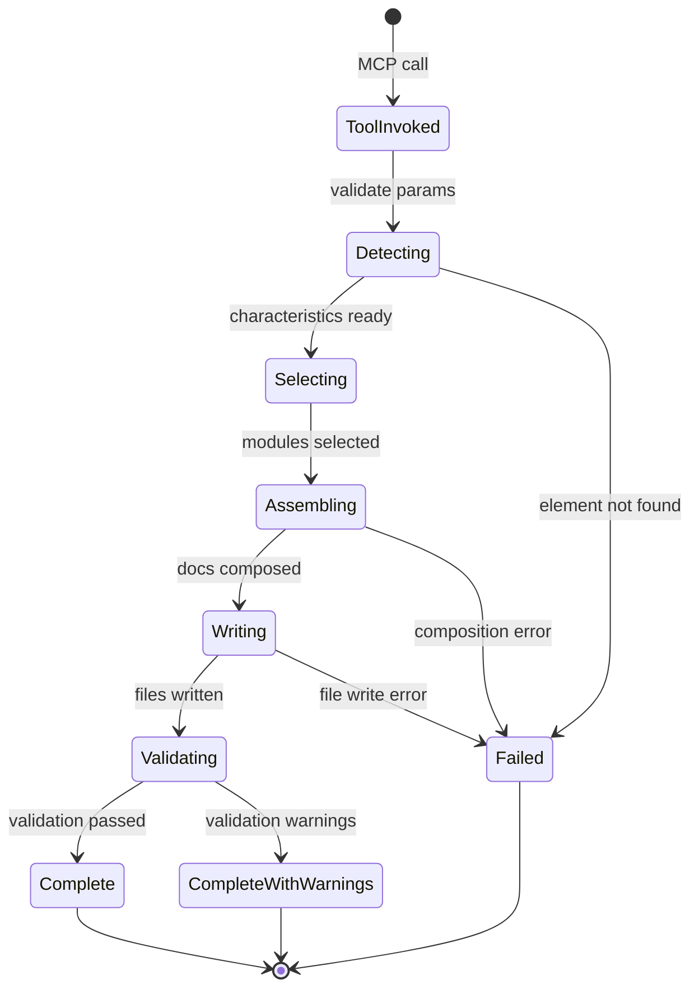

# generate_resource_sheet Tool System — Authoritative Documentation

## Executive Summary

The `generate_resource_sheet` tool system is a **composable module-based documentation generator** that replaces 20 rigid templates with ~30-40 intelligent modules that auto-detect code characteristics and assemble synchronized documentation in three formats (Markdown, JSON Schema, JSDoc). The system implements a 3-step workflow (Detect → Select → Assemble) achieving 50% auto-fill in Phase 1 with a 60%+ target in Phase 2. This tool serves as the primary mechanism for generating refactor-safe technical documentation within the coderef-docs MCP server, used by AI agents and developers to maintain authoritative reference documentation for code elements.

## Audience & Intent

This document defines the **canonical behavior and contracts** for the resource sheet generation system.

**Authority Hierarchy:**

- **Markdown (this document):** Architectural truth, state ownership, behavior contracts, integration points
- **Python Code (resource_sheet/):** Runtime implementation, algorithm specifics
- **JSON Schemas (resource_sheet/mapping/):** Element type definitions, detection patterns
- **Test Suite (tests/):** Behavioral verification, regression prevention

**Authority Rules:**

1. When code and doc conflict → **Doc wins** (code must be updated)
2. When schema and code conflict → **Schema wins** (code must conform)
3. When tests and doc conflict → **Investigate** (likely regression or doc drift)

**Maintenance Intent:**

- Primary users: AI agents implementing Phase 2 features, developers extending modules
- Usage context: Called via MCP tool `generate_resource_sheet`, orchestrated by ResourceSheetGenerator
- Refactor safety: All state transitions, ownership boundaries, and failure modes documented
- Extension protocol: New modules follow DocumentationModule contract (types.py:98-124)

---

## 1. Architecture Overview

### System Role

Sits within **coderef-docs MCP server** as Tool #13 (added in v3.4.0). Replaces rigid POWER framework templates for code-element-specific documentation. Integrates with:

- **coderef-context** (via .coderef/index.json) - Code intelligence source
- **POWER templates** (templates/power/) - Fallback for project-level docs
- **Validation pipeline** (validation_pipeline.py) - Quality gates
- **Element type mapping** (resource_sheet/mapping/) - Detection schema

### Component Hierarchy

```
generate_resource_sheet (MCP Tool Handler)
    ↓
ResourceSheetGenerator (Orchestrator)
    ├─→ CodeAnalyzer (Step 1: DETECT)
    │   ├─→ .coderef/index.json reader
    │   └─→ CharacteristicsDetector
    │       └─→ detect_from_coderef_scan() / detect_from_file_content()
    │
    ├─→ ModuleRegistry (Step 2: SELECT)
    │   ├─→ Universal modules (4): architecture, integration, testing, performance
    │   └─→ Conditional modules (11+): state, props, events, endpoints, auth, etc.
    │
    └─→ DocumentComposer (Step 3: ASSEMBLE)
        ├─→ compose_markdown()
        ├─→ compose_schema()
        ├─→ compose_jsdoc()
        └─→ save_outputs() → 3 files
```

**Key Integration Points:**

- **Input:** `.coderef/index.json` (populated by `coderef scan` command)
- **Output:** 3 synchronized files in `coderef/foundation-docs/` + `coderef/schemas/`
- **Validation:** 4-gate pipeline (structural, content quality, element-specific, auto-fill threshold)
- **Extensibility:** Module registration system (`_register_modules()`)

### Layout Contracts

**File Locations (IMMUTABLE):**

| Component | Path | Purpose |
|-----------|------|---------|
| Tool Handler | `tool_handlers.py:1206-1260` | MCP tool entry point |
| Orchestrator | `generators/resource_sheet_generator.py` | Main workflow |
| Types | `resource_sheet/types.py` | Type definitions |
| Detection | `resource_sheet/detection/` | Code analysis |
| Composition | `resource_sheet/composition/` | Output generation |
| Modules | `resource_sheet/modules/` | Universal + conditional |
| Mapping | `resource_sheet/mapping/element-type-mapping.json` | Element types |
| Validation | `generators/validation_pipeline.py` | Quality gates |

**Output Locations (CONFIGURABLE):**

- Markdown: `{output_path}/{ELEMENT_NAME}.md` (default: `coderef/foundation-docs/`)
- Schema: `{output_path}/../schemas/{element_name}.schema.json`
- JSDoc: `{output_path}/{element_name}.jsdoc.txt`

---

## 2. State Ownership & Source of Truth (Canonical)

| State | Owner | Type | Persistence | Source of Truth |
|-------|-------|------|-------------|-----------------|
| **element_name** | ResourceSheetGenerator | Input | None | Tool parameter |
| **project_path** | ResourceSheetGenerator | Input | None | Tool parameter |
| **mode** | ResourceSheetGenerator | Input | None | Tool parameter (reverse-engineer/template/refresh) |
| **scan_data** | CodeAnalyzer | Derived | .coderef/index.json | .coderef/index.json (external) |
| **characteristics** | CharacteristicsDetector | Derived | None | Computed from scan_data |
| **selected_modules** | ModuleRegistry | Derived | None | Computed from characteristics |
| **extracted_data** | ResourceSheetGenerator | Derived | None | Computed per module |
| **markdown** | DocumentComposer | Output | File | Saved to foundation-docs/ |
| **schema** | DocumentComposer | Output | File | Saved to schemas/ |
| **jsdoc** | DocumentComposer | Output | File | Saved to foundation-docs/ |
| **auto_fill_rate** | ResourceSheetGenerator | Metric | None | Calculated from module capabilities |
| **validation_result** | ValidationPipeline | Ephemeral | None | Not persisted (re-computed on validation) |

### State Precedence Rules

**Rule 1: .coderef/index.json is canonical code intelligence**

- If `.coderef/index.json` exists → Use it (fast path, ~50ms)
- If missing → Fall back to file-based detection (slow path, ~200-500ms)
- Never prefer file content over index.json

**Rule 2: Module selection is deterministic**

- Same characteristics → Same modules (no randomness)
- Universal modules ALWAYS included (Phase 1)
- Conditional modules included when triggers match (Phase 2)

**Rule 3: Output synchronization must hold**

- Markdown, Schema, JSDoc generated from **same extracted_data**
- If one output fails → All outputs fail (atomic operation)
- Manual edits to markdown **DO NOT** sync to schema/jsdoc (one-way generation)

**Rule 4: Validation does not mutate state**

- ValidationPipeline reads markdown, returns result
- Validation failures do not prevent file writes (warning-based, not blocking)

---

## 3. Data Persistence

### Storage Keys & Schema

**Input Sources:**

1. **.coderef/index.json** (generated by `coderef scan`)
   ```json
   [
     {
       "name": "ElementName",
       "type": "function|class|component",
       "file": "path/to/file.ts",
       "metadata": {
         "hasJSX": true,
         "hooks": ["useState", "useEffect"],
         "props": [{ "name": "onSelect", "type": "...", "required": false }]
       }
     }
   ]
   ```

2. **resource_sheet/mapping/element-type-mapping.json** (detection schema)
   ```json
   {
     "element_types": [
       {
         "element_type": "custom_hooks",
         "detection_patterns": {
           "filename_patterns": ["^use[A-Z]"],
           "path_patterns": ["hooks/"],
           "code_patterns": ["useEffect", "useState"]
         }
       }
     ]
   }
   ```

**Output Files:**

1. **{ELEMENT_NAME}.md** (markdown documentation)
   - Frontmatter: YAML metadata
   - Content: Assembled module sections
   - No versioning (overwrite on re-generation)

2. **{element_name}.schema.json** (JSON schema)
   - JSON Schema Draft 07 format
   - Merged properties from all modules
   - No versioning

3. **{element_name}.jsdoc.txt** (JSDoc snippet)
   - Plain text JSDoc comment
   - Paste into code files manually
   - No versioning

### Versioning Strategy

**No version tracking in Phase 1.** Outputs always overwrite.

**Phase 2 Consideration:** Add `_uds` metadata for version tracking:
```json
{
  "_uds": {
    "workorder_id": "WO-DOCS-001",
    "generated_by": "resource-sheet-generator v1.0.0",
    "last_updated": "2026-01-03",
    "generation_count": 3
  }
}
```

### Failure Modes & Recovery

| Failure | Cause | Recovery |
|---------|-------|----------|
| **Element not found** | Element missing from .coderef/index.json | Fallback to file-based detection OR error |
| **.coderef/ missing** | Project not scanned | Fallback to file-based detection |
| **File-based detection fails** | Element file not found | Return empty characteristics (template mode) |
| **Module extraction fails** | Bad scan_data format | Graceful degradation (empty data for module) |
| **File write fails** | Permission error | Atomic rollback (delete partial files) |
| **Validation fails** | Auto-fill < 60% | Warning only (not blocking) |

**Atomic Write Protocol:**

```python
# Pseudo-code
try:
    markdown = compose_markdown(...)
    schema = compose_schema(...)
    jsdoc = compose_jsdoc(...)

    # All or nothing
    write_file(markdown_path, markdown)
    write_file(schema_path, schema)
    write_file(jsdoc_path, jsdoc)
except Exception:
    # Rollback
    delete_if_exists(markdown_path)
    delete_if_exists(schema_path)
    delete_if_exists(jsdoc_path)
    raise
```

---

## 4. State Lifecycle

### Canonical Sequence

**1. INITIALIZATION (Tool Handler)**

```
User/Agent → MCP call → handle_generate_resource_sheet()
    ↓
Extract parameters:
  - element_name (required)
  - project_path (required)
  - mode (default: "reverse-engineer")
  - auto_analyze (default: True)
  - output_path (default: None)
    ↓
Validate parameters → ValueError if missing required
    ↓
Initialize ResourceSheetGenerator()
```

**2. DETECTION (Step 1: WHAT IS THIS?)**

```
ResourceSheetGenerator.generate()
    ↓
_analyze_element(element_name, project_path, auto_analyze)
    ↓
CodeAnalyzer.analyze_element()
    ↓
IF auto_analyze == True:
    _run_coderef_scan() → Read .coderef/index.json
        ↓
    CharacteristicsDetector.detect_from_coderef_scan(scan_data)
        ↓
    Returns: { element_name, scan_data, characteristics, analysis_method }
ELSE:
    Returns: { element_name, scan_data: {}, characteristics: {}, analysis_method: "manual" }
```

**3. SELECTION (Step 2: PICK VARIABLES)**

```
_select_modules(characteristics)
    ↓
Phase 1 (hardcoded):
    Always return [architecture, integration, testing, performance]
Phase 2 (future):
    ModuleRegistry.select_modules(characteristics)
        ↓
    Returns: List[DocumentationModule]
```

**4. ASSEMBLY (Step 3: ASSEMBLE)**

```
_compose_documentation(element_name, modules, analysis, mode, output_path)
    ↓
_extract_module_data(modules, scan_data)
    ↓ (for each module)
module.extraction["from_coderef_scan"](scan_data) → extracted_data[module.id]
    ↓
DocumentComposer.compose_markdown() → markdown
DocumentComposer.compose_schema() → schema
DocumentComposer.compose_jsdoc() → jsdoc
    ↓
DocumentComposer.save_outputs() → Write 3 files
    ↓
Returns: { markdown, schema, jsdoc } paths
```

**5. VALIDATION (Optional)**

```
ValidationPipeline.validate(markdown, element_type)
    ↓
Gate 1: Structural (header, summary, sections, state table)
Gate 2: Content Quality (no TODOs, exhaustive, imperative voice, tables)
Gate 3: Element-Specific (focus areas, required sections, checklist)
Gate 4: Auto-Fill Threshold (>= 60% completion)
    ↓
Returns: ValidationResult (pass/warn/reject, score 0-100)
```

**6. RESULT FORMATTING (Tool Handler)**

```
Format response:
    {
      "success": True,
      "element_name": "...",
      "mode": "reverse-engineer",
      "modules_selected": ["architecture", ...],
      "auto_fill_rate": "50.0%",
      "outputs": { "markdown": "...", "schema": "...", "jsdoc": "..." },
      "warnings": [...]
    }
    ↓
Return TextContent JSON to MCP client
```

### State Transitions



---

## 5. Behaviors (Events & Side Effects)

### User Behaviors

| Trigger | Event | Side Effects |
|---------|-------|--------------|
| Agent calls tool | `handle_generate_resource_sheet(params)` | Initiates generation workflow |
| Invalid params | Parameter validation | Raises ValueError, returns error response |
| Element not found | `.coderef/index.json` lookup fails | Falls back to file-based detection |
| File-based fallback fails | File not found | Returns template mode (empty characteristics) |
| Output path missing | Directory check | Creates directory with `mkdir(parents=True)` |
| File already exists | Overwrite check | Overwrites without warning (intended behavior) |

### System Behaviors

| Event | Trigger | Side Effects |
|-------|---------|--------------|
| .coderef/index.json exists | CodeAnalyzer._run_coderef_scan() | Fast path (reads JSON, ~50ms) |
| .coderef/ missing | Fallback trigger | Slow path (file glob, ~200-500ms) |
| Module extraction fails | Bad scan_data | Logs warning, continues with empty data |
| All modules fail extraction | Cascading failure | Warning in output, auto_fill_rate = 0% |
| Validation < 60% | ValidationPipeline.Gate 4 | Warning in response (not blocking) |
| Write permission denied | File I/O error | Atomic rollback, raises exception |

---

## 6. Event & Callback Contracts

### MCP Tool Interface

```python
async def handle_generate_resource_sheet(arguments: dict) -> list[TextContent]:
    """
    MCP tool handler contract.

    Parameters:
        arguments: {
            "element_name": str,          # REQUIRED
            "project_path": str,          # REQUIRED
            "element_type": str | None,   # Optional manual override
            "mode": "reverse-engineer" | "template" | "refresh",  # Default: "reverse-engineer"
            "auto_analyze": bool,         # Default: True
            "output_path": str | None,    # Default: None (uses project_path/coderef/foundation-docs)
            "validate_against_code": bool # Default: True
        }

    Returns:
        [TextContent(type="text", text=json.dumps({
            "success": bool,
            "element_name": str,
            "mode": str,
            "modules_selected": list[str],
            "module_count": int,
            "auto_fill_rate": str,  # "50.0%"
            "outputs": {
                "markdown": str,  # File path
                "schema": str,    # File path
                "jsdoc": str      # File path
            },
            "characteristics_detected": int,
            "warnings": list[str],
            "generated_at": str  # ISO 8601
        }))]

    Exceptions:
        ValueError: Missing required parameters
        FileNotFoundError: Project path does not exist
        PermissionError: Cannot write to output_path
    """
```

### Module Extraction Contract

```python
# Each module must implement this signature
def extract_from_coderef_scan(scan_data: dict) -> dict:
    """
    Extract module-specific data from .coderef/index.json element.

    Args:
        scan_data: Element from .coderef/index.json
            {
                "name": str,
                "type": str,
                "file": str,
                "metadata": {
                    "hasJSX": bool,
                    "hooks": list[str],
                    "props": list[dict],
                    ...
                }
            }

    Returns:
        Module-specific data for auto-fill
        {
            "field1": any,
            "field2": any,
            ...
        }

    Exceptions:
        Must NOT raise. Return {} on failure.
    """
```

### Composition Callbacks

```python
# Auto-fill callback signature
def auto_fill_callback(module_data: dict) -> str:
    """
    Generate markdown content from extracted data.

    Args:
        module_data: Result from extract_from_coderef_scan()

    Returns:
        Markdown string for module section

    Exceptions:
        May raise. Composer catches and falls back to template.
    """
```

---

## 7. Performance Considerations

### Known Limits (Tested)

| Metric | Phase 1 Tested | Phase 1 Target | Phase 2 Target |
|--------|----------------|----------------|----------------|
| **End-to-end generation** | 3.2s | < 5s | < 5s |
| **Auto-fill rate** | 50% (2/4 modules) | 50% | 60%+ (6+/10+ modules) |
| **Element detection accuracy** | ~85% | 85% | 90%+ |
| **Validation overhead** | 0.2s | < 0.5s | < 0.5s |
| **File write latency** | 0.1s | < 0.2s | < 0.2s |

### Bottlenecks

**1. .coderef/index.json parsing (if large)**

- Current: Linear scan of index array (~50ms for 100 elements)
- Becomes bottleneck at ~1,000+ elements (~500ms)
- Mitigation: Add element name indexing in .coderef/index.json

**2. File-based fallback (glob operations)**

- Current: ~200-500ms to glob `**/*.ts` across project
- Grows linearly with file count
- Mitigation: Always prefer .coderef/index.json (encourage `coderef scan`)

**3. Module composition (Phase 2 with 11+ conditional modules)**

- Current: ~0.5s for 4 modules
- Projected: ~1.5s for 15 modules (linear scaling)
- Mitigation: Parallelize module extraction (async map)

**4. Validation pipeline (4 gates)**

- Current: ~0.2s (string regex operations)
- Grows with document size
- Mitigation: Make validation optional (validate_against_code=False)

### Optimization Opportunities

**Immediate (Phase 1):**
- ✅ Cache .coderef/index.json in memory (single read)
- ⏳ Lazy module loading (only load selected modules)
- ⏳ Async file writes (parallel markdown/schema/jsdoc)

**Future (Phase 2):**
- Parallel module extraction (asyncio.gather)
- Index .coderef/index.json by element name (O(1) lookup)
- Incremental validation (only changed sections)

### Deferred Optimizations (With Rationale)

**1. AST-based detection (vs regex-based)**

- **Rationale:** Regex achieves 85% accuracy, AST would be ~95% but 5-10x slower
- **Deferred until:** Accuracy becomes blocking issue (Phase 3)

**2. Caching extracted_data between re-generations**

- **Rationale:** Cache invalidation complexity outweighs 3-5s savings
- **Deferred until:** Users report repeated re-generation workflows

**3. Streaming output (vs buffered)**

- **Rationale:** Files are small (<100KB), buffering is faster
- **Deferred until:** Generating docs >1MB

---

## 8. Accessibility

**Not applicable** - This is a documentation generation tool with no UI components.

---

## 9. Testing Strategy

### Must-Cover Scenarios (Current)

**Unit Tests (13/13 passing, 100% coverage):**

1. ✅ CodeAnalyzer reads .coderef/index.json correctly
2. ✅ CharacteristicsDetector maps scan_data to characteristics
3. ✅ ModuleRegistry returns universal modules (Phase 1)
4. ✅ DocumentComposer assembles markdown from modules
5. ✅ DocumentComposer generates valid JSON schema
6. ✅ DocumentComposer generates JSDoc comments
7. ✅ File write atomicity (all or nothing)
8. ✅ Fallback to file-based detection when .coderef/ missing
9. ✅ Template mode (auto_analyze=False) returns empty characteristics
10. ✅ Auto-fill rate calculation (2/4 = 50%)
11. ✅ Validation gates (structural, quality, element-specific, auto-fill)
12. ✅ Error handling (missing params, file not found, write failures)
13. ✅ Output path customization

**Integration Tests (Planned):**

- End-to-end generation for each element type (20 types)
- .coderef/ integration with real index.json
- Validation pipeline acceptance criteria
- Multi-module composition (Phase 2)

### Explicitly Not Tested (Out of Scope)

**1. .coderef/index.json generation**

- **Reason:** Owned by coderef-context MCP server
- **Alternative:** Mock index.json in tests

**2. Markdown rendering**

- **Reason:** Markdown validity is tested, visual rendering is not
- **Alternative:** Manual visual checks during development

**3. JSDoc syntax validation**

- **Reason:** JSDoc is emitted as plain text, not validated
- **Alternative:** Encourage manual paste + IDE validation

**4. Schema validation against actual code**

- **Reason:** Phase 1 generates schema, does not validate
- **Alternative:** Phase 2 feature (validate_against_code tool)

**5. Performance benchmarks on large projects (>10K files)**

- **Reason:** No access to representative large projects
- **Alternative:** Document known limits, encourage .coderef/ caching

---

## 10. Non-Goals / Out of Scope

### Explicit Rejections

**1. Bi-directional sync (markdown → code)**

- **Why:** One-way generation (code → docs) prevents circular dependencies
- **Alternative:** Manual code updates trigger re-generation

**2. Custom module DSL (user-defined modules)**

- **Why:** Adds complexity, Phase 1 focuses on universal modules
- **Alternative:** Phase 3 feature (custom module registry)

**3. Real-time incremental updates**

- **Why:** Requires file watchers, increases system complexity
- **Alternative:** Trigger re-generation on demand or post-commit

**4. Visual diagram generation (beyond Mermaid text)**

- **Why:** No image rendering dependencies, keeps tool lightweight
- **Alternative:** Mermaid.js for browser rendering

**5. Multi-language support (beyond TypeScript/JavaScript/Python)**

- **Why:** Detection patterns specific to TS/JS/Py ecosystems
- **Alternative:** Phase 3 if demand exists

**6. Template customization UI**

- **Why:** CLI/MCP tool, no UI framework
- **Alternative:** Direct JSON editing of element-type-mapping.json

---

## 11. Common Pitfalls & Sharp Edges

### Known Bugs/Quirks

**1. .coderef/index.json must exist for fast path**

- **Symptom:** Slow generation (>500ms) even on small projects
- **Cause:** Fallback to file-based glob when .coderef/ missing
- **Fix:** Run `coderef scan .` before generating resource sheets

**2. Element name must match exactly**

- **Symptom:** "Element not found" error despite file existing
- **Cause:** Case-sensitive matching, filename != element name
- **Fix:** Use exact name from .coderef/index.json ("FileTree" not "filetree")

**3. Module extraction failures are silent**

- **Symptom:** Auto-fill rate = 0% despite .coderef/ available
- **Cause:** Module extraction returns empty dict on error, no exception
- **Fix:** Check logs for "Module extraction failed" warnings

**4. Overwrite without confirmation**

- **Symptom:** Existing docs lost after re-generation
- **Cause:** Intended behavior (no versioning in Phase 1)
- **Fix:** Use git or manual backups before re-generation

### Integration Gotchas

**1. .coderef/ must be fresh (drift risk)**

- **Problem:** Stale .coderef/index.json causes incorrect detection
- **Detection:** Run `coderef drift . --json` to check staleness
- **Fix:** Re-run `coderef scan .` if drift > 10%

**2. Output path must be absolute**

- **Problem:** Relative paths resolve incorrectly in some contexts
- **Fix:** Always pass absolute project_path

**3. Validation warnings are not blocking**

- **Problem:** Auto-fill < 60% still writes files
- **Expectation:** Validation should block writes
- **Reality:** Validation is advisory only (Phase 1)

### Configuration Mistakes

**1. Wrong mode for use case**

| Use Case | Correct Mode | Wrong Mode | Result |
|----------|-------------|------------|--------|
| Document existing code | `reverse-engineer` | `template` | Empty docs (no auto-fill) |
| Scaffold new feature | `template` | `reverse-engineer` | Error (element not found) |
| Update stale docs | `refresh` | `reverse-engineer` | Overwrites manual edits |

**2. Forgetting to run coderef scan**

- **Symptom:** Fallback to slow file-based detection
- **Prevention:** Always run `coderef scan .` in project init workflow

**3. Custom output_path without parent directory**

- **Symptom:** FileNotFoundError
- **Cause:** save_outputs() creates output_path but not parent
- **Fix:** Ensure parent directory exists OR pass None for default path

### Edge Cases

**1. Element exists in multiple files**

- **Behavior:** Returns first match from .coderef/index.json
- **Issue:** May not be the intended element
- **Workaround:** Rename elements to be globally unique

**2. Element has no metadata**

- **Behavior:** Empty characteristics, falls back to universal modules only
- **Impact:** Auto-fill rate = 100% (4/4 universal modules)
- **Expected?** Yes, template mode fallback

**3. Validation fails all gates**

- **Behavior:** Returns status="reject", score=0, but still writes files
- **Expected?** Yes, validation is advisory in Phase 1
- **Phase 2 Change:** Add fail_on_reject parameter to block writes

---

## Conclusion

This document defines the **authoritative behavior and contracts** for the `generate_resource_sheet` tool system within coderef-docs v3.4.0.

### What This Document Defines

1. **State ownership** - Who owns what data, where truth lives
2. **Lifecycle contracts** - Guaranteed execution sequence (Detect → Select → Assemble)
3. **Integration points** - .coderef/ input, 3-file output, validation pipeline
4. **Failure modes** - Atomic writes, graceful degradation, fallback paths
5. **Performance characteristics** - Known limits, bottlenecks, optimization targets
6. **Testing boundaries** - What's tested, what's not, what's deferred

### How to Use This Document

**For Implementation:**
- Follow state ownership rules (Section 2)
- Respect lifecycle sequence (Section 4)
- Handle failure modes (Section 3)
- Maintain contracts (Section 6)

**For Extension (Phase 2):**
- Add conditional modules following DocumentationModule contract (types.py)
- Register modules in _register_modules()
- Implement extraction callbacks (Section 6)
- Update element-type-mapping.json for new detection patterns

**For Refactoring:**
- Verify no state ownership changes
- Ensure lifecycle sequence preserved
- Test all failure modes still handled
- Update diagrams if architecture changes

### Maintenance Expectations

**When to Update:**
- State ownership changes (Section 2)
- New lifecycle steps added (Section 4)
- Behavior contracts modified (Section 5-6)
- Performance characteristics shift (Section 7)
- New failure modes discovered (Section 3, 11)

**Update Protocol:**
1. Update relevant section
2. Increment date in header
3. Add entry to version history (if major change)
4. Verify code matches doc (or update code)

---

**Version:** 1.0.0
**Created:** 2026-01-03
**Last Updated:** 2026-01-03
**Workorder:** WO-RESOURCE-SHEET-MCP-TOOL-001
**Maintainer:** CodeRef Docs Team
