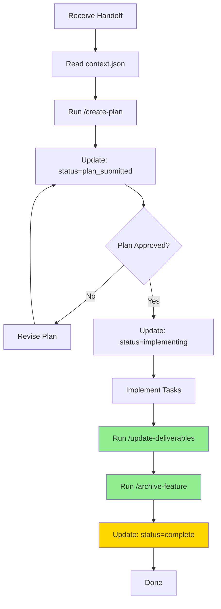
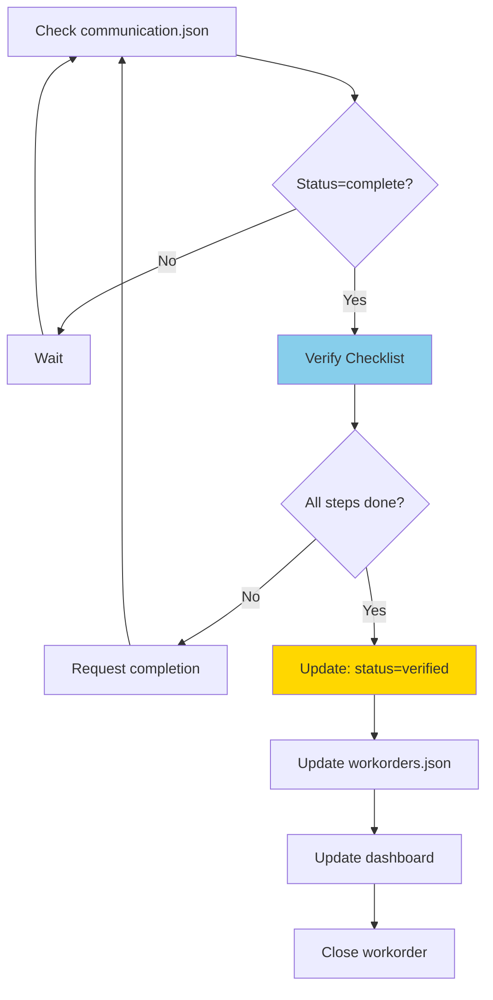

# Workflow Separation: Agent vs Orchestrator Responsibilities

**Version**: 1.0.0
**Last Updated**: 2025-12-20
**Purpose**: Define clear boundaries between agent execution and orchestrator verification

---

## Introduction

This document clarifies the separation of responsibilities between **agents** (who execute work) and the **orchestrator** (who delegates and verifies). This separation is critical for maintaining clean workflows and preventing role confusion.

### Core Principle

> **Agents execute everything. Orchestrator verifies everything.**

The orchestrator follows the **"Identify, Delegate, Collect"** principle:
1. **Identify** - Recognize work that needs to be done
2. **Delegate** - Hand off to appropriate agent
3. **Collect** - Verify completion and aggregate results

The orchestrator **NEVER** executes work in target projects. Each project has its own embedded agent with full context.

---

## Agent Workflow (Complete Lifecycle)



### Agent Phase Details

| Step | Action | Tool/Command | Updates |
|------|--------|--------------|---------|
| 1 | Receive work | Read HANDOFF.md | - |
| 2 | Plan | `/create-plan` | communication.json → `plan_submitted` |
| 3 | Implement | Code changes | communication.json → `implementing` |
| 4 | **Capture metrics** | `/update-deliverables` | DELIVERABLES.md (LOC, commits, time) |
| 5 | **Archive** | `/archive-feature` | Move to `coderef/archived/` |
| 6 | **Mark complete** | Update status | communication.json → `complete` |

---

## Orchestrator Workflow (Verification Only)



### Orchestrator Phase Details

| Step | Action | What Orchestrator Checks | Tool |
|------|--------|-------------------------|------|
| 1 | Verify completion | Read communication.json | - |
| 2 | Check deliverables | DELIVERABLES.md populated? | - |
| 3 | Check archive | Feature in `coderef/archived/`? | - |
| 4 | Update tracking | communication.json → `verified` | - |
| 5 | Update dashboard | workorders.json, index.html | - |
| 6 | Close workorder | Mark as closed | - |

**Critical**: Orchestrator **NEVER** runs `/update-deliverables`, `/archive-feature`, or modifies files in target projects.

---

## Correct vs Incorrect Behavior

### ✅ Correct: Agent Completes Everything

```
Agent receives handoff
    ↓
Agent implements feature
    ↓
Agent runs /update-deliverables  ← AGENT DOES THIS
    ↓
Agent runs /archive-feature      ← AGENT DOES THIS
    ↓
Agent sets status="complete"
    ↓
Orchestrator verifies checklist
    ↓
Orchestrator sets status="verified"
```

**Result**: Clean separation, agent owns full lifecycle.

### ❌ Incorrect: Orchestrator Does Agent Work

```
Agent receives handoff
    ↓
Agent implements feature
    ↓
Agent sets status="complete"  ← TOO EARLY!
    ↓
Orchestrator sees incomplete DELIVERABLES.md
    ↓
Orchestrator runs /update-deliverables  ← WRONG! Violates role
    ↓
Orchestrator runs /archive-feature      ← WRONG! Stepping in
    ↓
Orchestrator sets status="verified"
```

**Result**: Role confusion, orchestrator executing instead of delegating.

---

## Validation Criteria

### How to Know Work is Properly Complete

**Agent Self-Checklist** (before setting status="complete"):
- [ ] All implementation tasks finished
- [ ] All tests passing
- [ ] `/update-deliverables` completed
- [ ] DELIVERABLES.md shows real metrics (not "TBD")
- [ ] `/archive-feature` completed
- [ ] Feature exists in `coderef/archived/{feature-name}/`
- [ ] communication.json status set to "complete"

**Orchestrator Verification** (before setting status="verified"):
- [ ] communication.json status is "complete"
- [ ] DELIVERABLES.md exists and has metrics
- [ ] Metrics are populated (LOC, commits, time not "TBD")
- [ ] Feature archived to `coderef/archived/`
- [ ] Archive index updated
- [ ] All files in target project (orchestrator didn't touch them)

---

## Success Indicators

### Signs of Healthy Workflow

✅ Agents consistently complete ALL steps before marking "complete"
✅ DELIVERABLES.md always populated with real metrics
✅ Features always archived automatically by agents
✅ Orchestrator only reads files, never writes in target projects
✅ communication.json accurately reflects current status
✅ No manual intervention needed for routine completions

### Signs of Broken Workflow

❌ DELIVERABLES.md frequently has "TBD" values
❌ Features left in `coderef/working/` after completion
❌ Orchestrator running agent commands (update-deliverables, archive-feature)
❌ Incomplete work marked as "complete"
❌ Manual cleanup required after "completion"

---

## Benefits of Proper Separation

### For Agents:
- Clear expectations: know exactly what "done" means
- Ownership: responsible for complete lifecycle
- Autonomy: no waiting for orchestrator to finish work

### For Orchestrator:
- Scalability: can delegate to many agents without execution bottleneck
- Oversight: verify completion without doing the work
- Consistency: standard process across all workorders

### For The System:
- Traceability: complete git history per agent
- Metrics: accurate DELIVERABLES.md from actual work
- Clean state: archived features don't clutter working directory

---

## Common Questions

### Q: Why can't orchestrator help finish incomplete work?

**A**: Violates "identify, delegate, collect" principle. If work is incomplete, orchestrator should **redirect** to agent, not execute. Orchestrator lacks project context that embedded agents have.

### Q: What if agent forgets to run `/update-deliverables`?

**A**: Orchestrator catches this during verification (DELIVERABLES.md has "TBD" values) and sends work back to agent for completion. Do NOT run the command for them.

### Q: When should orchestrator touch files in target projects?

**A**: **NEVER**. Orchestrator only reads for verification. All file modifications happen through agents.

---

## Enforcement Mechanisms

### Automatic

- `/archive-feature` checks DELIVERABLES.md status before archiving
- `/update-deliverables` validates git history and populates metrics
- communication.json schema validation

### Manual

- Code reviews of orchestrator actions (should see NO file writes to target projects)
- Periodic audits of DELIVERABLES.md (should have NO "TBD" values)
- Workorder retrospectives (identify where orchestrator stepped in)

---

## Migration Guide

### If You've Been Doing It Wrong

**Old Pattern** (orchestrator finishing work):
```bash
# In orchestrator terminal:
/update-deliverables  # ❌ STOP DOING THIS
/archive-feature      # ❌ STOP DOING THIS
```

**New Pattern** (agent finishes work):
```bash
# In agent terminal (target project):
/update-deliverables  # ✅ Agent does this
/archive-feature      # ✅ Agent does this

# In orchestrator terminal:
# Just verify completion, no commands
```

### Transition Steps

1. Update CLAUDE.md in orchestrator (document new workflow)
2. Update HANDOFF.md template (add completion checklist)
3. Train agents on full workflow
4. Monitor first few handoffs closely
5. Audit for orchestrator file writes (should be zero)

---

## Version History

- **1.0.0** (2025-12-20): Initial documentation of workflow separation principles

---

**Remember**: The orchestrator's job is to **verify completion**, not to **complete the work**.
