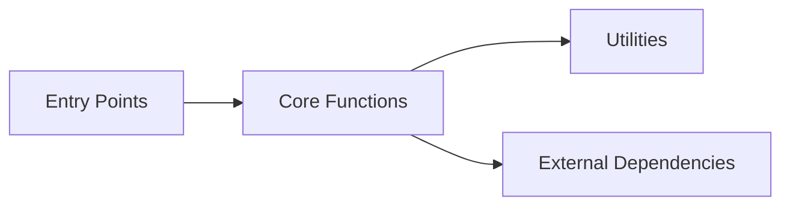

# Codebase Context

**Generated:** 2025-12-31
**Purpose:** Quick codebase understanding for humans and AI agents

## Overview

- **Source Directory:** `.`
- **Languages:** ts, tsx, js, jsx
- **Total Files:** 0
- **Total Elements:** 0

## Entry Points

*No entry points detected*

## Critical Functions

*No functions analyzed*

## Architecture Patterns

- **Error Handling:** 0 try-catch blocks
- **Barrel Exports:** 0 export-from statements
- **Decorators:** 0 decorator usages
- **Async/Await:** 0 async functions

## Dependency Graph

### Statistics

- **Nodes:** 0
- **Edges:** 0
- **Circularity:** 0.0%
- **Isolated Nodes:** 0

### Visualization

*Note: Run `pnpm start diagram ./src` for detailed dependency diagram*

## Health Metrics

- **Test Coverage:** Unknown
- **Avg Complexity:** 0.0
- **Maintainability:** Good

---

*Generated by CodeRef Context Generator*
*Run `pnpm start context ./src` to regenerate*