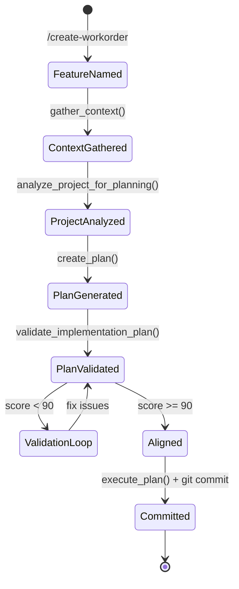
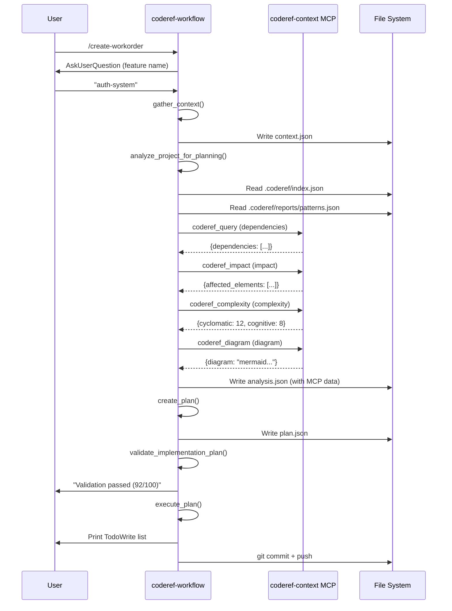

# coderef-workflow Workorder System — Authoritative Documentation

## Executive Summary

The **coderef-workflow workorder system** is an enterprise-grade MCP server that orchestrates the complete feature development lifecycle from context gathering through planning, execution tracking, and archival. It serves as the central orchestration layer in the CodeRef ecosystem, coordinating between coderef-context (code intelligence), coderef-docs (documentation), coderef-personas (expert agents), and coderef-testing (test automation). The system uses a workorder-centric architecture (WO-{FEATURE}-{CATEGORY}-{SEQUENCE}) to provide complete audit trails and enable multi-agent coordination on complex feature implementations.

## Audience & Intent

- **Markdown (this document):** Authoritative source for workorder workflow architecture, state ownership, lifecycle contracts, and integration points
- **Python code (`generators/*.py`, `tool_handlers.py`):** Runtime implementation of workflow logic, MCP tool handlers, and file I/O operations
- **JSON schemas (`plan.json`, `context.json`, `analysis.json`):** Data contracts for workflow artifacts
- **Slash commands (`.claude/commands/*.md`):** User-facing workflow entry points and documentation

**Conflict Resolution:** When discrepancies exist, this document defines the intended behavior and architecture. Code reflects current implementation state. JSON schemas are validation contracts that must not be violated.

## 1. Architecture Overview

### 1.1 System Role

coderef-workflow sits at the **orchestration layer** of the CodeRef ecosystem:

```
User/Agent → Slash Commands → MCP Tools → Generators → File System
                ↓                           ↓
         coderef-context MCP       coderef-docs MCP
         (code intelligence)       (documentation)
```

### 1.2 Component Hierarchy

```
coderef-workflow/
├── server.py                      # MCP server + tool registration
├── tool_handlers.py               # 24 MCP tool implementations
├── generators/                    # Core workflow engines
│   ├── planning_analyzer.py      # Project analysis + MCP tool integration
│   ├── planning_generator.py     # Plan.json generation
│   ├── plan_validator.py         # Quality scoring (0-100)
│   ├── review_formatter.py       # Markdown review reports
│   ├── risk_generator.py         # AI risk assessment
│   ├── handoff_generator.py      # Agent handoff context
│   ├── foundation_generator.py   # Foundation docs orchestration
│   └── changelog_generator.py    # CHANGELOG.json management
├── .claude/commands/              # 40+ slash commands (user interface)
├── coderef/workorder/            # Active feature workspaces (state storage)
├── coderef/archived/             # Completed features (historical archive)
└── coderef/workorder-log.txt     # Global audit trail
```

### 1.3 Key Integration Points

| Integration | Direction | Purpose | Contract |
|-------------|-----------|---------|----------|
| **coderef-context** | Workflow → Context | Code intelligence during planning | MCP tools: `coderef_query`, `coderef_impact`, `coderef_complexity`, `coderef_diagram` |
| **coderef-docs** | Workflow → Docs | Foundation doc generation | MCP tool: `coderef_foundation_docs` |
| **coderef-personas** | Workflow ← Personas | Expert agent activation | Agent calls workflow tools during implementation |
| **coderef-testing** | Workflow ← Testing | Test execution tracking | Testing calls workflow for deliverables updates |
| **File System** | Workflow ↔ FS | State persistence | `.coderef/`, `coderef/workorder/`, `coderef/archived/` |

## 2. State Ownership & Source of Truth (Canonical)

### 2.1 State Ownership Table

| State | Owner | Type | Persistence | Source of Truth |
|-------|-------|------|-------------|-----------------|
| **Workorder ID** | `generate_workorder_id()` | System | `plan.json` + `workorder-log.txt` | Workorder log (global authority) |
| **Feature Context** | User input | Domain | `coderef/workorder/{feature}/context.json` | context.json (immutable after creation) |
| **Project Analysis** | `PlanningAnalyzer` | System | `coderef/workorder/{feature}/analysis.json` | analysis.json (regenerated per planning run) |
| **Implementation Plan** | `PlanningGenerator` | Domain | `coderef/workorder/{feature}/plan.json` | plan.json (versioned, tracks status) |
| **Task Status** | `update_task_status()` | Domain | `plan.json` section 6 | plan.json task array |
| **Agent Assignments** | `assign_agent_task()` | System | `coderef/workorder/{feature}/communication.json` | communication.json (multi-agent only) |
| **Deliverables Metrics** | Git history + user input | Domain | `coderef/workorder/{feature}/DELIVERABLES.md` | DELIVERABLES.md (updated post-implementation) |
| **Telemetry Data** | `PlanningAnalyzer.telemetry` | System | In-memory (not persisted) | In-memory dict during analysis only |
| **Archive Index** | `archive_feature()` | System | `coderef/archived/index.json` | index.json (append-only log) |

### 2.2 State Precedence Rules

**Rule 1: Workorder ID Uniqueness**
- Global uniqueness enforced by `workorder-log.txt` (append-only)
- Format: `WO-{FEATURE}-{CATEGORY}-{SEQUENCE}` (e.g., `WO-AUTH-SYSTEM-001`)
- Collision detection: Check log before assigning new ID
- **Authority:** workorder-log.txt > plan.json META_DOCUMENTATION

**Rule 2: Context Immutability**
- `context.json` is **write-once** after `gather_context()`
- Modifications require manual edit or re-run workflow
- **Authority:** Original context.json (no overwrite without user confirmation)

**Rule 3: Analysis Staleness**
- `analysis.json` is **regenerated** on every `/create-workorder` run
- Stale data detected via `.coderef/reports/drift.json` (>10% = warning)
- **Authority:** Latest analysis.json from most recent planning run

**Rule 4: Plan Versioning**
- `plan.json` tracks status: `planning` → `in_progress` → `completed`
- Task status updates are **incremental patches** (not full rewrites)
- **Authority:** plan.json with highest `META_DOCUMENTATION.version` (if versioned)

**Rule 5: Multi-Agent Coordination**
- `communication.json` exists ONLY for multi-agent features
- Agent-specific state stored in `agents/{agent_number}/` subdirectories
- **Authority:** communication.json for assignments, individual DELIVERABLES.md for metrics

## 3. Data Persistence

### 3.1 Storage Keys and Schema

#### context.json (Feature Requirements)
```json
{
  "feature_name": "string (alphanumeric + hyphens + underscores)",
  "description": "string (what to build)",
  "goal": "string (why)",
  "requirements": ["array of strings (must-haves)"],
  "out_of_scope": ["array of strings (explicitly excluded)"],
  "constraints": ["array of strings (technical/business limits)"],
  "decisions": {
    "key": "value (decisions made during gathering)"
  },
  "timestamp": "ISO 8601 string",
  "created_by": "string (AI agent identifier)"
}
```

**Validation:** `validate_feature_name_input()` enforces regex `^[a-zA-Z0-9_-]+$`

#### analysis.json (Project Analysis)
```json
{
  "foundation_docs": {
    "README.md": "path or null",
    "ARCHITECTURE.md": "path or null",
    "SCHEMA.md": "path or null",
    "API.md": "path or null",
    "COMPONENTS.md": "path or null"
  },
  "foundation_doc_content": {
    "ARCHITECTURE.md": "string (first 500 chars or full content)"
  },
  "inventory_data": {
    "source": "coderef_index | coderef_scan | filesystem_regex",
    "total_elements": "number",
    "elements": ["array of code elements"]
  },
  "coding_standards": ["array of strings (patterns identified)"],
  "reference_components": ["array of strings (similar code to reference)"],
  "key_patterns_identified": ["array of strings (conventions)"],
  "technology_stack": {
    "language": "string",
    "framework": "string",
    "database": "string",
    "testing": "string"
  },
  "project_structure": "monolith | multi_service | library | cli | unknown",
  "gaps_and_risks": ["array of strings (missing docs/tests/standards)"],
  "dependency_analysis": {
    "target": "string",
    "dependencies": ["array"],
    "count": "number"
  },
  "impact_analysis": {
    "affected_elements": ["array"],
    "ripple_effects": ["array"]
  },
  "complexity_analysis": {
    "cyclomatic_complexity": "number",
    "cognitive_complexity": "number"
  },
  "architecture_diagram": "string (Mermaid diagram)",
  "telemetry_summary": {
    "total_sources_used": "number",
    "coderef_file_reads": {"count": "number", "percentage": "number", "files": []},
    "mcp_tool_calls": {"count": "number", "percentage": "number", "success_rate": "number", "calls": []},
    "foundation_doc_reads": {"count": "number", "percentage": "number", "docs": []}
  }
}
```

**NEW (v1.5.0):** Added `dependency_analysis`, `impact_analysis`, `complexity_analysis`, `architecture_diagram`, and `telemetry_summary` fields from MCP tool integration.

#### plan.json (10-Section Implementation Plan)
```json
{
  "META_DOCUMENTATION": {
    "feature_name": "string",
    "workorder_id": "string (WO-XXX-YYY-###)",
    "status": "planning | in_progress | completed | blocked",
    "generated_by": "string",
    "has_context": "boolean",
    "has_analysis": "boolean",
    "validation_score": "number (0-100)",
    "created_at": "ISO 8601",
    "updated_at": "ISO 8601"
  },
  "0_PREPARATION": {
    "foundation_docs_available": [],
    "coding_standards": [],
    "reference_components": [],
    "key_patterns_identified": [],
    "technology_stack": {},
    "project_structure": "string",
    "gaps_and_risks": []
  },
  "1_EXECUTIVE_SUMMARY": {
    "feature_overview": ["3-5 bullets"],
    "key_changes": ["3-5 bullets"],
    "success_criteria_preview": ["2-3 bullets"]
  },
  "2_RISK_ASSESSMENT": {
    "breaking_changes": [],
    "dependencies": [],
    "security_concerns": [],
    "performance_concerns": [],
    "rollback_strategy": "string"
  },
  "3_CURRENT_STATE_ANALYSIS": {
    "existing_architecture": "string",
    "current_patterns": [],
    "integration_points": []
  },
  "4_KEY_FEATURES": {
    "must_have": [],
    "should_have": [],
    "could_have": [],
    "wont_have": []
  },
  "5_TASK_ID_SYSTEM": {
    "prefix_mapping": {
      "SETUP": "Environment setup",
      "IMPL": "Implementation",
      "TEST": "Testing",
      "DOC": "Documentation"
    }
  },
  "6_IMPLEMENTATION_PHASES": [
    {
      "phase_id": "string (phase_1, phase_2, etc.)",
      "phase_name": "string",
      "description": "string",
      "tasks": [
        {
          "task_id": "string (PREFIX-###)",
          "description": "string",
          "dependencies": ["array of task IDs"],
          "estimated_effort": "string",
          "status": "pending | in_progress | completed | blocked"
        }
      ]
    }
  ],
  "7_TESTING_STRATEGY": {
    "unit_tests": [],
    "integration_tests": [],
    "e2e_tests": [],
    "coverage_targets": {}
  },
  "8_SUCCESS_CRITERIA": {
    "functional": [],
    "non_functional": [],
    "acceptance": []
  },
  "9_IMPLEMENTATION_CHECKLIST": []
}
```

**Validation:** `PlanValidator.validate()` enforces 15-point quality checklist (score >= 90 recommended)

### 3.2 Versioning Strategy

**Plan Versioning:**
- No explicit version field in plan.json currently
- Status progression: `planning` → `in_progress` → `completed`
- `updated_at` timestamp tracks last modification
- **Future:** Add `version` field to META_DOCUMENTATION for v2.0

**Context Versioning:**
- No versioning (write-once)
- Use feature name + timestamp for uniqueness

**Analysis Versioning:**
- No versioning (regenerated per run)
- Telemetry tracks data freshness via drift detection

### 3.3 Failure Modes & Recovery

| Failure | Detection | Recovery |
|---------|-----------|----------|
| **context.json missing** | `PlanningGenerator.load_context()` returns None | Error: "Run /gather-context first" |
| **analysis.json missing** | `PlanningGenerator.load_analysis()` returns None | Error: "Run /analyze-for-planning first" |
| **.coderef/ missing** | `PlanningAnalyzer.check_coderef_freshness()` fails | Error: "Run `coderef scan {project}` first" |
| **.coderef/ stale (>10% drift)** | `check_coderef_freshness()` warns | Warning: "Re-scan recommended, continuing..." |
| **plan.json malformed** | `PlanValidator.validate()` < 90 score | Validation loop: fix → re-validate (max 3 iterations) |
| **Workorder ID collision** | `generate_workorder_id()` checks log | Increment sequence number |
| **MCP tool timeout** | `call_coderef_tool()` raises exception | Log error, continue with fallback (filesystem regex) |
| **Partial plan generation** | Generator crashes mid-creation | Save partial plan.json with TODO markers |

### 3.4 Cross-Tab/Multi-Client Sync

**Not Applicable:** coderef-workflow is a file-based system, not a web app. Concurrency handled by:
- File locking (OS-level) for workorder-log.txt writes
- Git for version control across agents/developers
- No real-time sync required (batch workflow)

## 4. State Lifecycle

### 4.1 Canonical Workflow Sequence

```
1. INITIALIZATION
   └─> /create-workorder invoked
       ├─> AskUserQuestion for feature_name
       └─> Store in memory (not persisted yet)

2. HYDRATION (Context Gathering)
   └─> User provides context (description, goal, requirements)
       ├─> Parse user input
       ├─> Call gather_context() MCP tool
       └─> Write coderef/workorder/{feature}/context.json

3. VALIDATION (Analysis)
   └─> Call analyze_project_for_planning() MCP tool
       ├─> Check .coderef/ freshness (drift detection)
       ├─> Read .coderef/index.json (inventory)
       ├─> Read .coderef/reports/patterns.json (coding standards)
       ├─> Read .coderef/reports/coverage.json (test gaps)
       ├─> Call MCP tools (coderef_query, coderef_impact, coderef_complexity, coderef_diagram)
       ├─> Track telemetry (file reads, MCP calls, doc reads)
       └─> Write coderef/workorder/{feature}/analysis.json

4. MIGRATION (Plan Generation)
   └─> Call create_plan() MCP tool
       ├─> Load context.json
       ├─> Load analysis.json
       ├─> Load planning template (AI-optimized)
       ├─> Generate workorder ID (WO-{FEATURE}-{CATEGORY}-###)
       ├─> Synthesize 10-section plan
       └─> Write coderef/workorder/{feature}/plan.json

5. RUNTIME UPDATES (Validation Loop)
   └─> Call validate_implementation_plan() MCP tool
       ├─> Score plan (0-100)
       ├─> Identify issues (critical/major/minor)
       └─> If score < 90:
           ├─> Read plan.json
           ├─> Fix issues
           ├─> Write updated plan.json
           └─> Re-validate (max 3 iterations)

6. PERSISTENCE TRIGGERS (Align & Commit)
   └─> Call execute_plan() MCP tool
       ├─> Read plan.json
       ├─> Generate TodoWrite task list
       ├─> Print to terminal
       └─> Git commit all artifacts
```

### 4.2 Task Status Lifecycle

```
Task State Machine:
pending → in_progress → completed
   ↓            ↓
blocked ← ─ ─ ─ ┘

State Transitions:
- pending → in_progress: Agent starts work (update_task_status)
- in_progress → completed: Agent finishes work (update_task_status)
- in_progress → blocked: Dependency failure (update_task_status)
- blocked → in_progress: Blocker resolved (update_task_status)
- completed → TERMINAL STATE (no transitions out)
```

### 4.3 Feature Lifecycle

```
Feature State Machine:
planning → in_progress → completed → archived

State Transitions:
- planning: Plan created, not started (create_plan)
- in_progress: Agent executing tasks (first task update)
- completed: All tasks done, all success criteria met (manual/final task update)
- archived: Moved to coderef/archived/ (archive_feature)
```

## 5. Behaviors (Events & Side Effects)

### 5.1 User Behaviors

| Event | Trigger | Side Effects |
|-------|---------|--------------|
| `/create-workorder` | User command | 9-step workflow: gather context → analyze → plan → validate → align → commit |
| `/align-plan` | User command | Read plan.json → generate TodoWrite list → print to terminal |
| `/update-task-status` | User/agent command | Read plan.json → update task status → write plan.json |
| `/archive-feature` | User command | Check DELIVERABLES status → move to archived/ → update archive index |
| `/validate-plan` | User command | Read plan.json → score (0-100) → return issues |

### 5.2 System Behaviors

| Event | Trigger | Side Effects |
|-------|---------|--------------|
| **MCP tool call** | `call_coderef_tool()` invoked | Async MCP request → track telemetry → return result or None |
| **Drift detection** | `check_coderef_freshness()` called | Read .coderef/reports/drift.json → warn if >10% stale |
| **Workorder ID generation** | `generate_workorder_id()` called | Read workorder-log.txt → check uniqueness → increment sequence → append log |
| **Plan validation** | `PlanValidator.validate()` called | Check 15 quality criteria → calculate score → return issues by severity |
| **Telemetry tracking** | Analysis methods called | Increment counters → log with emoji (📁🔧📄📊) → calculate percentages |

## 6. Event & Callback Contracts

### 6.1 MCP Tool Contracts

| Tool | Trigger | Payload | Side Effects |
|------|---------|---------|--------------|
| `gather_context` | User provides requirements | `{project_path, feature_name, description, goal, requirements, out_of_scope, constraints}` | Write context.json |
| `analyze_project_for_planning` | After gather_context | `{project_path, feature_name}` | Read .coderef/, call MCP tools, write analysis.json |
| `create_plan` | After analyze | `{project_path, feature_name, workorder_id?}` | Read context + analysis, write plan.json |
| `validate_implementation_plan` | After create_plan or on-demand | `{project_path, plan_file_path}` | Read plan.json, return validation result |
| `execute_plan` | After validation passes | `{project_path, feature_name}` | Read plan.json, generate TodoWrite list |
| `update_task_status` | During implementation | `{project_path, feature_name, task_id, status, notes?}` | Update plan.json task status |
| `archive_feature` | After completion | `{project_path, feature_name, force?}` | Move to archived/, update index |

### 6.2 MCP Tool Integration Contracts (NEW v1.5.0)

| MCP Tool (coderef-context) | Wrapper Method | Input | Output | Fallback Behavior |
|----------------------------|----------------|-------|--------|-------------------|
| `coderef_query` | `analyze_dependencies()` | `{project_path, query_type, target, max_depth}` | `{target, dependencies, count}` | Return None, continue |
| `coderef_impact` | `analyze_impact()` | `{project_path, element, operation, max_depth}` | `{affected_elements, ripple_effects}` | Return None, continue |
| `coderef_complexity` | `analyze_complexity()` | `{project_path, element}` | `{cyclomatic_complexity, cognitive_complexity}` | Return None, continue |
| `coderef_diagram` | `generate_architecture_diagram()` | `{project_path, diagram_type, format, depth}` | `{diagram: "mermaid string"}` | Return None, continue |

**Error Handling:** All MCP tool calls wrapped in try/except. Failures logged but do not abort planning workflow.

## 7. Performance Considerations

### 7.1 Known Limits (Tested)

| Metric | Threshold | Impact |
|--------|-----------|--------|
| **Project size** | <10,000 files | Planning completes in <30 seconds |
| **Project size** | >10,000 files | Planning may take 1-2 minutes (filesystem scan bottleneck) |
| **.coderef/ staleness** | <10% drift | No warnings, analysis trusted |
| **.coderef/ staleness** | >10% drift | Warning issued, re-scan recommended |
| **MCP tool timeout** | 10 seconds | Tool fails, workflow continues with fallback |
| **Plan validation iterations** | Max 3 | Prevent infinite loops, accept score >= 85 after 3 tries |

### 7.2 Bottlenecks

**Filesystem Scanning (Legacy Fallback):**
- **Impact:** 5-10x slower than .coderef/ reads
- **Mitigation:** Prioritize .coderef/ structure, warn if missing
- **Metric:** `telemetry_summary` tracks file reads vs MCP calls

**MCP Tool Latency:**
- **Impact:** Each MCP call adds 3-50ms (depends on coderef-context CoderefReader performance)
- **Mitigation:** Parallel MCP calls where possible, timeout after 10s
- **Metric:** Telemetry tracks success rate and call count

**Plan Generation (AI Synthesis):**
- **Impact:** 10-20 seconds per plan (depends on LLM latency)
- **Mitigation:** Batch mode generation (all 10 sections in one call)
- **Metric:** Logged as `INFO` level timing

### 7.3 Optimization Opportunities

**P0: .coderef/ Pre-Scanning**
- Generate .coderef/ structure before planning (one-time setup)
- Reduces planning time from 30-60s to <5s
- **Status:** Implemented in v1.3.0

**P1: Parallel MCP Calls**
- Call `coderef_query`, `coderef_impact`, `coderef_complexity`, `coderef_diagram` in parallel
- **Status:** Not yet implemented (sequential calls currently)

**P2: Incremental Plan Updates**
- Update plan.json sections individually instead of full rewrites
- **Status:** Implemented for task status updates

### 7.4 Deferred Optimizations

**Real-Time Collaboration:**
- Multi-agent editing of same plan.json
- **Rationale:** Git provides sufficient coordination, no evidence of contention
- **Decision:** Defer until user reports conflicts

**Plan Caching:**
- Cache generated plans to avoid re-generation
- **Rationale:** Plans are context-specific, low cache hit rate expected
- **Decision:** Defer until profiling shows benefit

## 8. Accessibility

**Not Applicable:** coderef-workflow is a backend MCP server with no UI. Accessibility concerns handled by:
- Claude Code terminal interface (outside scope)
- Slash command discoverability (documentation-driven)

## 9. Testing Strategy

### 9.1 Must-Cover Scenarios

**Critical Paths:**
1. **Full workflow end-to-end:** `/create-workorder` → context → analysis → plan → validate → align → commit
2. **Validation loop:** Plan < 90 score → fix → re-validate → pass
3. **MCP tool integration:** All 4 tools called successfully during analysis
4. **Failure recovery:** Missing .coderef/ → error, missing context.json → error
5. **Workorder ID uniqueness:** Collision detection → increment sequence

**Unit Test Coverage:**
- `PlanningAnalyzer`: 14 tests (MCP tool methods, telemetry tracking)
- `PlanningGenerator`: 8 tests (context loading, analysis loading, template loading)
- `PlanValidator`: 6 tests (validation scoring, issue detection)

**Integration Tests:**
- Full workflow with real project (coderef-workflow itself)
- Multi-agent coordination (communication.json generation)

### 9.2 Explicitly Not Tested

**Out of Scope:**
- **Git operations:** Assumes git commands succeed (user responsibility)
- **MCP transport layer:** Tested by MCP SDK, not workflow logic
- **LLM quality:** Plan content quality depends on AI, not deterministic
- **Filesystem permissions:** Assumes user has write access to project

**Rationale:** Focus on workflow logic, not external dependencies

## 10. Non-Goals / Out of Scope

### 10.1 Rejected Features

**Real-Time Plan Editing:**
- No collaborative editing UI
- Plans are batch-generated, not incrementally built
- **Rationale:** File-based workflow, git for collaboration

**Auto-Implementation:**
- Workflow plans features, does not implement them
- Agents execute tasks, workflow tracks progress
- **Rationale:** Separation of concerns (planning vs. execution)

**Cross-Project Plans:**
- One feature = one project
- No multi-repo coordination
- **Rationale:** Complexity not justified by use cases

**LLM Model Selection:**
- No model switching (uses default Claude Code model)
- **Rationale:** MCP server doesn't control agent's model

### 10.2 Explicitly Excluded Patterns

**❌ Local Copies:**
- NO `coderef/working/` (legacy path)
- NO project-specific commands (global `.claude/commands/` only)
- **Enforcement:** Path validation rejects non-global paths

**❌ Manual JSON Editing:**
- Users should NOT hand-edit plan.json (use MCP tools)
- **Rationale:** Validation ensures quality, manual edits bypass checks

**❌ Plan Templates:**
- No user-customizable templates
- Single AI-optimized template (`planning-template-for-ai.json`)
- **Rationale:** Consistency across all features

## 11. Common Pitfalls & Sharp Edges

### 11.1 Known Bugs/Quirks

**None currently tracked** (all known bugs fixed in v1.5.0)

### 11.2 Integration Gotchas

**MCP Tool Availability:**
- **Issue:** coderef-context MCP server must be running for tool calls to succeed
- **Symptom:** Analysis succeeds but has no dependency/impact/complexity data
- **Detection:** Check `telemetry_summary.mcp_tool_calls.success_rate < 100%`
- **Fix:** Start coderef-context server, re-run analysis

**Feature Name Validation:**
- **Issue:** Feature names with spaces/slashes cause file path errors
- **Symptom:** `ValueError: Invalid feature name`
- **Prevention:** Regex enforced: `^[a-zA-Z0-9_-]+$`

**Plan Status Lifecycle:**
- **Issue:** Manually editing plan.json status can skip validation
- **Symptom:** Status = "completed" but tasks = "pending"
- **Prevention:** Use `update_task_status()` MCP tool, not manual edits

### 11.3 Configuration Mistakes

**.coderef/ Not Generated:**
- **Mistake:** Running `/create-workorder` without pre-scanning project
- **Error:** "Error: .coderef/ directory not found"
- **Fix:** `coderef scan {project_path}` or `python scripts/populate-coderef.py {project_path}`

**Stale .coderef/ Data:**
- **Mistake:** Major refactor but .coderef/ not regenerated
- **Warning:** "⚠️ .coderef/ drift detected (15%)"
- **Fix:** Re-run `python scripts/populate-coderef.py {project_path}`

**Workorder ID Collision:**
- **Mistake:** Manual workorder-log.txt edit creating duplicate IDs
- **Symptom:** `generate_workorder_id()` increments sequence unexpectedly
- **Prevention:** Never manually edit workorder-log.txt

### 11.4 Edge Cases

**Empty Context:**
- User provides minimal context (no requirements, no constraints)
- **Behavior:** Plan generated but generic (low validation score)
- **Mitigation:** gather_context requires `description`, `goal`, `requirements` (non-empty)

**MCP Tool Timeout:**
- coderef_query takes >10 seconds (large codebase)
- **Behavior:** Tool call fails, analysis continues without dependency data
- **Mitigation:** Logged as warning, telemetry tracks failure

**Plan Validation Never Passes:**
- After 3 iterations, score still < 90
- **Behavior:** Workflow completes with warning, plan saved as-is
- **Mitigation:** User can manually fix issues, re-validate separately

## 12. Diagrams (Illustrative, Not Authoritative)

### 12.1 Workflow State Machine



### 12.2 MCP Tool Call Flow (v1.5.0)



**Note:** Diagrams are illustrative. Text and tables define authoritative behavior.

## 13. Telemetry System (NEW v1.5.0)

### 13.1 Data Sources Tracked

The telemetry system tracks all data sources used during planning analysis:

| Data Source | Emoji | Tracking Method | Stored In |
|-------------|-------|-----------------|-----------|
| **.coderef/ file reads** | 📁 | `_track_coderef_file_read(file_path)` | `telemetry['coderef_file_reads']` |
| **MCP tool calls** | 🔧 | `_track_mcp_tool_call(tool_name, success)` | `telemetry['mcp_tool_calls']` |
| **Foundation doc reads** | 📄 | `_track_foundation_doc_read(doc_name)` | `telemetry['foundation_doc_reads']` |
| **Summary** | 📊 | `get_telemetry_summary()` | Returned in analysis result |

### 13.2 Telemetry Schema

```python
telemetry = {
    'coderef_file_reads': [
        ".coderef/index.json",
        ".coderef/reports/patterns.json",
        ".coderef/reports/coverage.json"
    ],
    'mcp_tool_calls': [
        {'tool': 'coderef_query', 'success': True},
        {'tool': 'coderef_impact', 'success': True},
        {'tool': 'coderef_complexity', 'success': False},
        {'tool': 'coderef_diagram', 'success': True}
    ],
    'foundation_doc_reads': [
        "ARCHITECTURE.md",
        "SCHEMA.md"
    ],
    'total_sources_used': 9  # Sum of all above
}
```

### 13.3 Telemetry Summary Output

```python
get_telemetry_summary() -> {
    'total_sources_used': 9,
    'coderef_file_reads': {
        'count': 3,
        'percentage': 33.33,
        'files': [".coderef/index.json", ...]
    },
    'mcp_tool_calls': {
        'count': 4,
        'percentage': 44.44,
        'success_rate': 75.0,  # 3 out of 4 succeeded
        'calls': [{'tool': 'coderef_query', 'success': True}, ...]
    },
    'foundation_doc_reads': {
        'count': 2,
        'percentage': 22.22,
        'docs': ["ARCHITECTURE.md", "SCHEMA.md"]
    }
}
```

**Use Case:** Verify MCP tool integration is working, debug data source failures

## 14. No-Timeline Constraint (Agentic Planning Principle)

### 14.1 Core Principle

**ALL PLANNING IS COMPLEXITY-BASED, NOT TIME-BASED.**

Since all coding is performed autonomously by AI agents, plans focus on **WHAT** needs to be done and **HOW COMPLEX** it is, never **WHEN** or **HOW LONG**.

### 14.2 Forbidden Keywords

Plans are **automatically rejected** (validation failure, major severity) if they contain:

| Category | Forbidden Keywords | Reason |
|----------|-------------------|--------|
| **Explicit time** | `hours`, `minutes`, `duration` | Agents don't work on human timelines |
| **Temporal planning** | `timeline`, `schedule`, `deadline` | Implies deadlines that don't exist |
| **Time fields** | `estimated_time`, `time_estimate` | Time-based field names |

### 14.3 Allowed Terminology

| Type | Allowed | Example |
|------|---------|---------|
| **Complexity levels** | `trivial`, `low`, `medium`, `high`, `very_high` | `"complexity": "high"` |
| **Scope indicators** | Task counts, percentages | `"typical_scope": "15-25% of total tasks"` |
| **Technical terms** | `real-time`, `runtime` | System properties, not estimates |

### 14.4 Enforcement

**File:** `generators/plan_validator.py`
**Method:** `validate_no_time_estimates()`
**Invoked:** Automatically during `/validate-plan` and `/create-workorder`

```python
# Validation logic
time_keywords = ['hours', 'minutes', 'duration', 'timeline', 'schedule', 'deadline']
exceptions = ['real-time', 'realtime', 'runtime']  # Technical terms allowed

if forbidden_keyword_found and not_in_exceptions:
    issue = {
        'severity': 'major',
        'message': 'Plan contains time estimates: {keywords}',
        'suggestion': 'Use complexity levels (trivial/low/medium/high/very_high)'
    }
```

### 14.5 Example Violations vs. Compliance

**❌ Violates Constraint:**
```json
{
  "task_id": "IMPL-001",
  "description": "Implement auth system",
  "estimated_time": "2 hours",        // REJECTED
  "duration": "30 minutes"             // REJECTED
}
```

**✅ Complies with Constraint:**
```json
{
  "task_id": "IMPL-001",
  "description": "Implement auth system",
  "complexity": "high",                // ALLOWED
  "task_count_range": "5-8 tasks"      // ALLOWED
}
```

### 14.6 Rationale

1. **Agents work autonomously** - No human schedules or deadlines apply
2. **Complexity matters, time doesn't** - Focus on problem difficulty, not duration
3. **Prevents false expectations** - Users won't expect "2-hour features"
4. **Encourages quality planning** - Think about completeness, not speed

**Principle:** Plans describe architecture and completeness, not schedules.

## Conclusion

This resource sheet defines the **authoritative architecture** for the coderef-workflow workorder system. It specifies:

1. **State ownership:** What owns each piece of state (tables in section 2)
2. **Data contracts:** JSON schemas for all persisted artifacts (section 3.1)
3. **Lifecycle:** Canonical workflow sequence from initialization to archive (section 4)
4. **Behaviors:** All user and system events with side effects (sections 5-6)
5. **MCP tool integration:** 4 new methods for code intelligence during planning (section 6.2)
6. **Telemetry:** Complete tracking of data sources used during analysis (section 13)
7. **No-timeline constraint:** Enforced agentic planning principle (section 14)

**Maintenance Expectations:**
- Update this document when adding new MCP tools or workflow steps
- Keep state ownership table in sync with code changes
- Mark deprecated sections with `⚠️ DEPRECATED` header
- Verify refactor safety checklist before major changes

**How to Use:**
- **New developers:** Read sections 1-4 to understand architecture and state flow
- **Debugging:** Check section 11 (Common Pitfalls) for known issues
- **Integration:** Reference section 6 (Event Contracts) for MCP tool contracts
- **Refactoring:** Verify section 2 (State Ownership) before modifying persistence logic

---

**Version:** 1.0.0
**Last Updated:** 2026-01-10
**Maintained by:** willh, Claude Code AI
