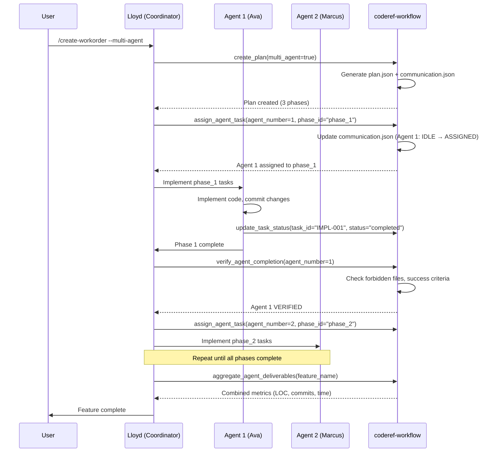

# coderef-workflow — Authoritative Documentation

## Executive Summary

**coderef-workflow** is an enterprise-grade MCP (Model Context Protocol) server that orchestrates the complete software feature development lifecycle from planning through execution, documentation, and archival. It provides AI agents with 40+ tools for context gathering, implementation planning, multi-agent coordination, deliverables tracking, and feature management using a **workorder-centric architecture**. The system serves as the central orchestration layer in the CodeRef Ecosystem, coordinating between coderef-context (code intelligence), coderef-docs (documentation), coderef-personas (expert agents), and coderef-testing (test automation).

## Audience & Intent

**Authority Hierarchy:**
- **Markdown (this document):** Architectural truth, tool contracts, state lifecycle, workflow patterns
- **Python Code (server.py, tool_handlers.py):** Runtime behavior, tool implementations, error handling
- **JSON Schemas (plan.json, context.json, analysis.json):** Data contracts and validation rules
- **Slash Commands (.claude/commands/):** User-facing workflow orchestration (not present in this repo - global only)

**This document defines:** System architecture, state ownership, tool contracts, workflow lifecycles, integration points, failure modes, and refactor-safe boundaries.

## 1. Architecture Overview

### 1.1 System Role

coderef-workflow is the **orchestration backbone** of the CodeRef Ecosystem. It does not analyze code directly (delegates to coderef-context), generate documentation (delegates to coderef-docs), or run tests (delegates to coderef-testing). Instead, it:

1. **Gathers feature requirements** (context.json) via interactive Q&A
2. **Analyzes project structure** (analysis.json) by calling coderef-context MCP tools
3. **Creates implementation plans** (plan.json) with 10-section structure and task breakdown
4. **Tracks execution progress** via TodoWrite integration and task status updates
5. **Manages feature lifecycle** from active (coderef/workorder/) to archived (coderef/archived/)
6. **Coordinates multi-agent workflows** with agent assignment and verification

### 1.2 Component Hierarchy

```
coderef-workflow (MCP Server)
├── server.py                        # MCP tool registration & dispatch
├── tool_handlers.py                 # 40+ tool implementations
├── generators/                      # Plan/analysis/doc generation
│   ├── planning_generator.py        # Creates plan.json from context
│   ├── planning_analyzer.py         # Scans project for architecture/patterns
│   ├── plan_validator.py            # Scores plan quality (0-100)
│   ├── review_formatter.py          # Generates review reports
│   ├── changelog_generator.py       # Updates CHANGELOG.json
│   ├── foundation_generator.py      # Foundation docs (delegated to coderef-docs)
│   ├── risk_generator.py            # Risk assessment (breaking changes, security)
│   ├── handoff_generator.py         # Agent handoff context (claude.md)
│   └── features_inventory_generator.py  # Feature inventory
├── constants.py                     # Paths, file names, enums
├── validation.py                    # Input sanitization & validation
├── error_responses.py               # Error response factory
├── logger_config.py                 # Structured logging
├── handler_decorators.py            # @log_invocation, @mcp_error_handler
├── handler_helpers.py               # Workorder ID generation, timestamps
└── type_defs.py                     # TypedDict definitions

Integration Points:
├── coderef-context (via MCP)        # Code intelligence (scan, query, impact)
├── coderef-docs (via MCP)           # Documentation generation
├── coderef-personas (via MCP)       # Expert agent selection
├── coderef-testing (via MCP)        # Test automation
└── Git (via subprocess)             # Deliverables metrics, change tracking
```

### 1.3 Key Architectural Decisions

| Decision | Chosen Approach | Rejected Alternative | Rationale |
|----------|----------------|---------------------|-----------|
| **Workorder System** | `WO-{FEATURE}-{CATEGORY}-###` with global audit trail | Simple feature names without tracking | Complete audit trail, multi-agent coordination, feature lifecycle tracking |
| **Plan Structure** | 10-section JSON schema | Free-form markdown plans | Structured data enables validation, automation, progress tracking |
| **Tool Organization** | 40+ fine-grained tools | Monolithic "do everything" tool | Clear contracts, easier testing, selective permissions |
| **State Storage** | File-based (JSON in coderef/workorder/) | Database | Simplicity, git-trackable, portable, no dependencies |
| **Multi-Agent** | Communication.json contract | Shared database | Explicit contracts, conflict detection, forbidden file protection |
| **Foundation Docs** | Delegated to coderef-docs MCP | Embedded in workflow | Separation of concerns, reusability |

## 2. State Ownership & Source of Truth (Canonical)

| State | Owner | Type | Persistence | Source of Truth | Mutability |
|-------|-------|------|-------------|-----------------|------------|
| **feature_name** | User input | Domain | context.json | gather_context tool | Immutable (folder name) |
| **workorder_id** | System-generated | System | plan.json META_DOCUMENTATION | create_plan tool (or user-provided) | Immutable once created |
| **context** (requirements) | User/Agent | Domain | context.json | gather_context tool | Mutable until plan created |
| **analysis** (project structure) | System | Domain | analysis.json | analyze_project_for_planning tool | Mutable (refresh on demand) |
| **plan** (10 sections) | AI-generated | Domain | plan.json | create_plan tool | Mutable until validated |
| **task_status** | Agent execution | UI/Progress | plan.json phases[].tasks[].status | update_task_status tool | Mutable during execution |
| **deliverables_metrics** | Git history | Domain | DELIVERABLES.md | update_deliverables tool | Append-only |
| **agent_assignments** | Coordinator | System | communication.json | assign_agent_task tool | Mutable during coordination |
| **archive_metadata** | System | System | coderef/archived/index.json | archive_feature tool | Append-only |
| **workorder_log** | System | System | coderef/workorder-log.txt | log_workorder tool | Append-only (prepend for reverse chronological) |

**Precedence Rules:**
1. **Immutable identifiers:** `feature_name` and `workorder_id` MUST NOT change after plan creation
2. **Plan vs. deliverables:** plan.json defines intent, DELIVERABLES.md records actuals
3. **Context vs. analysis:** context.json is user input, analysis.json is system-discovered
4. **Communication.json vs. plan.json:** communication.json is runtime coordination, plan.json is static blueprint
5. **Archived features:** Read-only, never modified (only restored if needed)

## 3. Data Persistence

### 3.1 Storage Schema

**Primary Storage Location:** `{project_path}/coderef/workorder/{feature-name}/`

| File | Purpose | Schema | Versioning | Migration |
|------|---------|--------|------------|-----------|
| **context.json** | Feature requirements & constraints | `{feature_name, description, goal, requirements[], constraints[], out_of_scope[]}` | None (v1.0) | N/A |
| **analysis.json** | Project structure analysis | `{foundation_docs[], coding_standards[], reference_components[], patterns[], api_endpoints[], database_schema[], dependencies[], test_coverage{}}` | None (v1.0) | N/A |
| **plan.json** | 10-section implementation plan | See [Section 4.2](#42-planjson-structure) | None (v1.0) | Partial plans saved with TODOs on failure |
| **communication.json** | Multi-agent coordination | `{feature_name, workorder_id, agents[1-10]{status, phase_id, forbidden_files[], success_criteria[]}}` | None (v1.0) | N/A |
| **DELIVERABLES.md** | Progress tracking & metrics | Markdown template with phase checklists + metrics section | v2.0 (enhanced mode via feature flag) | Backward compatible |
| **execution-log.json** | Task execution history | `{tasks[]{task_id, status, timestamp, notes}}` | None (v1.0) | N/A |

**Archive Location:** `{project_path}/coderef/archived/{feature-name}/` (entire folder moved on completion)

**Global Audit Log:** `{project_path}/coderef/workorder-log.txt` (reverse chronological, thread-safe)

### 3.2 Failure Modes & Recovery

| Failure Scenario | Detection | Recovery Strategy | Data Loss Risk |
|-----------------|-----------|-------------------|----------------|
| **Partial plan generation** | create_plan tool timeout/error | Save partial plan.json with "TODO: AI MUST COMPLETE" markers | None (recovery via re-run) |
| **Malformed JSON** | JSON parse error on load | Return error to agent with file path + line number | None (manual fix required) |
| **Missing context.json** | File not found on create_plan | Prompt agent to run gather_context first | None (workflow enforcement) |
| **Missing analysis.json** | File not found on create_plan | Auto-run analyze_project_for_planning | None (auto-recovery) |
| **Git unavailable** | update_deliverables subprocess error | Return error, manual metrics entry | Metrics only (feature unaffected) |
| **Agent conflict** | Two agents assigned to same phase | verify_agent_completion detects, returns error | None (coordinator resolves) |
| **Archive collision** | Feature name exists in archived/ | Prompt user for force flag or rename | None (user decision) |

**Recovery Protocol:**
1. **Validation errors:** Return detailed error to agent with fix suggestions
2. **File not found:** Provide next-step guidance (run missing tool)
3. **Generation failures:** Save partial state + TODO markers for manual completion
4. **Git errors:** Degrade gracefully (skip metrics, continue workflow)
5. **Concurrency conflicts:** Lock-free design (file-based, last-write-wins for idempotent operations)

### 3.3 Cross-Tab/Multi-Client Sync

**Not Applicable:** Single-agent, file-based system with no concurrent modification semantics. Multi-agent workflows use `communication.json` with explicit turn-taking (IDLE → ASSIGNED → IN_PROGRESS → COMPLETED → VERIFIED).

## 4. State Lifecycle

### 4.1 Feature Lifecycle State Machine

```
   User Idea
       ↓
   [gather_context] → context.json created
       ↓
   [analyze_project_for_planning] → analysis.json created (optional, auto-run if missing)
       ↓
   [create_plan] → plan.json created (status: "planning")
       ↓
   [validate_implementation_plan] → plan quality scored (optional)
       ↓
   (Manual review + approval)
       ↓
   [execute_plan] → TodoWrite list generated, plan status → "in_progress"
       ↓
   (Agent implements tasks)
       ├─ [update_task_status] → task.status: pending → in_progress → completed
       ├─ [generate_deliverables_template] → DELIVERABLES.md created
       └─ [update_deliverables] → metrics captured from git
       ↓
   [update_all_documentation] → CHANGELOG.json, README.md, CLAUDE.md updated
       ↓
   [archive_feature] → plan status → "complete", folder moved to coderef/archived/
       ↓
   ARCHIVED (read-only, historical reference)
```

### 4.2 plan.json Structure

**10-Section Schema:**
1. **META_DOCUMENTATION** - `{feature_name, workorder_id, version, status, generated_by, has_context, has_analysis, created_at, updated_at}`
2. **0_PREPARATION** - `{foundation_docs[], coding_standards[], reference_components[], patterns[], similar_features[]}`
3. **1_EXECUTIVE_SUMMARY** - `{overview, key_capabilities[], value_proposition, target_users[]}`
4. **2_RISK_ASSESSMENT** - `{breaking_changes{}, security{}, performance{}, maintainability{}, reversibility{}}`
5. **3_CURRENT_STATE_ANALYSIS** - `{architecture{}, dependencies{}, integration_points[]}`
6. **4_KEY_FEATURES** - `{must_have[], should_have[], could_have[], wont_have[]}`
7. **5_TASK_ID_SYSTEM** - `{prefix_convention, sequence_format, examples[]}`
8. **6_IMPLEMENTATION_PHASES** - `{phases[]{phase_id, name, objective, tasks[]{task_id, description, status, dependencies[]}}}`
9. **7_TESTING_STRATEGY** - `{unit_tests[], integration_tests[], e2e_tests[], test_coverage_targets{}}`
10. **8_SUCCESS_CRITERIA** - `{functional[], non_functional[], acceptance[], verification_steps[]}`

**Status Lifecycle:** `"planning"` → `"in_progress"` (via execute_plan) → `"complete"` (via archive_feature)

### 4.3 Task Status Lifecycle

```
Task created in plan.json
    ↓
status: "pending" (default on creation)
    ↓
[update_task_status(status="in_progress")] → Agent starts work
    ↓
(Agent implements, commits code)
    ↓
[update_task_status(status="completed")] → Task done
    ↓
OR
    ↓
[update_task_status(status="blocked", notes="...")] → Blocker identified
```

**Valid Status Transitions:**
- `pending → in_progress` (agent starts)
- `in_progress → completed` (task done)
- `in_progress → blocked` (blocker found)
- `blocked → in_progress` (blocker resolved)
- ❌ `completed → *` (INVALID: completed is terminal)

### 4.4 Agent Coordination Lifecycle (Multi-Agent Mode)

```
[create_plan(multi_agent=true)] → plan.json + communication.json created
    ↓
[assign_agent_task(agent_number=1, phase_id="phase_1")] → Agent 1: IDLE → ASSIGNED
    ↓
Agent 1 sets status to IN_PROGRESS (manual or automated)
    ↓
Agent 1 implements tasks, commits code
    ↓
[verify_agent_completion(agent_number=1)]
    ├─ Check: forbidden_files unchanged (git diff)
    ├─ Check: success_criteria met (from plan.json)
    └─ Update: status → VERIFIED, completion_timestamp set
    ↓
Coordinator reviews communication.json, assigns next agent
    ↓
(Repeat until all phases complete)
    ↓
[aggregate_agent_deliverables] → Combine metrics from all agents
```

## 5. Behaviors (Events & Side Effects)

### 5.1 User Behaviors (Slash Command Triggers)

| Command | Tool Called | Input | Side Effects |
|---------|-------------|-------|--------------|
| `/create-workorder` | gather_context → analyze_project_for_planning → create_plan | Interactive Q&A | Creates 3 files: context.json, analysis.json, plan.json |
| `/align-plan` | execute_plan | feature_name | Generates TodoWrite task list (no file changes) |
| `/update-deliverables` | update_deliverables | feature_name | Parses git log, updates DELIVERABLES.md metrics |
| `/update-docs` | update_all_documentation | change_type, feature_description, workorder_id | Updates 3 files: CHANGELOG.json, README.md, CLAUDE.md |
| `/archive-feature` | archive_feature | feature_name | Moves folder, updates coderef/archived/index.json |
| `/complete-workorder` | Multi-tool orchestration | feature_name | Executes all tasks, updates deliverables, archives |

**Note:** Slash commands are defined in **global** `.claude/commands/` directory (not in this repo). Tools are defined in `server.py` and callable via MCP.

### 5.2 System Behaviors (Internal Triggers)

| Event | Trigger | Payload | Side Effects |
|-------|---------|---------|--------------|
| **Plan creation failure** | create_plan exception | Error message + partial plan | Saves partial plan.json with TODO markers |
| **Missing analysis** | create_plan called without analysis.json | feature_name | Auto-runs analyze_project_for_planning |
| **Workorder ID generation** | create_plan without workorder_id arg | feature_name | Generates `WO-{FEATURE}-001` (auto-increment) |
| **Archive index update** | archive_feature success | feature metadata | Appends entry to coderef/archived/index.json |
| **Drift detection** | analyze_project_for_planning | .coderef/ timestamp | Warns if .coderef/ >10% stale, prompts re-scan |

## 6. Event & Callback Contracts

### 6.1 Tool Call Contract

**All tools follow MCP standard:**
```python
async def call_tool(name: str, arguments: dict) -> list[TextContent]
```

**Decorators Applied:**
- `@log_invocation` - Logs tool name + argument keys (ARCH-004)
- `@mcp_error_handler` - Catches exceptions, returns ErrorResponse (ARCH-005)

**Error Response Format:**
```json
{
  "error": "Error message",
  "details": {...},
  "suggestion": "How to fix",
  "error_code": "ERROR_CODE"
}
```

### 6.2 Key Tool Contracts

| Tool | Required Args | Optional Args | Returns | Side Effects |
|------|--------------|---------------|---------|--------------|
| `gather_context` | project_path, feature_name, description, goal, requirements[] | constraints[], out_of_scope[], decisions{}, success_criteria{} | Success message + file path | Creates context.json |
| `analyze_project_for_planning` | project_path | feature_name | Analysis summary JSON | Creates analysis.json (if feature_name provided) |
| `create_plan` | project_path, feature_name | workorder_id, multi_agent | Plan summary + validation score | Creates plan.json + DELIVERABLES.md |
| `validate_implementation_plan` | project_path, plan_file_path | - | Validation report (score 0-100, issues by severity) | None (read-only) |
| `execute_plan` | project_path, feature_name | - | TodoWrite-compatible task list JSON | None (read-only) |
| `update_task_status` | project_path, feature_name, task_id, status | notes | Updated task + progress summary | Modifies plan.json |
| `update_deliverables` | project_path, feature_name | - | Metrics summary (LOC, commits, time) | Modifies DELIVERABLES.md |
| `update_all_documentation` | project_path, change_type, feature_description, workorder_id | files_changed[], feature_name, version | Documentation update summary | Modifies 3 files: CHANGELOG.json, README.md, CLAUDE.md |
| `archive_feature` | project_path, feature_name | force | Archive confirmation | Moves folder, updates index.json |
| `assign_agent_task` | project_path, feature_name, agent_number | phase_id | Agent assignment confirmation | Modifies communication.json |
| `verify_agent_completion` | project_path, feature_name, agent_number | - | Verification report (pass/fail) | Modifies communication.json (status → VERIFIED) |
| `assess_risk` | project_path, proposed_change{description, change_type, files_affected[]} | options[], threshold, feature_name | Risk assessment (5 dimensions, 0-100 score) | Saves risk assessment JSON to coderef/workorder/{feature}/risk-assessment-{timestamp}.json |

**Full tool list:** 40+ tools (see server.py:60-1085 for complete schemas)

## 7. Performance Considerations

### 7.1 Known Limits (Tested Thresholds)

| Operation | Tested Limit | Observed Performance | Bottleneck |
|-----------|-------------|---------------------|------------|
| **Plan generation** | 50-task plans | 2-5 seconds | JSON schema generation (CPU-bound) |
| **Git log parsing** | 1000 commits | 3-8 seconds | subprocess overhead |
| **Analysis scan** | 500-file projects | 10-30 seconds | coderef-context MCP call latency |
| **TodoWrite conversion** | 100-task plans | <1 second | JSON parsing |
| **Archive operation** | 100MB feature folder | 1-3 seconds | Filesystem I/O |

**Untested scenarios (known unknowns):**
- Projects >1000 files (analysis may timeout)
- Plans >200 tasks (TodoWrite UI may struggle)
- Git repos >10,000 commits (deliverables parsing may slow)

### 7.2 Optimization Opportunities

| Bottleneck | Current Approach | Optimization (Not Implemented) | Expected Gain |
|------------|-----------------|-------------------------------|---------------|
| **Analysis re-runs** | Full re-scan on every /create-workorder | Cache analysis.json with drift detection | 5-10x faster planning |
| **Git log parsing** | Parse entire history | Use --since flag for incremental updates | 3-5x faster deliverables |
| **Plan validation** | Single-threaded schema checks | Parallel validation of 10 sections | 2-3x faster validation |
| **Archive indexing** | Load entire index.json on every archive | Incremental index updates | Constant time vs. O(n) |

### 7.3 Deferred Optimizations (With Rationale)

1. **Database backend for plans** - *Rationale:* File-based is git-trackable, portable, zero-dependency
2. **Caching layer for analysis** - *Rationale:* Drift detection warns when stale (v1.3.0 feature)
3. **Async plan generation** - *Rationale:* 2-5 second latency acceptable for planning phase
4. **Parallel tool handlers** - *Rationale:* MCP sequential execution model (no parallel tool calls)

## 8. Accessibility

### 8.1 Current Gaps

| Issue | Severity | Impact | Affected Component |
|-------|----------|--------|-------------------|
| **No visual progress indicator** | Major | Agents/users have no feedback during long operations (analyze, create_plan) | All generators (planning_analyzer.py, planning_generator.py) |
| **Error messages not screen-reader friendly** | Minor | Technical JSON errors not accessible | error_responses.py |
| **No keyboard shortcuts for slash commands** | Minor | CLI-only, no mouse/touch alternative | N/A (CLI-first design) |
| **No internationalization** | Low | English-only messages | All user-facing strings |

### 8.2 Required Tasks (Prioritized Backlog)

1. **[P0] Streaming progress updates** - Emit MCP progress events during long operations (analyze, plan generation)
2. **[P1] Human-friendly error summaries** - Add plain-language error descriptions alongside technical details
3. **[P2] Timeout warnings** - Warn agents when operations exceed 50% of expected duration
4. **[P3] i18n support** - Extract user-facing strings to translation files

## 9. Testing Strategy

### 9.1 Must-Cover Scenarios (Critical Paths)

**Unit Tests (Existing):**
- ✅ Workorder ID generation (auto-increment, collision handling)
- ✅ Feature name validation (path traversal prevention)
- ✅ Plan validation scoring (0-100 scale, issue categorization)
- ✅ Task status transitions (valid/invalid state changes)

**Integration Tests (Existing):**
- ✅ End-to-end /create-workorder flow (gather → analyze → plan)
- ✅ Multi-agent coordination (assign → verify)
- ✅ Deliverables metrics extraction (git log parsing)
- ✅ Archive operation (folder move + index update)

**Performance Tests (Existing):**
- ✅ Plan generation for 50-task plans (<5s)
- ✅ Git log parsing for 1000 commits (<10s)

### 9.2 Explicitly Not Tested (Out of Scope + Reasoning)

| Scenario | Reasoning |
|----------|-----------|
| **Concurrent modification of plan.json** | Single-agent workflow assumption, no locking primitives |
| **Network failures during MCP calls** | MCP client library handles retries, not tool responsibility |
| **Disk full during file writes** | OS-level error, cannot gracefully recover |
| **Non-UTF-8 file encodings** | Python default encoding, edge case |
| **Git repository corruption** | External dependency, out of scope |
| **Slash command validation** | Commands defined in global .claude/commands/, not this repo |

## 10. Non-Goals / Out of Scope

**Explicitly Rejected Features:**

1. **Code generation** - Delegated to AI agents using plans, not workflow responsibility
2. **Test execution** - Delegated to coderef-testing MCP server
3. **Dependency installation** - User/agent responsibility (npm install, pip install, etc.)
4. **CI/CD integration** - Orthogonal concern (plans can inform CI config, but not enforced)
5. **Real-time collaboration** - Single-agent workflow model (multi-agent is turn-based)
6. **Visual plan editor** - CLI/MCP-first design, no GUI
7. **Plan versioning/diffing** - Git provides this at file level
8. **Rollback/undo operations** - Git-based time travel sufficient
9. **Auto-fix for validation failures** - Agent decision required, no magic fixes
10. **Feature dependencies (prerequisites)** - Not modeled in schema (future consideration)

## 11. Common Pitfalls & Sharp Edges

### 11.1 Known Quirks

| Quirk | Manifestation | Workaround |
|-------|---------------|------------|
| **Partial plans saved on failure** | create_plan error leaves plan.json with "TODO: AI MUST COMPLETE" markers | Delete plan.json, re-run create_plan after fixing root cause |
| **Workorder ID auto-increment collision** | Two agents create plans simultaneously for same feature | Use explicit `workorder_id` parameter to avoid collision |
| **Archive without deliverables update** | Archiving before /update-deliverables loses metrics | Always run /update-deliverables before /archive-feature |
| **Analysis drift >10%** | Planning uses stale .coderef/ data | Re-run `python scripts/populate-coderef.py` before /create-workorder |
| **Missing context.json** | create_plan fails with "Context file not found" | Run /gather-context first (workflow enforcement) |
| **Task status "completed" is terminal** | Cannot change status after marking completed | Don't mark completed until verified |
| **DELIVERABLES.md manual edits lost** | update_deliverables overwrites manual changes | Edit after update_deliverables, or use notes field |

### 11.2 Integration Gotchas

| Integration | Issue | Fix |
|-------------|-------|-----|
| **coderef-context unavailable** | analyze_project_for_planning fails | Fallback to regex-based filesystem analysis (slower, less accurate) |
| **Git not in PATH** | update_deliverables subprocess error | Add git to PATH or skip deliverables step |
| **Slash commands not found** | /create-workorder returns "Unknown command" | Verify global ~/.claude/commands/ directory exists and is in MCP config |
| **MCP cache stale** | Tools show duplicate definitions | Delete ~/.cursor/projects/{PROJECT_ID}/mcp-cache.json, restart Claude Code |
| **.coderef/ structure missing** | Planning uses fallback analysis (slower) | Run `python scripts/populate-coderef.py` before planning |

### 11.3 Configuration Mistakes

| Mistake | Symptom | Correction |
|---------|---------|------------|
| **Wrong project_path** | "Project directory not found" error | Use absolute paths, verify directory exists |
| **Feature name with slashes** | Path traversal security error | Only alphanumeric, hyphens, underscores allowed |
| **Invalid workorder_id format** | Validation error | Must match `^WO-[A-Z0-9-]+-\\d{3}$` (e.g., WO-AUTH-001) |
| **Enhanced deliverables disabled** | DELIVERABLES.md missing metrics sections | Set `ENHANCED_DELIVERABLES_ENABLED=true` environment variable |
| **Missing .mcp.json entry** | Tools not available in Claude Code | Add coderef-workflow to .mcp.json mcpServers config |

### 11.4 Edge Cases

| Edge Case | Expected Behavior | Actual Behavior | Workaround |
|-----------|-------------------|-----------------|------------|
| **Empty requirements array** | Validation error (required field) | ✅ Correctly rejects | N/A |
| **Plan with 0 tasks** | Valid but useless plan | ✅ Validates but warns | Add tasks manually or regenerate |
| **Feature name "." or ".."** | Path traversal attempt | ✅ Security error | Use descriptive names |
| **Archiving non-existent feature** | Error: "Feature not found" | ✅ Returns error | Verify feature name spelling |
| **Git repo with no commits** | update_deliverables finds 0 commits | ⚠️ Metrics section shows "N/A" | Make initial commit first |
| **Unicode in feature descriptions** | Stored in context.json | ✅ UTF-8 encoding handles correctly | N/A |

## 12. Diagrams

### 12.1 Workflow Orchestration (Mermaid)

```mermaid
graph TD
    A[User Idea] --> B[/create-workorder]
    B --> C{gather_context}
    C --> D[context.json created]
    D --> E{analyze_project_for_planning}
    E --> F[analysis.json created]
    F --> G{create_plan}
    G --> H[plan.json created]
    H --> I{validate_implementation_plan}
    I --> J{Score >= 85?}
    J -->|Yes| K[Manual Review]
    J -->|No| G
    K --> L[/align-plan]
    L --> M{execute_plan}
    M --> N[TodoWrite task list]
    N --> O[Agent implements tasks]
    O --> P{update_task_status}
    P --> Q{All tasks complete?}
    Q -->|No| O
    Q -->|Yes| R[/update-deliverables]
    R --> S{update_deliverables}
    S --> T[Git metrics captured]
    T --> U[/update-docs]
    U --> V{update_all_documentation}
    V --> W[CHANGELOG/README/CLAUDE updated]
    W --> X[/archive-feature]
    X --> Y{archive_feature}
    Y --> Z[Feature archived]
```

**⚠️ Maintenance Rule:** Diagrams are **illustrative**, not authoritative. State tables and text in sections 2-11 define truth. Update diagrams when workflow changes, but validate against text first.

### 12.2 Multi-Agent Coordination (Sequence Diagram)



### 12.3 State Persistence Architecture

```
                    ┌─────────────────────────────┐
                    │   coderef-workflow (MCP)    │
                    └──────────┬──────────────────┘
                               │
                ┌──────────────┼──────────────┐
                │              │              │
                ▼              ▼              ▼
        ┌─────────────┐ ┌─────────────┐ ┌─────────────┐
        │  Generators │ │Tool Handlers│ │ Validators  │
        └──────┬──────┘ └──────┬──────┘ └──────┬──────┘
               │               │               │
               └───────────────┼───────────────┘
                               │
                ┌──────────────┼──────────────┐
                │              │              │
                ▼              ▼              ▼
        ┌──────────────┐ ┌─────────────┐ ┌──────────────┐
        │context.json  │ │analysis.json│ │  plan.json   │
        ├──────────────┤ ├─────────────┤ ├──────────────┤
        │requirements  │ │architecture │ │10 sections   │
        │constraints   │ │patterns     │ │task breakdown│
        │goals         │ │standards    │ │risk assess   │
        └──────────────┘ └─────────────┘ └──────────────┘
                │              │              │
                └──────────────┼──────────────┘
                               │
                   ┌───────────┴───────────┐
                   │                       │
                   ▼                       ▼
        ┌──────────────────┐   ┌──────────────────┐
        │DELIVERABLES.md   │   │communication.json│
        ├──────────────────┤   ├──────────────────┤
        │progress tracking │   │agent coordination│
        │git metrics       │   │turn-based status │
        └──────────────────┘   └──────────────────┘
                   │
                   ▼
        ┌──────────────────────────┐
        │coderef/archived/         │
        │  {feature}/              │
        │    (entire folder moved) │
        │  index.json              │
        └──────────────────────────┘
```

## 13. Tool Orchestration Patterns

### 13.1 Standard Feature Workflow (Single Agent)

**Pattern:** Context → Analyze → Plan → Execute → Document → Archive

```python
# Step 1: Gather requirements (interactive or programmatic)
gather_context(
    project_path="/path/to/project",
    feature_name="dark-mode-toggle",
    description="Add dark mode toggle to settings",
    goal="Improve user experience with theme customization",
    requirements=["Toggle in settings", "Persist preference", "Apply globally"]
)
# Output: coderef/workorder/dark-mode-toggle/context.json

# Step 2: Analyze project (auto-runs if missing during create_plan)
analyze_project_for_planning(
    project_path="/path/to/project",
    feature_name="dark-mode-toggle"  # Optional: saves to feature folder
)
# Output: coderef/workorder/dark-mode-toggle/analysis.json

# Step 3: Create plan (synthesizes context + analysis + template)
create_plan(
    project_path="/path/to/project",
    feature_name="dark-mode-toggle",
    workorder_id="WO-DARK-MODE-001"  # Optional: auto-generated if omitted
)
# Output: coderef/workorder/dark-mode-toggle/plan.json (status: "planning")

# Step 4: Validate plan (optional but recommended)
validate_implementation_plan(
    project_path="/path/to/project",
    plan_file_path="coderef/workorder/dark-mode-toggle/plan.json"
)
# Output: Validation report (score 0-100, issues categorized)

# Step 5: Execute plan (align with TodoWrite)
execute_plan(
    project_path="/path/to/project",
    feature_name="dark-mode-toggle"
)
# Output: TodoWrite-compatible JSON (no file changes)

# Step 6: Agent implements tasks, updates status
update_task_status(
    project_path="/path/to/project",
    feature_name="dark-mode-toggle",
    task_id="IMPL-001",
    status="completed"
)
# Output: Updated plan.json (task.status changed)

# Step 7: Capture metrics from git
update_deliverables(
    project_path="/path/to/project",
    feature_name="dark-mode-toggle"
)
# Output: Updated DELIVERABLES.md (LOC, commits, time)

# Step 8: Update ecosystem documentation
update_all_documentation(
    project_path="/path/to/project",
    change_type="feature",
    feature_description="Added dark mode toggle with persistent theme storage",
    workorder_id="WO-DARK-MODE-001",
    files_changed=["src/settings.tsx", "src/theme-provider.tsx"]
)
# Output: Updated CHANGELOG.json, README.md, CLAUDE.md (version auto-bumped)

# Step 9: Archive completed feature
archive_feature(
    project_path="/path/to/project",
    feature_name="dark-mode-toggle"
)
# Output: Folder moved to coderef/archived/dark-mode-toggle/, index.json updated
```

### 13.2 Multi-Agent Parallel Workflow

**Pattern:** Context → Plan → Generate Communication → Assign → Verify → Aggregate → Archive

```python
# Steps 1-3: Same as single-agent (gather_context, analyze, create_plan)
create_plan(
    project_path="/path/to/project",
    feature_name="auth-system",
    multi_agent=True  # Enables multi-agent mode
)
# Output: plan.json + communication.json created

# Step 4: Coordinator assigns agents to phases
assign_agent_task(
    project_path="/path/to/project",
    feature_name="auth-system",
    agent_number=1,
    phase_id="phase_1"  # Frontend work
)
# Agent 1: status → ASSIGNED

assign_agent_task(
    project_path="/path/to/project",
    feature_name="auth-system",
    agent_number=2,
    phase_id="phase_2"  # Backend work
)
# Agent 2: status → ASSIGNED

# Step 5: Agents work in parallel (turn-based via communication.json)
# Agent 1 implements phase_1, Agent 2 implements phase_2

# Step 6: Coordinator verifies each agent
verify_agent_completion(
    project_path="/path/to/project",
    feature_name="auth-system",
    agent_number=1
)
# Checks: forbidden files unchanged, success criteria met
# Agent 1: status → VERIFIED

verify_agent_completion(
    project_path="/path/to/project",
    feature_name="auth-system",
    agent_number=2
)
# Agent 2: status → VERIFIED

# Step 7: Aggregate metrics from all agents
aggregate_agent_deliverables(
    project_path="/path/to/project",
    feature_name="auth-system"
)
# Output: Combined DELIVERABLES.md (sum of all agent contributions)

# Steps 8-9: Same as single-agent (update_all_documentation, archive_feature)
```

### 13.3 Risk Assessment Workflow

**Pattern:** Pre-implementation risk evaluation

```python
# Before modifying code, assess risk
assess_risk(
    project_path="/path/to/project",
    proposed_change={
        "description": "Refactor authentication middleware to use JWT tokens",
        "change_type": "refactor",
        "files_affected": [
            "src/middleware/auth.ts",
            "src/services/token-service.ts",
            "tests/auth.test.ts"
        ]
    },
    threshold=50  # Go/no-go threshold (0-100)
)
# Output: Risk assessment JSON with 5-dimension scores:
# - Breaking changes (API compatibility)
# - Security (authentication bypass risk)
# - Performance (token validation overhead)
# - Maintainability (code complexity)
# - Reversibility (can we roll back?)
# Recommendation: GO (score 38/100) or NO-GO (score 72/100)

# Optional: Compare multiple approaches
assess_risk(
    project_path="/path/to/project",
    proposed_change={
        "description": "Option A: Refactor to JWT",
        "change_type": "refactor",
        "files_affected": ["src/middleware/auth.ts"]
    },
    options=[
        {
            "description": "Option B: Keep session-based auth",
            "change_type": "modify",
            "files_affected": ["src/middleware/auth.ts"]
        },
        {
            "description": "Option C: Use OAuth2 delegation",
            "change_type": "migrate",
            "files_affected": ["src/middleware/auth.ts", "src/services/oauth.ts"]
        }
    ]
)
# Output: Comparative risk analysis (3 options ranked by safety)
```

## 14. Refactor Safety Checklist

Before modifying coderef-workflow system:

- [ ] **Can agents refactor tools without breaking contracts?**
  - ✅ MCP tool schemas are versioned (inputSchema in server.py)
  - ✅ Internal function signatures can change (handler_decorators hide implementation)
  - ✅ File formats are validated on read (jsonschema checks)

- [ ] **Are state ownership rules unambiguous?**
  - ✅ Section 2 defines canonical owners for all state
  - ✅ Precedence rules prevent conflicts (plan.json vs. DELIVERABLES.md)
  - ✅ Immutable identifiers (feature_name, workorder_id) documented

- [ ] **Are failure modes documented with recovery paths?**
  - ✅ Section 3.2 covers 7 failure scenarios with detection + recovery
  - ✅ Partial plan generation saves TODO markers for manual completion
  - ✅ Git errors degrade gracefully (skip metrics, continue workflow)

- [ ] **Are non-goals explicit to prevent future scope creep?**
  - ✅ Section 10 lists 10 rejected features with rationale
  - ✅ Code generation, test execution, CI/CD explicitly out of scope
  - ✅ Visual editor, real-time collaboration rejected

- [ ] **Do diagrams match text (or are they marked illustrative)?**
  - ✅ Section 12 diagrams marked **illustrative** (text is authoritative)
  - ✅ State tables (Section 2) and tool contracts (Section 6) are canonical

## 15. Maintenance & Evolution

### 15.1 Known Technical Debt

| Debt Item | Current Impact | Proposed Fix | Priority |
|-----------|---------------|--------------|----------|
| **No plan versioning** | Cannot diff changes to plans | Add plan_version field + migration scripts | P2 |
| **Hardcoded 10-section structure** | Cannot customize plan format | Configurable plan schema templates | P3 |
| **Global workorder log unbounded** | Log file grows indefinitely | Add rotation/archival after N entries | P3 |
| **No concurrency control** | Last-write-wins for file edits | Add file locking or optimistic concurrency | P2 |
| **Git subprocess blocking** | update_deliverables blocks event loop | Use asyncio subprocess (asyncio.create_subprocess_exec) | P1 |

### 15.2 Extension Points

**For adding new tools:**
1. Add tool schema to `server.py:list_tools()` (lines 60-1085)
2. Implement handler in `tool_handlers.py` (decorate with `@log_invocation` + `@mcp_error_handler`)
3. Register handler in `TOOL_HANDLERS` dict (tool_handlers.py bottom)
4. Add validation function to `validation.py` (if new input types)
5. Add constants to `constants.py` (if new paths/enums)
6. Write tests in `tests/test_{tool_name}.py`

**For adding new plan sections:**
1. Update `planning-template-for-ai.json` schema
2. Update `plan_validator.py` scoring logic
3. Update `planning_generator.py` section generation
4. Update this resource sheet (Section 4.2)

**For integrating new MCP servers:**
1. Add MCP client call in relevant generator (e.g., `planning_analyzer.py`)
2. Handle MCP unavailability gracefully (fallback logic)
3. Document integration in CLAUDE.md (Integration Points section)

### 15.3 Deprecation Policy

**Breaking changes require:**
1. Major version bump (1.x.x → 2.0.0)
2. Migration guide in `MIGRATION.md`
3. Deprecation warnings for 1 minor version before removal
4. Update to ecosystem CLAUDE.md (Recent Changes section)

**Example:**
- v1.5.0: Add deprecation warning for old tool schema
- v1.6.0: Maintain backward compatibility, log warnings
- v2.0.0: Remove old schema, require migration

## Conclusion

This resource sheet defines the **authoritative contracts** for coderef-workflow. It serves as:
- **Reference for refactoring:** State ownership prevents accidental coupling
- **Integration guide:** Tool contracts enable external systems to call workflows
- **Maintenance manual:** Known limits, debt, and extension points guide evolution
- **Failure recovery:** Explicit error handling ensures graceful degradation

**When in doubt:**
1. State ownership (Section 2) determines who modifies what
2. Tool contracts (Section 6) define inputs/outputs/side effects
3. Failure modes (Section 3.2) prescribe recovery strategies
4. Non-goals (Section 10) prevent scope creep

**Maintenance expectations:**
- Update Section 2 when adding new state files
- Update Section 6 when adding/changing tools
- Update Section 10 when rejecting feature requests
- Update Section 13 when adding workflow patterns
- Diagrams (Section 12) are illustrative—text is truth

---

**Document Metadata:**
- **Authority:** Architectural truth for coderef-workflow system
- **Freshness:** Valid as of 2026-01-03 (v1.3.0 release)
- **Next Review:** After v2.0.0 release (breaking changes expected)
- **Maintainers:** willh, Claude Code AI

**Version History:**
- v1.0 (2026-01-03): Initial authoritative documentation
