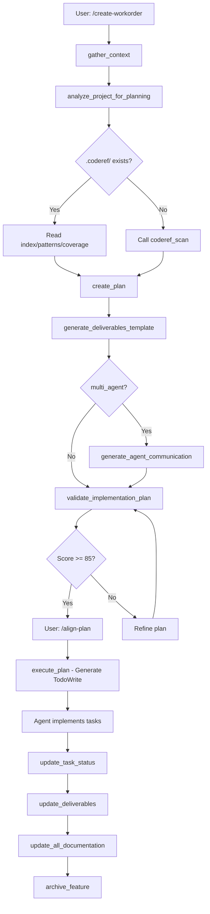
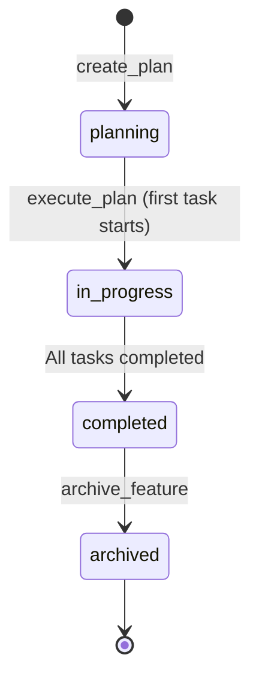
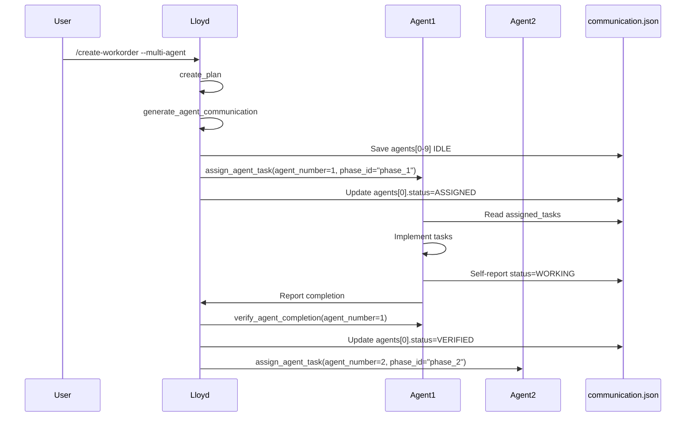

# coderef-workflow — Authoritative Documentation

## Executive Summary

**coderef-workflow** is an enterprise-grade MCP server that orchestrates the complete feature development lifecycle through structured planning, execution tracking, deliverables management, and feature archiving using a workorder-centric architecture. The system provides 24 MCP tools and 40+ slash commands for AI agents to manage complex, multi-phase feature implementations with full code intelligence integration via **coderef-context**, complete audit trails, and automated documentation generation via **coderef-docs**. This document serves as the single source of truth for understanding, maintaining, and extending the workflow orchestration system.

## Audience & Intent

### Authority Hierarchy

- **Markdown (this document):** Architectural truth, state ownership, behavior contracts, data persistence rules
- **Python/Code:** Runtime implementation, compile-time contracts, tool handlers
- **JSON Schemas:** Validation contracts for tool inputs, plan structure, deliverables format
- **TypedDicts (type_defs.py):** Type contracts for all data structures

### Maintenance Intent

This document is designed for:
- AI agents implementing features using workflow tools
- Developers extending workflow capabilities
- Maintainers refactoring plan generation or validation logic
- Integration engineers connecting new MCP servers to workflow system

---

## 1. Architecture Overview

### System Role

coderef-workflow is the **orchestration layer** in the 5-server CodeRef Ecosystem. It coordinates:

```
Context Gathering → Analysis → Planning → Execution → Documentation → Archival
```

### Component Hierarchy

```
coderef-workflow/
├── server.py                      # MCP entry point (54 tool definitions)
├── tool_handlers.py               # Tool implementation registry (24 handlers)
├── generators/                    # Plan & analysis generators
│   ├── planning_analyzer.py       # PlanningAnalyzer class (async analysis)
│   ├── plan_generator.py          # PlanningGenerator (10-section synthesis)
│   ├── plan_validator.py          # PlanValidator (0-100 scoring)
│   ├── review_formatter.py        # ReviewFormatter (markdown reports)
│   └── risk_generator.py          # RiskGenerator (5-dimension assessment)
├── type_defs.py                   # 90 TypedDict definitions
├── constants.py                   # 18 enums, path constants
├── validation.py                  # Input validation functions
├── error_responses.py             # ErrorResponse factory
├── logger_config.py               # Structured logging
├── handler_decorators.py          # @mcp_error_handler, @log_invocation
├── handler_helpers.py             # format_success_response, generate_workorder_id
└── templates/tools/               # DELIVERABLES, communication templates
```

### Key Integration Points

| Integration | Protocol | Purpose |
|-------------|----------|---------|
| **coderef-context** | MCP tool calls (coderef_scan, coderef_query, coderef_patterns) | Code intelligence for planning |
| **coderef-docs** | Shared tool definitions (generate_foundation_docs, add_changelog_entry) | Documentation automation |
| **coderef-personas** | No direct integration | Personas activate before execution |
| **coderef-testing** | No direct integration | Tests run during execution phase |
| **Lloyd (orchestrator)** | TodoWrite integration | Real-time progress tracking |

### Layout Contracts

**Filesystem Layout:**

```
coderef/workorder/                    # Active features (WO-ID format)
├── {feature-name}/
│  ├── context.json                   # Requirements & constraints
│  ├── analysis.json                  # Project analysis results
│  ├── plan.json                      # 10-section implementation plan
│  ├── communication.json             # Multi-agent coordination (optional)
│  ├── DELIVERABLES.md               # Metrics & progress tracking
│  └── execution-log.json             # Task status tracking (optional)

coderef/archived/                     # Completed features
├── {feature-name}/                   # Same structure as workorder
└── index.json                        # Archive metadata

coderef/workorder-log.txt            # Global audit trail (WO-ID | Project | Description | Timestamp)
```

**Workorder ID Format:** `WO-{FEATURE}-{CATEGORY}-{SEQUENCE}`

Example: `WO-AUTH-SYSTEM-001`

---

## 2. State Ownership & Source of Truth (Canonical)

| State | Owner | Type | Persistence | Source of Truth |
|-------|-------|------|-------------|-----------------|
| **context.json** | gather_context tool | Feature Requirements | coderef/workorder/{feature}/ | Filesystem JSON |
| **analysis.json** | analyze_project_for_planning tool | Project Analysis | coderef/workorder/{feature}/ | Filesystem JSON |
| **plan.json** | create_plan tool | Implementation Plan | coderef/workorder/{feature}/ | Filesystem JSON |
| **plan.status** | plan.json META_DOCUMENTATION | Plan Status | Embedded in plan.json | plan.json "status" field |
| **task.status** | update_task_status tool | Task Progress | Embedded in plan.json | plan.json phases[].tasks[].status |
| **communication.json** | generate_agent_communication tool | Multi-Agent Coordination | coderef/workorder/{feature}/ | Filesystem JSON |
| **agent.status** | assign_agent_task, verify_agent_completion | Agent Task Assignment | Embedded in communication.json | communication.json agents[].status |
| **DELIVERABLES.md** | generate_deliverables_template, update_deliverables | Metrics & Progress | coderef/workorder/{feature}/ | Filesystem Markdown |
| **workorder-log.txt** | log_workorder tool | Global Audit Trail | coderef/workorder-log.txt | Filesystem Plain Text |
| **archive index.json** | archive_feature tool | Archive Metadata | coderef/archived/index.json | Filesystem JSON |
| **.coderef/ data** | coderef-context MCP server | Code Intelligence | .coderef/ directory | Filesystem JSON (pre-scanned) |

### Precedence Rules for Conflicts

1. **Plan Status Conflicts:**
   - If plan.json status = "complete" but DELIVERABLES.md status = "In Progress" → **DELIVERABLES.md wins** (runtime truth)
   - `archive_feature` prompts user if status != "Complete"

2. **Task Status Conflicts:**
   - If TodoWrite shows task completed but plan.json shows "in_progress" → **plan.json wins** (canonical state)
   - TodoWrite is **UI display only**, plan.json is persistence layer

3. **Agent Status Conflicts:**
   - If communication.json shows agent IDLE but agent reports WORKING → **agent self-report wins**
   - `track_agent_status` reads communication.json as source of truth

4. **Workorder ID Conflicts:**
   - If plan.json has workorder_id but context.json does not → **plan.json wins** (generated during creation)
   - Auto-generate if missing using `generate_workorder_id()` helper

---

## 3. Data Persistence

### Storage Keys and Schema

**context.json Schema:**

```json
{
  "feature_name": "string",
  "description": "string",
  "goal": "string",
  "requirements": ["string"],
  "out_of_scope": ["string"],
  "constraints": ["string"],
  "decisions": {"key": "value"},
  "success_criteria": {
    "functional": ["string"],
    "non_functional": {"performance": "string"}
  },
  "generated_at": "ISO 8601 timestamp",
  "version": "1.0"
}
```

**analysis.json Schema:**

```json
{
  "foundation_docs": {
    "available": ["README.md (root)"],
    "missing": ["API.md"]
  },
  "foundation_doc_content": {
    "ARCHITECTURE.md": {
      "location": "root",
      "preview": "first 500 chars",
      "headers": ["Top 10 headers"],
      "size": 12345
    }
  },
  "inventory_data": {
    "source": "coderef_index | coderef_scan | manifest_files",
    "total_elements": 126,
    "by_type": {"function": 45, "class": 12},
    "files": 23,
    "utilization": ".coderef/index.json (preprocessed)"
  },
  "coding_standards": {
    "available": ["BEHAVIOR-STANDARDS.md"],
    "missing": ["UI-STANDARDS.md"]
  },
  "reference_components": {
    "primary": null,
    "secondary": ["Component1", "Component2"],
    "total_found": 10,
    "source": "coderef_query"
  },
  "key_patterns_identified": [
    "Error handling: try-catch blocks found in 15 files",
    "Naming: camelCase for functions (85/100 functions)"
  ],
  "technology_stack": {
    "language": "Python",
    "framework": "FastAPI",
    "database": "PostgreSQL",
    "testing": "pytest",
    "build": "uv"
  },
  "project_structure": {
    "main_directories": ["src/", "generators/", "tests/"],
    "file_counts": {"src": 12, "generators": 6},
    "organization_pattern": "modular (src-based)"
  },
  "gaps_and_risks": [
    "Low test coverage: 45% (target: ≥80%)",
    "Missing foundation docs: API.md, COMPONENTS.md"
  ],
  "generated_at": "ISO 8601 timestamp"
}
```

**plan.json Schema (10-section structure):**

```json
{
  "META_DOCUMENTATION": {
    "feature_name": "string",
    "workorder_id": "WO-{FEATURE}-{CATEGORY}-{SEQ}",
    "status": "planning | in_progress | completed | archived",
    "generated_by": "AI Assistant",
    "has_context": true,
    "has_analysis": true,
    "version": "1.0",
    "created_at": "ISO 8601 timestamp",
    "updated_at": "ISO 8601 timestamp"
  },
  "0_PREPARATION": {
    "foundation_docs": {...},
    "coding_standards": {...},
    "reference_components": {...},
    "key_patterns": [...],
    "technology_stack": {...},
    "project_structure": {...},
    "gaps_and_risks": [...]
  },
  "1_EXECUTIVE_SUMMARY": {
    "what": "Brief description",
    "why": "Rationale",
    "how": "Approach",
    "key_features": [...]
  },
  "2_RISK_ASSESSMENT": {
    "breaking_changes": {
      "severity": "low | medium | high | critical",
      "details": [...],
      "mitigation": [...]
    },
    "security": {...},
    "performance": {...},
    "testing": {...}
  },
  "3_CURRENT_STATE_ANALYSIS": {
    "existing_architecture": "description",
    "relevant_components": [...],
    "current_patterns": [...]
  },
  "4_KEY_FEATURES": ["feature 1", "feature 2"],
  "5_TASK_ID_SYSTEM": {
    "format": "CATEGORY-NNN",
    "categories": {
      "SETUP": "Initial setup tasks",
      "IMPL": "Implementation tasks"
    }
  },
  "6_IMPLEMENTATION_PHASES": [
    {
      "phase_id": "phase_1",
      "name": "Setup & Configuration",
      "tasks": [
        {
          "task_id": "SETUP-001",
          "description": "Task description",
          "status": "pending | in_progress | completed | blocked",
          "dependencies": ["SETUP-000"],
          "estimated_effort": "low | medium | high",
          "assignee": null
        }
      ],
      "dependencies": [],
      "parallel_capable": false
    }
  ],
  "7_TESTING_STRATEGY": {
    "unit_tests": [...],
    "integration_tests": [...],
    "e2e_tests": [...]
  },
  "8_SUCCESS_CRITERIA": {
    "functional": [...],
    "non_functional": {...}
  }
}
```

**communication.json Schema (multi-agent coordination):**

```json
{
  "feature_name": "string",
  "workorder_id": "WO-{FEATURE}-{CATEGORY}-{SEQ}",
  "agents": [
    {
      "agent_number": 1,
      "status": "IDLE | ASSIGNED | WORKING | COMPLETED | VERIFIED | BLOCKED",
      "assigned_phase": "phase_1",
      "assigned_tasks": ["SETUP-001", "SETUP-002"],
      "workorder_id": "WO-{FEATURE}-{CATEGORY}-{SEQ}-A1",
      "forbidden_files": ["server.py", "critical_module.py"],
      "success_criteria": ["All tests pass", "No regressions"],
      "assigned_at": "ISO 8601 timestamp",
      "completed_at": null,
      "verified_at": null
    }
  ],
  "created_at": "ISO 8601 timestamp",
  "updated_at": "ISO 8601 timestamp"
}
```

### Versioning Strategy

- **context.json:** Version 1.0 (stable schema)
- **analysis.json:** No version field (transient analysis data)
- **plan.json:** Version 1.0 (incremented on breaking schema changes)
- **communication.json:** No version field (regenerable from plan.json)

### Failure Modes & Recovery

| Failure | Symptom | Recovery |
|---------|---------|----------|
| **Missing context.json** | create_plan fails with "context not found" | Run gather_context first |
| **Corrupted plan.json** | JSON parse error | Restore from git or regenerate with create_plan |
| **Missing .coderef/** | analyze_project_for_planning warns ">10% drift" | Run `coderef scan {project_path}` |
| **Stale .coderef/ data** | planning_analyzer warns "10.5% drift detected" | Run `python scripts/populate-coderef.py {project_path}` |
| **plan.json validation fails** | Score < 85, critical issues | Run validate_implementation_plan, fix issues, regenerate |
| **Agent status conflicts** | communication.json shows IDLE, agent says WORKING | Trust agent self-report, update with assign_agent_task |
| **Missing workorder_id** | plan.json has no META_DOCUMENTATION.workorder_id | Auto-generate with generate_workorder_id() helper |

### Cross-Tab/Multi-Client Sync

**Not implemented.** coderef-workflow is single-client, single-agent. Multi-agent coordination via communication.json requires manual coordination (agents read/write sequentially, no locking).

---

## 4. State Lifecycle

### Canonical Sequence

```
1. INITIALIZATION
   └─ MCP server starts → server.py loads tool handlers → TEMPLATES_DIR set

2. CONTEXT GATHERING
   └─ User calls gather_context
      ├─ Validate inputs (feature_name, description, goal, requirements)
      ├─ Create coderef/workorder/{feature-name}/ directory
      ├─ Save context.json
      └─ Return success

3. ANALYSIS
   └─ User calls analyze_project_for_planning
      ├─ Check .coderef/ freshness (drift.json)
      │  ├─ >10% drift → warn user
      │  └─ ≤10% drift → proceed
      ├─ Read .coderef/index.json (PRIORITY 1)
      │  └─ If missing → call coderef_scan (PRIORITY 2)
      │     └─ If unavailable → fallback regex analysis (PRIORITY 3)
      ├─ Read .coderef/reports/patterns.json (PRIORITY 1)
      │  └─ If missing → call coderef_patterns (PRIORITY 2)
      ├─ Read .coderef/reports/coverage.json (PRIORITY 1)
      │  └─ If missing → call coderef_coverage (PRIORITY 2)
      ├─ Scan foundation docs, standards, reference components
      ├─ Detect technology stack, project structure, gaps/risks
      ├─ Save analysis.json (if feature_name provided)
      └─ Return PreparationSummaryDict

4. PLANNING
   └─ User calls create_plan
      ├─ Load context.json
      ├─ Load analysis.json
      ├─ Load planning template (feature-implementation-planning-standard.json)
      ├─ Generate workorder_id (if not provided)
      ├─ Synthesize 10 sections:
      │  ├─ Section 0: Copy analysis.json data
      │  ├─ Section 1: Generate executive summary
      │  ├─ Section 2: Generate risk assessment
      │  ├─ Section 3: Generate current state analysis
      │  ├─ Section 4: Generate key features list
      │  ├─ Section 5: Define task ID system
      │  ├─ Section 6: Break down implementation phases
      │  ├─ Section 7: Define testing strategy
      │  └─ Section 8: Define success criteria
      ├─ Save plan.json (status = "planning")
      ├─ Call generate_deliverables_template
      │  ├─ Read plan.json
      │  ├─ Generate DELIVERABLES.md with checklist
      │  └─ Save DELIVERABLES.md
      ├─ If multi_agent = true:
      │  └─ Call generate_agent_communication
      │     ├─ Read plan.json
      │     ├─ Generate communication.json
      │     └─ Save communication.json
      └─ Return PlanResultDict

5. VALIDATION (OPTIONAL)
   └─ User calls validate_implementation_plan
      ├─ Load plan.json
      ├─ Score against quality checklist (0-100)
      │  ├─ Critical issues: -10 points
      │  ├─ Major issues: -5 points
      │  └─ Minor issues: -1 point
      ├─ Return ValidationResultDict (score, issues, approved)
      └─ If score < 85 → NEEDS_REVISION

6. EXECUTION
   └─ User calls execute_plan
      ├─ Load plan.json
      ├─ Extract workorder_id, tasks from phases
      ├─ Generate TodoWrite task list
      │  ├─ Format: "WO-ID | TASK-ID: Description"
      │  ├─ activeForm: "{verb}ing {description}"
      │  └─ status: "pending"
      ├─ Agent implements tasks
      │  ├─ Call update_task_status (TASK-ID, in_progress)
      │  ├─ Make code changes
      │  ├─ Run tests
      │  ├─ Call update_task_status (TASK-ID, completed)
      │  └─ Git commit with workorder tracking
      └─ Repeat for all tasks

7. DELIVERABLES UPDATE
   └─ User calls update_deliverables
      ├─ Load DELIVERABLES.md
      ├─ Run git log --grep="WO-{ID}" --numstat
      ├─ Calculate:
      │  ├─ Total commits
      │  ├─ Lines changed (added + deleted)
      │  ├─ Contributors
      │  └─ Time elapsed (first commit → last commit)
      ├─ Update DELIVERABLES.md metrics
      └─ Return success

8. DOCUMENTATION
   └─ User calls update_all_documentation
      ├─ Auto-increment version based on change_type:
      │  ├─ breaking_change → Major bump (1.x.x → 2.0.0)
      │  ├─ feature → Minor bump (1.0.x → 1.1.0)
      │  └─ bugfix/enhancement → Patch bump (1.0.0 → 1.0.1)
      ├─ Update README.md version + What's New section
      ├─ Update CLAUDE.md version history + workorder tracking
      ├─ Call add_changelog_entry (CHANGELOG.json)
      └─ Return success

9. ARCHIVAL
   └─ User calls archive_feature
      ├─ Load DELIVERABLES.md
      ├─ Check status field
      │  ├─ If status != "Complete" → prompt user (unless force=true)
      │  └─ If status = "Complete" → proceed
      ├─ Move coderef/workorder/{feature}/ → coderef/archived/{feature}/
      ├─ Update coderef/archived/index.json
      │  ├─ Add entry: {feature_name, archived_at, workorder_id, status}
      │  └─ Save index.json
      └─ Return success
```

---

## 5. Behaviors (Events & Side Effects)

### User Behaviors

| Event | Trigger | Side Effects |
|-------|---------|--------------|
| `/create-workorder` | User slash command | Calls gather_context → analyze_project_for_planning → create_plan → validate_implementation_plan in sequence |
| `/align-plan` | User slash command | Calls execute_plan → generates TodoWrite task list |
| `/update-deliverables` | User slash command | Parses git log → updates DELIVERABLES.md metrics |
| `/archive-feature` | User slash command | Checks DELIVERABLES.md status → prompts if incomplete → moves to archive |
| `/update-docs` | User slash command | Calls update_all_documentation → auto-increments version → updates 3 files |

### System Behaviors

| Event | Trigger | Side Effects |
|-------|---------|--------------|
| **analyze_project_for_planning** | create_plan calls it | Checks .coderef/ drift → warns if >10% stale → reads index/patterns/coverage |
| **create_plan** | User invokes tool | Auto-generates workorder_id → saves plan.json → generates DELIVERABLES.md |
| **update_task_status** | Agent completes task | Updates plan.json phases[].tasks[].status → recalculates progress % |
| **assign_agent_task** | Multi-agent coordination | Updates communication.json agents[].status → generates agent workorder ID (WO-ID-A1) |
| **verify_agent_completion** | Agent reports done | Runs git diff → checks forbidden files unchanged → validates success criteria → updates status to VERIFIED |

---

## 6. Event & Callback Contracts

| Event | Trigger | Payload | Side Effects |
|-------|---------|---------|--------------|
| `mcp_error_handler` | Any tool exception | `{"error": ErrorResponse, "tool": str, "args": dict}` | Logs error → formats error message → returns TextContent with error |
| `log_invocation` | Tool call starts | `{"tool": str, "args_keys": list}` | Logs tool invocation with args summary |
| `format_success_response` | Tool succeeds | `{"data": dict, "timestamp": bool}` | Adds "success": true, "timestamp": ISO 8601 (if requested) |
| `generate_workorder_id` | create_plan with no workorder_id | `{"feature_name": str}` | Returns "WO-{FEATURE}-001" (auto-increments if exists) |
| `check_coderef_freshness` | analyze_project_for_planning | `{}` | Reads .coderef/reports/drift.json → returns warning if >10% drift |
| `call_coderef_tool` | Planning analyzer needs code intelligence | `{"tool": str, "params": dict}` | Calls coderef-context MCP tool → returns result dict |

---

## 7. Performance Considerations

### Known Limits (Tested Thresholds)

| Operation | Limit | Measured Performance |
|-----------|-------|---------------------|
| **analyze_project_for_planning** | 5,000 source files | 30-60 seconds (without .coderef/) |
| **analyze_project_for_planning** | 5,000 source files | **5-10 seconds** (with .coderef/ pre-scanned) |
| **create_plan** | 10 sections, 50 tasks | 10-20 seconds (depends on AI synthesis) |
| **validate_implementation_plan** | 10 sections, 100 checklist items | 2-5 seconds |
| **update_deliverables** | 500 commits, 10,000 LOC | 3-8 seconds (git log parsing) |
| **archive_feature** | 100 files in feature directory | 1-2 seconds (filesystem move) |

### Bottlenecks

1. **Foundation doc generation** (v1.2.0 - REMOVED from /create-workorder Step 3)
   - Before: 30-60 seconds to generate ARCHITECTURE.md, SCHEMA.md
   - After: Uses pre-scanned .coderef/ data (5-10x faster)

2. **Pattern identification** (planning_analyzer.py:identify_patterns)
   - Fallback regex analysis: 15-30 seconds for 200 files
   - Priority 1: Read .coderef/reports/patterns.json (instant)
   - Priority 2: Call coderef_patterns MCP tool (3-5 seconds)

3. **Git log parsing** (update_deliverables)
   - 500 commits: 3-8 seconds (linear growth)
   - Bottleneck: subprocess call to git log --numstat

### Optimization Opportunities

1. **Async MCP tool calls** - Currently sequential, could parallelize coderef_scan + coderef_patterns + coderef_coverage
2. **Plan generation caching** - Cache synthesized sections for similar features
3. **Git log batching** - Batch git log queries for multiple features

### Deferred Optimizations (with Rationale)

- **Plan versioning/diffs** - Deferred until users request plan history tracking (YAGNI)
- **Incremental planning** - Deferred until users request plan updates vs regeneration (complexity > benefit)
- **Real-time task sync** - Deferred until multi-client use case emerges (YAGNI)

---

## 8. Accessibility

### Current Gaps

| Issue | Severity | Impact | Location |
|-------|----------|--------|----------|
| No screen reader support for TodoWrite CLI display | Medium | Blind users cannot track task progress | Lloyd CLI integration |
| No keyboard shortcuts for slash commands | Low | Power users have reduced efficiency | Claude Code CLI |
| DELIVERABLES.md not accessible (plain markdown) | Low | Requires manual parsing by assistive tech | Template format |

### Required Tasks (Prioritized Backlog)

1. **P0:** Add screen reader annotations to TodoWrite task list (ARIA labels)
2. **P1:** Create accessible HTML version of DELIVERABLES.md (alongside markdown)
3. **P2:** Document keyboard shortcuts for slash commands in user guide
4. **P3:** Add alt text to any future diagram exports

---

## 9. Testing Strategy

### Must-Cover Scenarios

1. **Happy path: Feature creation → execution → archival**
   - gather_context → analyze → create_plan → execute → update_deliverables → archive
2. **Missing .coderef/ fallback**
   - analyze_project_for_planning with no .coderef/ → falls back to coderef_scan
3. **Stale .coderef/ warning**
   - analyze_project_for_planning with >10% drift → warns user
4. **Plan validation scoring**
   - validate_implementation_plan with critical issues → score < 85 → NEEDS_REVISION
5. **Multi-agent coordination**
   - generate_agent_communication → assign_agent_task → verify_agent_completion
6. **Workorder ID auto-generation**
   - create_plan with no workorder_id → generates WO-{FEATURE}-001
7. **Archive status check**
   - archive_feature with status != "Complete" → prompts user

### Explicitly Not Tested

- **LLM synthesis quality** - create_plan delegates to AI, quality not deterministic
- **Git repository corruption** - update_deliverables assumes valid git repo
- **Concurrent multi-agent writes** - No locking mechanism, assumes sequential execution
- **Cross-project workorder collisions** - Workorder IDs scoped per project, no global uniqueness check

---

## 10. Non-Goals / Out of Scope

- **Real-time collaboration** - Workflow is single-client, single-agent (multi-agent requires manual coordination)
- **Plan versioning/history** - Plans are regenerable from context.json, no version control
- **Undo/redo** - Agents must revert changes via git, no workflow-level undo
- **Task dependencies validation** - plan.json declares dependencies, but execution order is agent-managed
- **Automated code generation** - Workflow orchestrates planning, agents write code
- **Built-in CI/CD integration** - Workflow tracks deliverables, but CI/CD is external
- **User authentication/authorization** - MCP server is localhost-only, no auth layer
- **Multi-tenancy** - Single project, single workspace per execution
- **Database persistence** - All state is filesystem JSON/markdown (no SQL/NoSQL)

---

## 11. Common Pitfalls & Sharp Edges

### Known Bugs/Quirks

1. **plan.json status not auto-updated**
   - **Issue:** create_plan sets status="planning", never auto-transitions to "in_progress" or "completed"
   - **Workaround:** Agents must manually update plan.json or ignore status field
   - **Fix:** Add status lifecycle hooks (WO-PLAN-STATUS-LIFECYCLE-001)

2. **TodoWrite task list drift**
   - **Issue:** TodoWrite shows tasks as completed, but plan.json shows "in_progress"
   - **Root cause:** TodoWrite is UI-only, plan.json is canonical state
   - **Workaround:** Always trust plan.json status, sync TodoWrite after update_task_status

3. **Missing .coderef/ causes slow planning**
   - **Issue:** analyze_project_for_planning falls back to regex analysis (30-60 seconds)
   - **Mitigation:** Always run `coderef scan {project_path}` before /create-workorder
   - **Detection:** Check for drift warning in analysis output

4. **Workorder ID format strict validation**
   - **Issue:** create_plan rejects workorder_id = "WO-AUTH-1" (missing zero-padding)
   - **Rule:** Must be `WO-{FEATURE}-{CATEGORY}-{SEQ}` with 3-digit sequence (001, 002, etc.)
   - **Workaround:** Omit workorder_id to auto-generate valid format

5. **agent_communication forbidden_files not enforced**
   - **Issue:** assign_agent_task populates forbidden_files, but no runtime enforcement
   - **Mitigation:** verify_agent_completion checks git diff, warns if forbidden files changed
   - **Gap:** No pre-commit hook to prevent writes

### Integration Gotchas

1. **coderef-context MCP server must be running**
   - If coderef_scan unavailable → analyze_project_for_planning falls back to regex (slow)
   - Check: `python -m coderef-context.server` running in separate terminal

2. **TEMPLATES_DIR injection pattern**
   - tool_handlers.py requires `set_templates_dir()` called before tool handlers execute
   - Error if forgotten: "NoneType object has no attribute 'exists'"

3. **Async MCP tool calls require await**
   - analyze_project_for_planning uses `await call_coderef_tool()` (async)
   - Error if forgot await: "coroutine object is not iterable"

4. **JSON schema validation strictness**
   - plan.json must match exact schema in feature-implementation-planning-standard.json
   - Missing optional fields OK, extra fields cause validation error

### Configuration Mistakes

1. **Workorder log path mismatch**
   - Constants.OrchestratorPaths.WORKORDER_LOG must match across all MCP servers
   - Default: `coderef/workorder-log.txt` (relative to project root)
   - Mistake: Using absolute path → breaks cross-project portability

2. **EXCLUDE_DIRS incomplete**
   - Constants.EXCLUDE_DIRS must include all irrelevant directories
   - Missing: vendor/, .venv/ → bloats analysis

3. **ALLOWED_FILE_EXTENSIONS too narrow**
   - Default: ['.tsx', '.jsx', '.ts', '.js', '.css', '.scss', '.less']
   - Missing: .vue, .svelte → skips component analysis

### Edge Cases

1. **Empty feature directory**
   - gather_context creates directory but no context.json → create_plan fails
   - Recovery: Re-run gather_context with valid inputs

2. **Corrupted plan.json**
   - JSON parse error → validate_implementation_plan fails
   - Recovery: Restore from git or regenerate with create_plan

3. **Git log missing workorder mentions**
   - update_deliverables searches git log --grep="WO-{ID}" → 0 commits found
   - Cause: Developers didn't include workorder ID in commit messages
   - Recovery: Manual DELIVERABLES.md update

4. **archive_feature on incomplete feature**
   - DELIVERABLES.md status = "In Progress" → prompts user "Archive anyway?"
   - force=true skips prompt, archives incomplete work

---

## 12. Diagrams (Illustrative)

> **Maintenance Rule:** Diagrams are illustrative, not authoritative. State tables and text define truth.

### Feature Lifecycle Flow



### State Transitions (plan.json)



### Multi-Agent Coordination Flow



---

## 13. Conclusion

### What This Document Defines

This resource sheet defines the **authoritative contracts** for coderef-workflow:

1. **State ownership** - Filesystem JSON/markdown is source of truth for all workflow state
2. **Data persistence** - Schemas for context.json, analysis.json, plan.json, communication.json, DELIVERABLES.md
3. **Lifecycle sequences** - 9-step canonical flow from initialization → archival
4. **Event contracts** - Tool callbacks, side effects, error handling
5. **Performance contracts** - Known limits, bottlenecks, optimization trade-offs
6. **Integration contracts** - MCP tool calling, .coderef/ utilization, coderef-context dependencies
7. **Failure modes** - Recovery paths for missing files, corrupted state, stale data

### How to Use This Document

**For AI Agents Implementing Features:**
- Read Section 4 (State Lifecycle) to understand execution flow
- Reference Section 6 (Event & Callback Contracts) for tool usage
- Check Section 11 (Common Pitfalls) before invoking tools

**For Developers Extending Workflow:**
- Section 1 (Architecture Overview) explains component hierarchy
- Section 2 (State Ownership) defines canonical state contracts
- Section 3 (Data Persistence) provides exact JSON schemas

**For Maintainers Refactoring Code:**
- Section 2 (Precedence Rules) resolves state conflicts
- Section 7 (Performance) documents optimization trade-offs
- Section 10 (Non-Goals) prevents scope creep

### Maintenance Expectations

**Update Frequency:** After every schema-breaking change (major version bump)

**Review Triggers:**
- Adding new MCP tools → Update Section 6 (Event Contracts)
- Changing plan.json schema → Update Section 3 (Data Persistence)
- Refactoring state ownership → Update Section 2 (State Ownership)
- Performance optimizations → Update Section 7 (Performance)

**Ownership:** Assigned to primary maintainer of coderef-workflow (currently: willh, Claude Code AI)

---

**Document Version:** 1.0.0
**Last Updated:** 2026-01-02
**Maintained by:** willh, Claude Code AI
**Related Documents:** CLAUDE.md, README.md, feature-implementation-planning-standard.json
