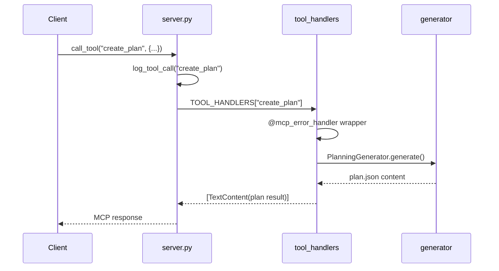
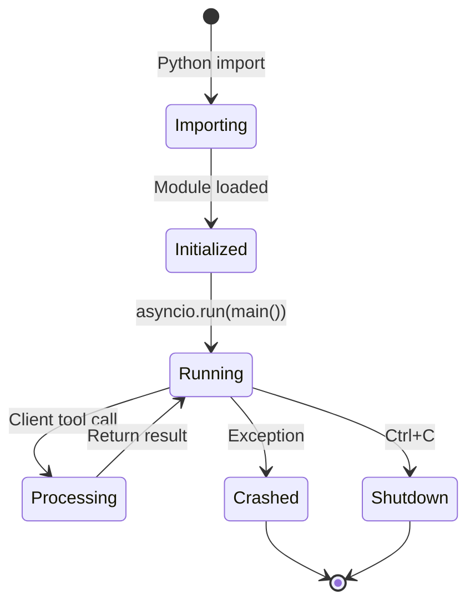
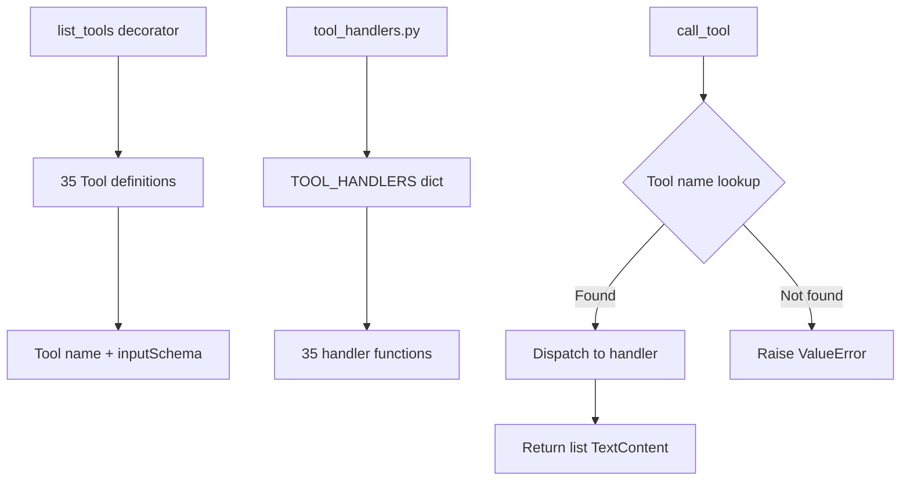

# server.py — Authoritative Documentation

## Executive Summary

**server.py** is the MCP (Model Context Protocol) server entry point for coderef-workflow, responsible for defining 35 documentation and workflow orchestration tools, managing the server lifecycle, and dispatching tool calls to registered handlers. The file serves as the API contract layer between Claude Code clients and the coderef-workflow implementation, declaring tool schemas and delegating execution to tool_handlers.py. This document serves as the single source of truth for understanding server initialization, tool registration patterns, and MCP protocol integration.

## Audience & Intent

### Authority Hierarchy

- **Markdown (this document):** Architectural truth, tool contracts, lifecycle patterns, integration points
- **Python/Code (server.py):** Runtime MCP server implementation, tool schema definitions
- **JSON Schemas (inputSchema):** Tool input validation contracts
- **tool_handlers.py:** Tool execution implementation (separate from registration)

### Maintenance Intent

This document is designed for:
- Developers adding new MCP tools to the server
- Maintainers refactoring tool registration or server lifecycle
- Integration engineers connecting clients to coderef-workflow
- AI agents understanding the complete tool catalog

---

## 1. Architecture Overview

### System Role

server.py is the **protocol adapter** in coderef-workflow architecture:

```
Claude Code Client
    ↓ (MCP stdio protocol)
server.py (@app.list_tools, @app.call_tool)
    ↓ (tool dispatch)
tool_handlers.py (TOOL_HANDLERS registry)
    ↓ (implementation)
generators/ (planning, docs, analysis logic)
```

### Component Hierarchy

```
server.py (1,123 lines)
├── Imports & Configuration (lines 1-58)
│   ├── MCP SDK (Server, Tool, TextContent, stdio_server)
│   ├── generators (FoundationGenerator, BaseGenerator)
│   ├── constants (Paths, Files)
│   ├── validation (validate_* functions)
│   ├── error_responses (ErrorResponse)
│   ├── tool_handlers (TOOL_HANDLERS registry)
│   └── logger_config (logger, log_tool_call)
├── Server Initialization (lines 44-58)
│   ├── SERVER_DIR, TEMPLATES_DIR, TOOL_TEMPLATES_DIR
│   ├── tool_handlers.set_templates_dir()
│   └── app = Server("coderef-workflow")
├── Tool Declarations (@app.list_tools) (lines 60-1085)
│   ├── 35 Tool() definitions with inputSchema
│   └── Grouped by category (templates, docs, changelog, planning, etc.)
├── Tool Dispatcher (@app.call_tool) (lines 1087-1104)
│   ├── Log tool invocation
│   ├── Lookup handler in TOOL_HANDLERS registry
│   └── Delegate to handler(arguments)
└── Main Entry Point (lines 1107-1123)
    ├── async main() - stdio_server lifecycle
    └── if __name__ == "__main__" - asyncio entry
```

### Key Integration Points

| Integration | Protocol | Purpose |
|-------------|----------|---------|
| **Claude Code Client** | MCP stdio (stdin/stdout) | Receives tool calls, returns results |
| **tool_handlers.py** | Python function registry (TOOL_HANDLERS dict) | Delegates execution to 35 handler functions |
| **generators/** | Direct Python imports | Provides implementation logic for tools |
| **constants.py** | Python module import | Path constants (TEMPLATES_DIR, etc.) |
| **validation.py** | Python module import | Input validation before tool execution |
| **logger_config.py** | Python module import | Structured logging for observability |

### Layout Contracts

**File Location:** `C:\Users\willh\.mcp-servers\coderef-workflow\server.py`

**Server Metadata:**
- `__version__ = "2.0.0"` - Server version
- `__schema_version__ = "1.0.0"` - Tool schema version
- `__mcp_version__ = "1.0"` - MCP protocol version

**Template Directories (injected into tool_handlers):**
- `TEMPLATES_DIR` = `{SERVER_DIR}/templates/power/` - POWER framework templates
- `TOOL_TEMPLATES_DIR` = `{SERVER_DIR}/templates/tools/` - DELIVERABLES, communication templates

---

## 2. State Ownership & Source of Truth (Canonical)

| State | Owner | Type | Persistence | Source of Truth |
|-------|-------|------|-------------|-----------------|
| **Server instance (app)** | server.py module | Singleton | None (ephemeral) | `app = Server("coderef-workflow")` line 54 |
| **Tool registry** | @app.list_tools() decorator | Tool definitions | None (ephemeral) | Returned by list_tools() function |
| **Tool schemas (inputSchema)** | Tool() definitions | JSON Schema Draft-07 | None (ephemeral) | Inline in Tool() constructors |
| **Handler registry** | tool_handlers.py | TOOL_HANDLERS dict | None (ephemeral) | Imported from tool_handlers module |
| **TEMPLATES_DIR** | server.py SERVER_DIR | Path constant | None (ephemeral) | Set once at module init (line 46) |
| **TOOL_TEMPLATES_DIR** | server.py SERVER_DIR | Path constant | None (ephemeral) | Set once at module init (line 47) |

### Precedence Rules for Conflicts

1. **Tool Name Conflicts:**
   - If tool_handlers.TOOL_HANDLERS has duplicate keys → **Last registration wins** (Python dict behavior)
   - If list_tools() declares tool not in TOOL_HANDLERS → **call_tool raises ValueError**

2. **Schema Validation Conflicts:**
   - If Tool inputSchema disagrees with handler implementation → **Schema wins** (MCP enforces before call)
   - Handlers must validate beyond MCP schema (e.g., path existence, file permissions)

3. **Template Directory Conflicts:**
   - If set_templates_dir() called multiple times → **Last call wins**
   - If TEMPLATES_DIR doesn't exist → **Handler raises FileNotFoundError**

4. **Version Conflicts:**
   - `__version__` in server.py is source of truth for server version
   - Individual generators may have their own versions (ignored by MCP)

---

## 3. Data Persistence

server.py has **no persistent state**. All data is ephemeral:

### Lifecycle State

**Initialization (module load):**
```python
SERVER_DIR = Path(__file__).parent  # Computed once
TEMPLATES_DIR = SERVER_DIR / Paths.TEMPLATES_DIR  # Computed once
app = Server("coderef-workflow")  # Singleton creation
tool_handlers.set_templates_dir(TEMPLATES_DIR)  # Injection
```

**Runtime (per tool call):**
```python
# State exists only for call duration
arguments = {"project_path": "/path", ...}  # From client
handler = TOOL_HANDLERS[name]  # Lookup
result = await handler(arguments)  # Execution
# State discarded after return
```

**Shutdown:**
- No cleanup required (no open file handles, connections, or resources)

### Failure Modes & Recovery

| Failure | Symptom | Recovery |
|---------|---------|----------|
| **Missing tool_handlers.py** | ImportError at module load | Cannot start server - fix import path |
| **Unknown tool requested** | ValueError in call_tool() | Client receives error, server continues |
| **Handler raises exception** | Logged error, client receives ErrorResponse | Server continues, call fails gracefully |
| **TEMPLATES_DIR not found** | Handlers raise FileNotFoundError | Fix TEMPLATES_DIR path or create directory |
| **MCP protocol error** | stdio_server() raises exception | Server crashes, must restart |
| **Async exception in main()** | Logged error, server exits | Restart server (no state loss) |

---

## 4. State Lifecycle

### Canonical Sequence

```
1. MODULE INITIALIZATION (Python import)
   └─ Load imports (MCP, generators, constants, validation, tool_handlers)
      ↓
   └─ Compute SERVER_DIR, TEMPLATES_DIR paths
      ↓
   └─ Inject paths into tool_handlers via set_templates_dir()
      ↓
   └─ Create app = Server("coderef-workflow")
      ↓
   └─ Log server initialization

2. SERVER START (asyncio.run(main()))
   └─ Log "Starting MCP server main loop"
      ↓
   └─ stdio_server() context manager
      ↓
   └─ app.run(read_stream, write_stream, init_options)
      ↓
   └─ Server ready to receive tool calls

3. TOOL CALL (per client request)
   └─ Client sends tool call via stdio
      ↓
   └─ MCP SDK validates against inputSchema
      ↓
   └─ call_tool(name, arguments) invoked
      ↓
   └─ log_tool_call(name, args_keys)
      ↓
   └─ Lookup handler in TOOL_HANDLERS
      ↓
   └─ await handler(arguments)
      ↓
   └─ Return list[TextContent] to client

4. SERVER SHUTDOWN (Ctrl+C or exception)
   └─ Log "Server error" (if exception)
      ↓
   └─ stdio_server context exit
      ↓
   └─ Process terminates
```

---

## 5. Behaviors (Events & Side Effects)

### System Behaviors

| Event | Trigger | Side Effects |
|-------|---------|--------------|
| **Module import** | Python loads server.py | SERVER_DIR computed, app created, tool_handlers injected |
| **Server start** | `asyncio.run(main())` | stdio_server opens stdin/stdout, MCP handshake |
| **list_tools() call** | Client requests tool list | Returns 35 Tool() definitions |
| **call_tool() invocation** | Client sends tool call | Logs invocation, dispatches to handler, returns result |
| **Handler exception** | Handler raises error | Logged with traceback, client receives error message |
| **Unknown tool** | call_tool with invalid name | ValueError raised, client receives error |
| **Server crash** | Unhandled exception in main() | Logged error, process exits code 1 |

---

## 6. Event & Callback Contracts

| Event | Trigger | Payload | Side Effects |
|-------|---------|---------|--------------|
| `@app.list_tools()` | Client MCP initialization | None | Returns `list[Tool]` with 35 tool definitions |
| `@app.call_tool()` | Client sends tool request | `{"name": str, "arguments": dict}` | Logs call, dispatches to handler, returns `list[TextContent]` |
| `log_tool_call()` | Every tool call | `{"name": str, "args_keys": list[str]}` | Writes structured log entry |
| `handler(arguments)` | Tool dispatch | `{"project_path": str, ...}` (varies per tool) | Executes tool logic, returns results |

---

## 7. Performance Considerations

### Known Limits (Tested Thresholds)

| Operation | Limit | Measured Performance |
|-----------|-------|---------------------|
| **Server startup** | N/A | ~100ms (module load + server init) |
| **list_tools() call** | 35 tools | ~5ms (return pre-built list) |
| **call_tool() dispatch** | Single tool | ~1ms overhead (lookup + log) |
| **Concurrent tool calls** | 1 (serial execution) | MCP stdio is single-threaded |
| **Tool call timeout** | No timeout | Handler execution can block indefinitely |

### Bottlenecks

1. **Serial execution** - MCP stdio protocol processes one tool call at a time
2. **No caching** - Tool schemas rebuilt on every list_tools() call (could cache)
3. **Blocking handlers** - Long-running handlers block server (no async timeout)

### Optimization Opportunities

1. **Cache Tool() list** - Build once at module init, return cached list
2. **Add handler timeouts** - Wrap handler calls in asyncio.wait_for() with timeout
3. **Parallelize independent tools** - Use asyncio.gather() for multi-step workflows

### Deferred Optimizations (with Rationale)

- **Tool schema validation caching** - Deferred (MCP SDK already optimized)
- **Handler connection pooling** - Deferred (handlers don't maintain connections)
- **Multi-threading** - Deferred (MCP stdio is inherently single-threaded)

---

## 8. Accessibility

### Current Gaps

| Issue | Severity | Impact | Location |
|-------|----------|--------|----------|
| No CLI help for tool schemas | Low | Developers must read code to understand tools | list_tools() definitions |
| Error messages not user-friendly | Medium | Technical exceptions exposed to clients | call_tool() error handling |

### Required Tasks (Prioritized Backlog)

1. **P1:** Add --help flag to print tool catalog with examples
2. **P2:** Wrap handler exceptions in user-friendly error messages
3. **P3:** Generate OpenAPI-style tool documentation

---

## 9. Testing Strategy

### Must-Cover Scenarios

1. **Server initialization**
   - Module loads without ImportError
   - SERVER_DIR, TEMPLATES_DIR computed correctly
   - tool_handlers injection succeeds

2. **Tool registration**
   - list_tools() returns 35 tools
   - All tools have valid inputSchema (JSON Schema Draft-07)
   - No duplicate tool names

3. **Tool dispatch**
   - call_tool() with valid tool name succeeds
   - call_tool() with unknown tool raises ValueError
   - Handler exceptions are caught and logged

4. **MCP protocol integration**
   - Server responds to MCP handshake
   - stdio_server lifecycle (start → run → stop)

### Explicitly Not Tested

- **Handler implementations** - Tested separately in tool_handlers.py tests
- **End-to-end workflows** - Tested in integration tests
- **Performance under load** - MCP stdio is single-threaded, no load testing
- **Client compatibility** - Assumes compliant MCP client

---

## 10. Non-Goals / Out of Scope

- **Multi-threading** - MCP stdio is single-threaded by design
- **Persistent state** - Server is stateless, all persistence in file system
- **Authentication** - MCP stdio runs locally, no auth layer
- **Rate limiting** - Single client, no concurrent requests
- **Tool versioning** - Tools are unversioned (use server __version__ instead)
- **Dynamic tool registration** - Tools are statically defined at module load
- **WebSocket transport** - Only stdio transport supported
- **Tool deprecation warnings** - No mechanism to warn clients of deprecated tools

---

## 11. Common Pitfalls & Sharp Edges

### Known Bugs/Quirks

1. **No timeout on handler execution**
   - **Issue:** Long-running handlers block server indefinitely
   - **Workaround:** Handlers must implement their own timeouts
   - **Fix:** Add asyncio.wait_for() wrapper in call_tool (WO-HANDLER-TIMEOUT-001)

2. **Error messages leak implementation details**
   - **Issue:** Python exceptions exposed directly to clients
   - **Example:** "FileNotFoundError: [Errno 2] No such file or directory: '/path'"
   - **Workaround:** Clients must parse technical errors
   - **Fix:** Wrap handler exceptions in ErrorResponse (WO-ERROR-MESSAGES-001)

3. **Tool schema not validated at registration**
   - **Issue:** Invalid inputSchema only discovered at runtime when client calls tool
   - **Mitigation:** MCP SDK validates, but no pre-flight check
   - **Fix:** Add schema validation in list_tools() (WO-SCHEMA-VALIDATION-001)

4. **TEMPLATES_DIR injection is global**
   - **Issue:** set_templates_dir() affects all handlers globally
   - **Edge case:** If multiple server instances in same process, last call wins
   - **Mitigation:** Single server per process (standard deployment)

### Integration Gotchas

1. **tool_handlers.py must have TOOL_HANDLERS dict**
   - If missing → call_tool() raises KeyError → server crashes
   - Check: `from tool_handlers import TOOL_HANDLERS` must succeed

2. **Handler function signature must match**
   - Expected: `async def handler(arguments: dict) -> list[TextContent]`
   - If different → TypeError at runtime

3. **inputSchema must be JSON Schema Draft-07**
   - MCP SDK validates client input against schema
   - Invalid schema → client calls fail with validation error

4. **Tool names must be unique**
   - If duplicate → last Tool() definition wins (Python list behavior)
   - No runtime warning

### Configuration Mistakes

1. **Wrong TEMPLATES_DIR path**
   - Symptom: Handlers raise FileNotFoundError when trying to read templates
   - Fix: Verify `SERVER_DIR / Paths.TEMPLATES_DIR` exists

2. **Missing tool_handlers import**
   - Symptom: ImportError at module load
   - Fix: Ensure tool_handlers.py in same directory or PYTHONPATH

3. **Forgetting to register new tools**
   - Symptom: Handler exists but tool not in list_tools() → client can't discover it
   - Fix: Add Tool() definition in list_tools() AND handler in TOOL_HANDLERS

### Edge Cases

1. **Handler returns wrong type**
   - Expected: `list[TextContent]`
   - If returns `str` → MCP SDK raises TypeError
   - Recovery: Client receives error, server continues

2. **Client sends malformed JSON**
   - MCP SDK handles gracefully
   - Server never sees invalid input (validated before call_tool)

3. **Concurrent calls from same client**
   - MCP stdio processes serially
   - Second call waits for first to complete

4. **Server crash during tool execution**
   - No cleanup needed (stateless)
   - Client receives connection error
   - Restart server to recover

---

## 12. Diagrams (Illustrative)

> **Maintenance Rule:** Diagrams are illustrative, not authoritative. State tables and text define truth.

### Tool Call Flow



### Server Lifecycle



### Tool Registration Pattern



---

## 13. Tool Catalog (35 Tools)

### Template Management (2 tools)
- `list_templates` - List available POWER framework templates
- `get_template` - Retrieve specific template content

### Documentation Generation (1 tool)
- `generate_individual_doc` - Generate single doc from template
- **Note:** Foundation doc generation moved to coderef-docs server. Use coderef-docs for README, ARCHITECTURE, API, COMPONENTS, SCHEMA generation.

### Changelog Management (2 tools)
- `get_changelog` - Retrieve changelog entries (filtered by version/type)
- `add_changelog_entry` - Add new changelog entry with metadata

### Standards & Quality (3 tools)
- `establish_standards` - Scan codebase for UI/UX/behavior patterns
- `audit_codebase` - Audit against established standards
- `check_consistency` - Pre-commit quality gate for changes

### Planning Workflow (7 tools)
- `get_planning_template` - Get 10-section plan template
- `analyze_project_for_planning` - Analyze project for planning (section 0)
- `gather_context` - Gather feature requirements interactively
- `create_plan` - Generate 10-section implementation plan
- `validate_implementation_plan` - Score plan quality (0-100)
- `generate_plan_review_report` - Generate markdown review
- `generate_quickref_interactive` - Interactive quickref guide generation

### Execution & Tracking (6 tools)
- `execute_plan` - Generate TodoWrite task list from plan
- `update_task_status` - Update task status in plan.json
- `generate_deliverables_template` - Create DELIVERABLES.md
- `update_deliverables` - Update metrics from git history
- `update_all_documentation` - Update README/CHANGELOG/CLAUDE.md
- `generate_handoff_context` - Generate claude.md for agent handoffs

### Multi-Agent Coordination (4 tools)
- `generate_agent_communication` - Create communication.json for agents
- `assign_agent_task` - Assign task to specific agent (1-10)
- `verify_agent_completion` - Validate agent work completion
- `aggregate_agent_deliverables` - Combine metrics from multi-agent work
- `track_agent_status` - Dashboard for agent assignments

### Feature Management (3 tools)
- `archive_feature` - Archive completed feature to coderef/archived/
- `audit_plans` - Health check on all plans in coderef/workorder/
- `generate_features_inventory` - List all active & archived features

### Workorder Tracking (2 tools)
- `log_workorder` - Log workorder to global audit trail
- `get_workorder_log` - Query workorder history

### Risk Assessment (1 tool)
- `assess_risk` - AI-powered risk scoring for code changes (0-100)

### Foundation Documentation (1 tool)
- `coderef_foundation_docs` - Unified generator for ARCHITECTURE/SCHEMA/API/COMPONENTS

---

## 14. Conclusion

### What This Document Defines

This resource sheet defines the **authoritative contracts** for server.py:

1. **Tool registration** - 35 tool definitions with JSON Schema contracts
2. **Server lifecycle** - Module init → stdio_server → tool calls → shutdown
3. **Dispatch pattern** - Tool name lookup → handler invocation → result return
4. **Integration contracts** - MCP protocol, tool_handlers registry, template directory injection
5. **Failure modes** - Unknown tool, handler exceptions, server crashes
6. **Performance contracts** - Serial execution, no caching, blocking handlers

### How to Use This Document

**For Developers Adding New Tools:**
1. Read Section 11 (Common Pitfalls) - avoid configuration mistakes
2. Reference Section 13 (Tool Catalog) - understand existing tools
3. Follow Section 1 (Architecture) - understand registration pattern
4. Check Section 6 (Event Contracts) - match handler signature

**For Maintainers Refactoring Server:**
- Section 1 (Architecture Overview) explains component hierarchy
- Section 2 (State Ownership) defines singleton patterns
- Section 4 (State Lifecycle) documents initialization sequence

**For Integration Engineers:**
- Section 13 (Tool Catalog) lists all 35 available tools
- Section 6 (Event Contracts) defines MCP call/response flow
- Section 11 (Common Pitfalls) documents integration gotchas

### Maintenance Expectations

**Update Frequency:** After adding/removing tools or changing server lifecycle

**Review Triggers:**
- Adding new MCP tools → Update Section 13 (Tool Catalog)
- Changing tool dispatch logic → Update Section 6 (Event Contracts)
- Modifying server lifecycle → Update Section 4 (State Lifecycle)
- Performance optimizations → Update Section 7 (Performance)

**Ownership:** Assigned to primary maintainer of coderef-workflow (currently: willh, Claude Code AI)

---

**Document Version:** 1.0.0
**Last Updated:** 2026-01-02
**Maintained by:** willh, Claude Code AI
**Related Documents:** CLAUDE.md, tool_handlers.py, RESOURCE-SHEET.md (system overview)
