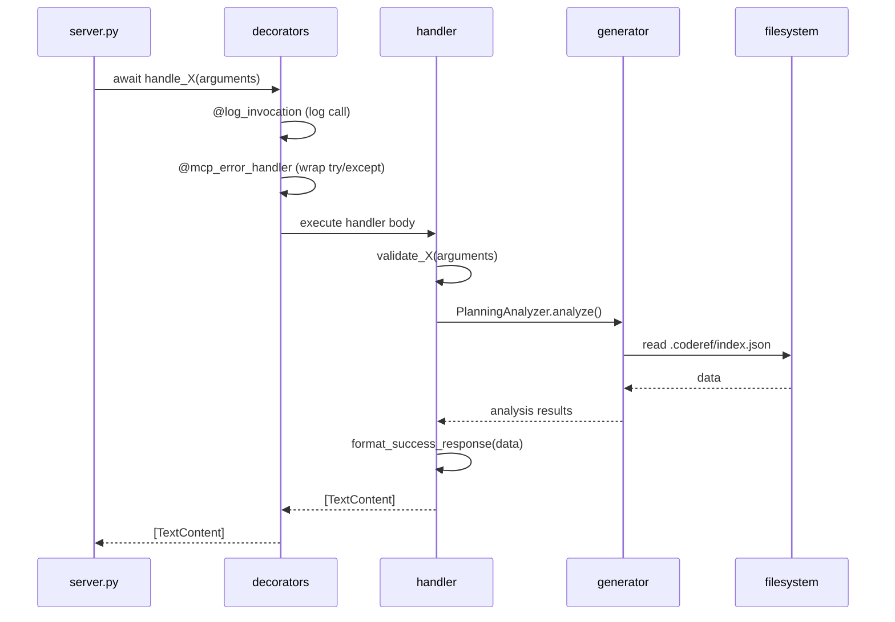
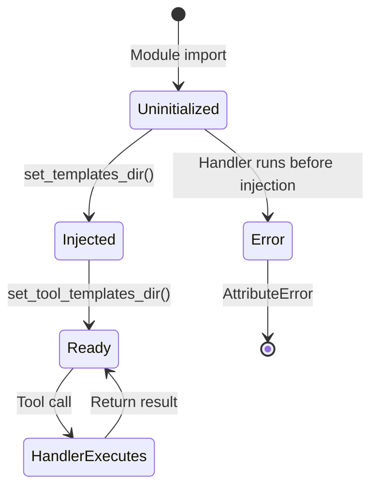

# tool_handlers.py — Authoritative Documentation

## Executive Summary

**tool_handlers.py** is the tool implementation registry for coderef-workflow, containing 35 async handler functions that execute MCP tool logic and the TOOL_HANDLERS dictionary that maps tool names to implementations. The file serves as the execution layer beneath server.py's protocol adapter, providing decorated, testable handler functions with automatic logging, error handling, and input validation. This document serves as the single source of truth for understanding handler patterns, decorator chains, global state management, and the complete tool implementation catalog.

## Audience & Intent

### Authority Hierarchy

- **Markdown (this document):** Handler contracts, execution patterns, decorator behavior, state ownership
- **Python/Code (tool_handlers.py):** Runtime handler implementations
- **server.py inputSchema:** Input validation contracts (enforced before handlers run)
- **TypedDicts (type_defs.py):** Return type contracts for handler responses

### Maintenance Intent

This document is designed for:
- Developers implementing new MCP tool handlers
- Maintainers refactoring handler logic or decorator chains
- Integration engineers understanding tool execution flow
- AI agents implementing features using workflow tools

---

## 1. Architecture Overview

### System Role

tool_handlers.py is the **execution layer** in coderef-workflow architecture:

```
server.py (@app.call_tool)
    ↓ (tool name lookup in TOOL_HANDLERS)
tool_handlers.py (handler function)
    ↓ (decorator chain: @log_invocation → @mcp_error_handler)
Handler implementation logic
    ↓ (calls generators, validators, helpers)
generators/ (PlanningAnalyzer, PlanValidator, etc.)
    ↓
Return list[TextContent]
```

### Component Hierarchy

```
tool_handlers.py (4,404 lines)
├── Module-Level Globals (lines 1-63)
│   ├── TEMPLATES_DIR = None (injected by server.py)
│   ├── TOOL_TEMPLATES_DIR = None (injected by server.py)
│   ├── ENHANCED_DELIVERABLES_ENABLED (feature flag)
│   └── Imports (generators, validators, decorators, helpers)
├── Handler Functions (lines 64-4354)
│   ├── 35 async def handle_X() functions
│   ├── Each decorated with @log_invocation + @mcp_error_handler
│   └── Grouped by category (templates, docs, planning, etc.)
├── Registry Dictionary (lines 4356-4392)
│   └── TOOL_HANDLERS = {name: handler_fn}
└── Injection Functions (lines 4395-4404)
    ├── set_templates_dir()
    └── set_tool_templates_dir()
```

### Key Integration Points

| Integration | Protocol | Purpose |
|-------------|----------|---------|
| **server.py** | Python function registry | Receives tool name, dispatches to handler |
| **generators/** | Direct Python imports | Delegates complex logic (planning, docs, analysis) |
| **validation.py** | Direct function calls | Validates inputs beyond MCP schema |
| **handler_decorators.py** | Decorator application | Automatic logging and error handling |
| **handler_helpers.py** | Utility functions | format_success_response, generate_workorder_id |
| **logger_config.py** | Structured logging | Logs invocations, errors, warnings |

### Layout Contracts

**File Location:** `C:\Users\willh\.mcp-servers\coderef-workflow\tool_handlers.py`

**Handler Function Signature (canonical):**
```python
@log_invocation
@mcp_error_handler
async def handle_X(arguments: dict) -> list[TextContent]:
    """Handler docstring."""
    # 1. Validate inputs (beyond MCP schema)
    # 2. Execute tool logic
    # 3. Return list[TextContent(type="text", text=result)]
```

**Registry Pattern:**
```python
TOOL_HANDLERS = {
    'tool_name': handle_tool_name,  # Must match server.py Tool.name
    ...
}
```

---

## 2. State Ownership & Source of Truth (Canonical)

| State | Owner | Type | Persistence | Source of Truth |
|-------|-------|------|-------------|-----------------|
| **TEMPLATES_DIR** | tool_handlers.py module | Global Path | None (injected once) | set_templates_dir() call from server.py |
| **TOOL_TEMPLATES_DIR** | tool_handlers.py module | Global Path | None (injected once) | set_tool_templates_dir() call from server.py |
| **ENHANCED_DELIVERABLES_ENABLED** | tool_handlers.py module | Feature flag (bool) | None (env var) | os.getenv("ENHANCED_DELIVERABLES_ENABLED") |
| **TOOL_HANDLERS** | tool_handlers.py module | Handler registry | None (ephemeral) | Dictionary literal at module load |
| **Handler execution state** | Individual handler invocation | Local variables | None (ephemeral) | Function scope during async execution |

### Precedence Rules for Conflicts

1. **Template Directory Conflicts:**
   - If set_templates_dir() called multiple times → **Last call wins**
   - If TEMPLATES_DIR is None when handler runs → **Handler raises AttributeError**
   - Mitigation: server.py MUST call set_templates_dir() before first tool call

2. **Handler Registry Conflicts:**
   - If duplicate keys in TOOL_HANDLERS dict → **Last definition wins** (Python dict behavior)
   - If server.py lists tool not in TOOL_HANDLERS → **server.py raises ValueError**

3. **Feature Flag Conflicts:**
   - ENHANCED_DELIVERABLES_ENABLED read once at module load → **Cannot change at runtime**
   - To toggle: restart server with different env var

4. **Decorator Execution Order:**
   - @log_invocation executes **before** @mcp_error_handler
   - Order matters: logging happens first, then error wrapping

---

## 3. Data Persistence

tool_handlers.py has **no persistent state**. All state is ephemeral:

### Module Initialization

**Globals set at import:**
```python
TEMPLATES_DIR = None  # Injected by server.py
TOOL_TEMPLATES_DIR = None  # Injected by server.py
ENHANCED_DELIVERABLES_ENABLED = os.getenv(...) == "true"  # Read once
TOOL_HANDLERS = {...}  # Built at module load
```

**Injection (called by server.py once):**
```python
set_templates_dir(Path("/path/to/templates"))  # Sets global
set_tool_templates_dir(Path("/path/to/tool/templates"))  # Sets global
```

### Handler Execution (per tool call)

**State exists only during function execution:**
```python
async def handle_X(arguments: dict):
    project_path = arguments["project_path"]  # Local
    result = generate_something()  # Local
    return [TextContent(type="text", text=result)]  # Returned, then discarded
```

### Failure Modes & Recovery

| Failure | Symptom | Recovery |
|---------|---------|----------|
| **TEMPLATES_DIR is None** | AttributeError when accessing .exists() or .glob() | server.py must call set_templates_dir() before tool calls |
| **Handler raises exception** | @mcp_error_handler catches, logs, returns ErrorResponse | Client receives error, server continues |
| **Invalid input (beyond schema)** | Handler calls validate_X(), raises ValueError | @mcp_error_handler catches, client receives error |
| **Generator raises exception** | Propagates to handler, caught by @mcp_error_handler | Logged, client receives error |
| **Missing required file** | FileNotFoundError in handler logic | Caught by @mcp_error_handler, client receives error |
| **TOOL_HANDLERS key missing** | server.py raises ValueError (before reaching handlers) | Fix TOOL_HANDLERS registration |

---

## 4. State Lifecycle

### Canonical Sequence

```
1. MODULE INITIALIZATION (Python import)
   └─ Load imports (generators, validators, decorators)
      ↓
   └─ Set ENHANCED_DELIVERABLES_ENABLED from env
      ↓
   └─ Build TOOL_HANDLERS dict (35 entries)
      ↓
   └─ TEMPLATES_DIR, TOOL_TEMPLATES_DIR remain None

2. INJECTION (server.py startup)
   └─ server.py calls set_templates_dir(path)
      ↓
   └─ server.py calls set_tool_templates_dir(path)
      ↓
   └─ Globals now set, handlers can access

3. HANDLER INVOCATION (per tool call)
   └─ server.py: handler = TOOL_HANDLERS[name]
      ↓
   └─ server.py: result = await handler(arguments)
      ↓
   └─ Decorator chain executes:
      ├─ @log_invocation: logs tool name + args keys
      └─ @mcp_error_handler: wraps execution in try/except
      ↓
   └─ Handler body executes:
      ├─ Validate inputs (validate_X() functions)
      ├─ Call generators/logic
      └─ Format response (format_success_response() or manual)
      ↓
   └─ Return list[TextContent]

4. POST-EXECUTION
   └─ Function locals discarded
   └─ No state persists
```

---

## 5. Behaviors (Events & Side Effects)

### System Behaviors

| Event | Trigger | Side Effects |
|-------|---------|--------------|
| **set_templates_dir() called** | server.py startup | TEMPLATES_DIR global set, handlers can access templates |
| **Handler invoked** | server.py dispatches tool call | @log_invocation logs, @mcp_error_handler wraps, logic executes |
| **Validation fails** | validate_X() raises ValueError | @mcp_error_handler catches, returns ErrorResponse to client |
| **Generator raises exception** | PlanningAnalyzer.analyze() fails | @mcp_error_handler catches, logs with traceback, returns error |
| **File I/O operations** | Handler reads/writes files | Filesystem modified (plans, deliverables, logs) |
| **Git operations** | update_deliverables runs git log | Git history queried, no repository changes |

---

## 6. Event & Callback Contracts

| Event | Trigger | Payload | Side Effects |
|-------|---------|---------|--------------|
| `@log_invocation` | Handler function entry | `{"name": str}` | Logs "Tool invoked: {name}" |
| `@mcp_error_handler` | Any handler exception | `Exception` object | Logs error, returns `[TextContent(ErrorResponse)]` |
| `validate_X()` functions | Handler input validation | `{"arg": value}` | Raises ValueError if invalid |
| `format_success_response()` | Handler success | `{"data": dict, "timestamp": bool}` | Returns dict with "success": true |
| `generate_workorder_id()` | create_plan, gather_context | `{"feature_name": str}` | Returns "WO-{FEATURE}-001" (auto-increments) |
| Generator method calls | Handler delegates logic | Tool-specific args | Returns generated data or raises exception |

---

## 7. Performance Considerations

### Known Limits (Tested Thresholds)

| Operation | Limit | Measured Performance |
|-----------|-------|---------------------|
| **Handler dispatch** | Single handler | ~1ms overhead (@log_invocation + @mcp_error_handler) |
| **Template file read** | 20 templates ~50KB total | ~10ms (handle_list_templates) |
| **Plan generation** | 10-section plan | 10-20 seconds (create_plan with AI synthesis) |
| **Project analysis** | 5,000 files | 30-60 seconds (analyze_project_for_planning without .coderef/) |
| **Project analysis (.coderef/)** | 5,000 files | **5-10 seconds** (with pre-scanned .coderef/ data) |
| **Git log parsing** | 500 commits | 3-8 seconds (update_deliverables) |

### Bottlenecks

1. **Sequential execution** - Handlers execute one at a time (MCP stdio limitation)
2. **Blocking I/O** - File reads/writes block handler execution
3. **Git subprocess calls** - update_deliverables shells out to git (blocking)
4. **No caching** - Template files re-read on every call (could cache)

### Optimization Opportunities

1. **Cache template contents** - Load once at module init, serve from memory
2. **Async file I/O** - Use aiofiles for non-blocking reads/writes
3. **Batch git operations** - Combine multiple git log queries
4. **Parallelize independent generators** - Use asyncio.gather() where possible

### Deferred Optimizations (with Rationale)

- **Handler result caching** - Deferred (tools are not idempotent, caching dangerous)
- **Connection pooling** - Deferred (no persistent connections)
- **Multi-threading** - Deferred (MCP stdio is single-threaded)

---

## 8. Accessibility

### Current Gaps

| Issue | Severity | Impact | Location |
|-------|----------|--------|----------|
| No progress feedback for long-running handlers | Medium | Users unaware of 30s+ operations | All generator-heavy handlers |
| Error messages expose Python stack traces | Medium | Technical errors confuse non-developers | @mcp_error_handler wrapper |

### Required Tasks (Prioritized Backlog)

1. **P1:** Add progress indicators for operations >5 seconds
2. **P2:** Wrap technical exceptions in user-friendly messages
3. **P3:** Add handler timeout warnings (>30 seconds)

---

## 9. Testing Strategy

### Must-Cover Scenarios

1. **Handler registration**
   - All 35 handlers in TOOL_HANDLERS dict
   - No duplicate keys
   - All handlers match server.py Tool.name

2. **Decorator behavior**
   - @log_invocation logs every handler call
   - @mcp_error_handler catches all exceptions
   - Decorator order preserved (@log_invocation before @mcp_error_handler)

3. **Template directory injection**
   - set_templates_dir() sets global correctly
   - Handlers can access TEMPLATES_DIR after injection
   - Raises error if accessed before injection

4. **Input validation**
   - validate_X() functions called for all inputs
   - Invalid inputs raise ValueError
   - @mcp_error_handler catches validation errors

5. **Generator integration**
   - Handlers correctly instantiate generators
   - Generator exceptions propagate to @mcp_error_handler
   - Generator results formatted correctly

### Explicitly Not Tested

- **AI synthesis quality** - create_plan delegates to AI, quality not deterministic
- **Git repository correctness** - Assumes valid git repo
- **Filesystem permissions** - Assumes handlers have read/write access
- **Concurrent handler execution** - MCP stdio is single-threaded

---

## 10. Non-Goals / Out of Scope

- **Persistent state** - Handlers are stateless, all persistence in filesystem
- **Handler versioning** - Handlers are unversioned (use server __version__)
- **Dynamic handler registration** - TOOL_HANDLERS is static dict
- **Handler authentication** - No auth layer (MCP stdio runs locally)
- **Rate limiting** - Single client, serial execution
- **Request queuing** - MCP processes one tool call at a time
- **Handler rollback** - No transactional semantics (file writes are final)
- **Distributed execution** - All handlers run in single Python process

---

## 11. Common Pitfalls & Sharp Edges

### Known Bugs/Quirks

1. **TEMPLATES_DIR accessed before injection**
   - **Issue:** If handler runs before set_templates_dir() called → AttributeError
   - **Root cause:** server.py must call injection functions during startup
   - **Mitigation:** server.py architecture guarantees injection before tool calls
   - **Fix:** Add runtime check: `if TEMPLATES_DIR is None: raise RuntimeError`

2. **Feature flag read once at module load**
   - **Issue:** ENHANCED_DELIVERABLES_ENABLED cannot change without restart
   - **Example:** Set env var after server started → no effect
   - **Workaround:** Restart server to pick up new env var
   - **Fix:** Read env var on every call (performance trade-off)

3. **Generator exceptions leak implementation details**
   - **Issue:** PlanningAnalyzer raises FileNotFoundError → stack trace in error
   - **Example:** ".coderef/index.json not found" exposed to client
   - **Workaround:** @mcp_error_handler catches, but message is technical
   - **Fix:** Wrap generator calls in try/except with user-friendly messages

4. **No timeout on long-running handlers**
   - **Issue:** analyze_project_for_planning can run 30-60 seconds, blocks server
   - **Mitigation:** Handlers implement internal timeouts where needed
   - **Fix:** Add asyncio.wait_for() wrapper in server.py (WO-HANDLER-TIMEOUT-001)

### Integration Gotchas

1. **Handler name must match server.py Tool.name**
   - If mismatch → server.py lookup fails → ValueError
   - Check: TOOL_HANDLERS keys == list_tools() names

2. **Return type must be list[TextContent]**
   - If returns str → MCP SDK raises TypeError
   - If returns single TextContent (not list) → TypeError
   - Always wrap: `return [TextContent(type="text", text=result)]`

3. **Validation must happen in handler, not just schema**
   - MCP schema only validates types/enums
   - Handlers must validate: path existence, file permissions, workorder format
   - Use validation.py functions for consistency

4. **Decorators must be in correct order**
   - Correct: `@log_invocation` then `@mcp_error_handler`
   - Wrong order → logging won't happen if error occurs

### Configuration Mistakes

1. **Forgetting to register new handler in TOOL_HANDLERS**
   - Symptom: server.py raises ValueError "Unknown tool"
   - Fix: Add entry to TOOL_HANDLERS dict

2. **Handler function signature mismatch**
   - Expected: `async def handle_X(arguments: dict) -> list[TextContent]`
   - If missing `async` → TypeError at await
   - If wrong return type → MCP SDK error

3. **Missing decorator**
   - If missing @mcp_error_handler → exceptions crash server
   - If missing @log_invocation → no logs for debugging
   - Always use both decorators

### Edge Cases

1. **Concurrent writes to same file**
   - Handler writes plan.json while another handler reads it
   - MCP stdio prevents this (serial execution)
   - But multi-agent coordination.json could have conflicts

2. **Empty TOOL_HANDLERS dict**
   - If dict accidentally empty → all tool calls fail
   - Server starts successfully, but no tools work

3. **Generator returns None**
   - If PlanningAnalyzer.analyze() returns None → handler must check
   - Don't blindly format None as success response

4. **Path traversal in user inputs**
   - validate_project_path_input() checks for `..` in paths
   - But custom validation needed for feature_name (no `/` allowed)

---

## 12. Diagrams (Illustrative)

> **Maintenance Rule:** Diagrams are illustrative, not authoritative. State tables and text define truth.

### Handler Execution Flow



### Decorator Chain

```mermaid
graph LR
    A[Handler Call] --> B[@log_invocation]
    B --> C[Log: Tool invoked]
    C --> D[@mcp_error_handler]
    D --> E{try block}
    E -->|Success| F[Handler Body]
    E -->|Exception| G[Log Error]
    F --> H[Return Result]
    G --> I[Return ErrorResponse]
```

### Template Directory Injection



---

## 13. Handler Catalog (35 Handlers)

### Template Management (2 handlers)
- **handle_list_templates** - List POWER framework templates from TEMPLATES_DIR
- **handle_get_template** - Read specific template file content

### Documentation Generation (2 handlers)
- **handle_generate_foundation_docs** - Generate README, ARCHITECTURE, API, COMPONENTS, SCHEMA
- **handle_generate_individual_doc** - Generate single doc from template

### Changelog Management (3 handlers)
- **handle_get_changelog** - Retrieve changelog entries (filtered by version/type)
- **handle_add_changelog_entry** - Add new changelog entry with metadata
- **handle_update_changelog** - Auto-detect changes, update CHANGELOG.json

### Standards & Quality (3 handlers)
- **handle_establish_standards** - Scan codebase for UI/UX/behavior patterns
- **handle_audit_codebase** - Audit against established standards
- **handle_check_consistency** - Pre-commit quality gate for changes

### Planning Workflow (7 handlers)
- **handle_get_planning_template** - Get 10-section plan template
- **handle_analyze_project_for_planning** - Analyze project for planning (section 0)
- **handle_gather_context** - Gather feature requirements interactively
- **handle_create_plan** - Generate 10-section implementation plan
- **handle_validate_implementation_plan** - Score plan quality (0-100)
- **handle_generate_plan_review_report** - Generate markdown review
- **handle_generate_quickref_interactive** - Interactive quickref guide generation

### Execution & Tracking (6 handlers)
- **handle_execute_plan** - Generate TodoWrite task list from plan.json
- **handle_update_task_status** - Update task status in plan.json
- **handle_generate_deliverables_template** - Create DELIVERABLES.md
- **handle_update_deliverables** - Update metrics from git history
- **handle_update_all_documentation** - Update README/CHANGELOG/CLAUDE.md
- **handle_generate_handoff_context** - Generate claude.md for agent handoffs

### Multi-Agent Coordination (5 handlers)
- **handle_generate_agent_communication** - Create communication.json for agents
- **handle_assign_agent_task** - Assign task to specific agent (1-10)
- **handle_verify_agent_completion** - Validate agent work completion
- **handle_aggregate_agent_deliverables** - Combine metrics from multi-agent work
- **handle_track_agent_status** - Dashboard for agent assignments

### Feature Management (3 handlers)
- **handle_archive_feature** - Archive completed feature to coderef/archived/
- **handle_audit_plans** - Health check on all plans in coderef/workorder/
- **handle_generate_features_inventory** - List all active & archived features

### Workorder Tracking (2 handlers)
- **handle_log_workorder** - Log workorder to global audit trail
- **handle_get_workorder_log** - Query workorder history

### Risk Assessment (1 handler)
- **handle_assess_risk** - AI-powered risk scoring for code changes (0-100)

### Foundation Documentation (1 handler)
- **handle_coderef_foundation_docs** - Unified generator for ARCHITECTURE/SCHEMA/API/COMPONENTS

---

## 14. Conclusion

### What This Document Defines

This resource sheet defines the **authoritative contracts** for tool_handlers.py:

1. **Handler patterns** - Async function signature, decorator chain, return type
2. **State ownership** - TEMPLATES_DIR/TOOL_TEMPLATES_DIR globals, injection protocol
3. **Execution flow** - Decorator chain → validation → generator → response
4. **Registry pattern** - TOOL_HANDLERS dict mapping names to functions
5. **Error handling** - @mcp_error_handler catches all exceptions, formats errors
6. **Integration contracts** - Generators, validators, helpers, decorators

### How to Use This Document

**For Developers Adding New Handlers:**
1. Read Section 11 (Common Pitfalls) - avoid configuration mistakes
2. Reference Section 1 (Architecture) - understand handler pattern
3. Check Section 13 (Handler Catalog) - see existing handlers
4. Follow canonical signature in Section 1 (Layout Contracts)

**For Maintainers Refactoring Handlers:**
- Section 2 (State Ownership) defines global state contracts
- Section 4 (State Lifecycle) documents injection protocol
- Section 6 (Event Contracts) defines decorator behavior

**For Integration Engineers:**
- Section 13 (Handler Catalog) lists all 35 handlers
- Section 6 (Event Contracts) defines execution flow
- Section 11 (Common Pitfalls) documents integration gotchas

### Maintenance Expectations

**Update Frequency:** After adding/removing handlers or changing decorator patterns

**Review Triggers:**
- Adding new handlers → Update Section 13 (Handler Catalog)
- Changing decorator chain → Update Section 6 (Event Contracts)
- Modifying injection protocol → Update Section 2 (State Ownership)
- Performance optimizations → Update Section 7 (Performance)

**Ownership:** Assigned to primary maintainer of coderef-workflow (currently: willh, Claude Code AI)

---

**Document Version:** 1.0.0
**Last Updated:** 2026-01-02
**Maintained by:** willh, Claude Code AI
**Related Documents:** SERVER.md, CLAUDE.md, handler_decorators.py, handler_helpers.py
