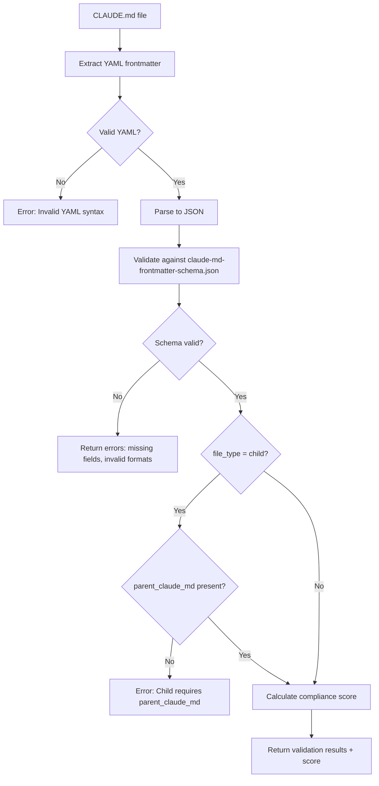
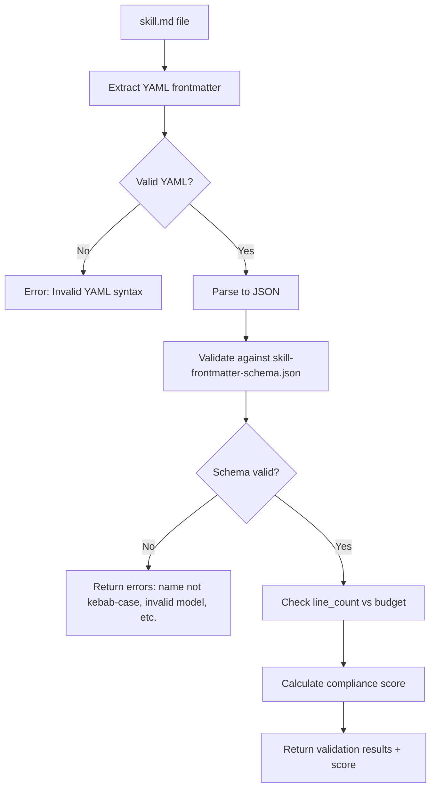

# JSON Schema Testing Results

**Phase:** 4 - Build JSON Schemas
**Date:** 2026-01-22
**Workorder:** WO-CLAUDE-MD-STANDARDS-001

---

## Schemas Created

### 1. claude-md-frontmatter-schema.json

**Location:** `C:\Users\willh\.mcp-servers\papertrail\schemas\documentation\claude-md-frontmatter-schema.json`

**Purpose:** Validates YAML front matter for CLAUDE.md files (both project-level and child)

**Key Features:**
- Extends `base-frontmatter-schema.json` for UDS compliance
- Supports two file types: "project" and "child"
- Enforces required fields: file_type, project_name, version, status, created, last_updated
- Conditional validation: child files MUST have `parent_claude_md` field
- Includes compliance tracking: line_count, compliance_score, line_budget_status
- Defines required_sections per file_type

**Validation Rules:**
- `file_type`: Must be "project" or "child"
- `project_name`: 1-100 characters
- `version`: Semantic versioning pattern (e.g., "2.0.0")
- `status`: Must be one of 5 emoji statuses (✅ Production, 🚧 Building, etc.)
- `created` and `last_updated`: YYYY-MM-DD format
- `parent_claude_md`: Required for child, must match pattern `../../CLAUDE.md`
- `line_count`: 200-1200 range
- `compliance_score`: 0-100 integer

---

### 2. skill-frontmatter-schema.json

**Location:** `C:\Users\willh\.mcp-servers\papertrail\schemas\documentation\skill-frontmatter-schema.json`

**Purpose:** Validates YAML front matter for skill.md files in Claude Code

**Key Features:**
- Extends `base-frontmatter-schema.json` for UDS compliance
- Required fields: name, description
- Optional fields: allowed-tools, model, context, tags, version, workorder_id
- Includes compliance tracking: line_count, compliance_score, line_budget_status

**Validation Rules:**
- `name`: Kebab-case pattern, 3-50 characters (e.g., "deploy-production")
- `description`: 10-200 characters, action-oriented
- `allowed-tools`: Array of valid tool names (Bash, Read, Write, etc. + MCP tools)
- `model`: Must be "haiku", "sonnet", or "opus"
- `context`: 10-500 characters explaining when to use skill
- `tags`: Array of kebab-case tags, 1-10 items, 2-30 characters each
- `line_count`: 100-800 range (target: 300-500)
- `compliance_score`: 0-100 integer

---

## Test Cases

### Test 1: Valid Project-Level CLAUDE.md Frontmatter

**Input:**
```json
{
  "agent": "CodeRef Assistant",
  "date": "2025-11-15",
  "task": "CREATE",
  "file_type": "project",
  "project_name": "Assistant",
  "version": "2.0.0",
  "status": "✅ Production",
  "created": "2025-11-15",
  "last_updated": "2025-12-28",
  "workorder_id": "WO-ASSISTANT-SETUP-001",
  "line_count": 561,
  "compliance_score": 92,
  "line_budget_status": "✅ Within target"
}
```

**Expected Result:** ✅ Valid
**Reason:** All required fields present, valid formats, within constraints

---

### Test 2: Valid Child CLAUDE.md Frontmatter

**Input:**
```json
{
  "agent": "Ava",
  "date": "2026-01-20",
  "task": "CREATE",
  "file_type": "child",
  "project_name": "Universal Context Menu System",
  "parent_claude_md": "../../CLAUDE.md",
  "version": "1.0.0",
  "status": "🚧 Building",
  "created": "2026-01-20",
  "last_updated": "2026-01-22",
  "line_count": 340,
  "compliance_score": 88,
  "line_budget_status": "✅ Within target"
}
```

**Expected Result:** ✅ Valid
**Reason:** Child file has required `parent_claude_md` field, all constraints met

---

### Test 3: Invalid Child CLAUDE.md (Missing parent_claude_md)

**Input:**
```json
{
  "agent": "Ava",
  "date": "2026-01-20",
  "task": "CREATE",
  "file_type": "child",
  "project_name": "Universal Context Menu System",
  "version": "1.0.0",
  "status": "🚧 Building",
  "created": "2026-01-20",
  "last_updated": "2026-01-22"
}
```

**Expected Result:** ❌ Invalid
**Reason:** Child file type requires `parent_claude_md` field (conditional validation)

---

### Test 4: Invalid Project CLAUDE.md (Line Count Over Budget)

**Input:**
```json
{
  "agent": "coderef-docs v2.0.0",
  "date": "2026-01-10",
  "task": "DOCUMENT",
  "file_type": "project",
  "project_name": "coderef-workflow MCP Server",
  "version": "2.1.0",
  "status": "✅ Production",
  "created": "2025-10-01",
  "last_updated": "2026-01-10",
  "line_count": 1142,
  "compliance_score": 55,
  "line_budget_status": "🚨 Critical bloat"
}
```

**Expected Result:** ⚠️ Valid but flagged
**Reason:** Schema allows line_count up to 1200 (for flexibility), but `line_budget_status` field indicates critical bloat

---

### Test 5: Valid Skill Frontmatter (Full Features)

**Input:**
```json
{
  "agent": "DevOps Team",
  "date": "2026-01-15",
  "task": "CREATE",
  "name": "deploy-production",
  "description": "Deploy application to AWS production environment with health checks",
  "allowed-tools": ["Bash", "Read", "WebFetch"],
  "model": "sonnet",
  "context": "Use when the user explicitly requests a production deployment. It requires AWS credentials to be configured in the environment.",
  "tags": ["deployment", "aws", "production"],
  "version": "1.0.0",
  "line_count": 220,
  "compliance_score": 95,
  "line_budget_status": "✅ Within target (300-500)"
}
```

**Expected Result:** ✅ Valid
**Reason:** All required fields present, all optional fields valid

---

### Test 6: Valid Skill Frontmatter (Minimal)

**Input:**
```json
{
  "agent": "Taylor",
  "date": "2026-01-05",
  "task": "CREATE",
  "name": "generate-docs",
  "description": "Generate foundation docs from codebase"
}
```

**Expected Result:** ✅ Valid
**Reason:** Only required fields (agent, date, task from base + name, description from skill) are provided

---

### Test 7: Invalid Skill (Name Not Kebab-Case)

**Input:**
```json
{
  "agent": "Taylor",
  "date": "2026-01-05",
  "task": "CREATE",
  "name": "DeployProduction",
  "description": "Deploy application to production"
}
```

**Expected Result:** ❌ Invalid
**Reason:** `name` must be kebab-case (e.g., "deploy-production"), not PascalCase

---

### Test 8: Invalid Skill (Invalid Model)

**Input:**
```json
{
  "agent": "Taylor",
  "date": "2026-01-05",
  "task": "CREATE",
  "name": "deploy-staging",
  "description": "Deploy to staging environment",
  "model": "gpt-4"
}
```

**Expected Result:** ❌ Invalid
**Reason:** `model` must be one of: "haiku", "sonnet", or "opus"

---

## Integration with Papertrail MCP

### Schema Location

Both schemas are placed in:
```
C:\Users\willh\.mcp-servers\papertrail\schemas\documentation\
├── claude-md-frontmatter-schema.json
├── skill-frontmatter-schema.json
└── base-frontmatter-schema.json (referenced by both)
```

### Expected Validator Tools (Phase 5)

These schemas will be used by Papertrail MCP validators:

1. **`mcp__papertrail__validate_claude_md`**
   - Input: Path to CLAUDE.md file
   - Extracts YAML frontmatter
   - Validates against claude-md-frontmatter-schema.json
   - Returns validation results + compliance score

2. **`mcp__papertrail__check_all_claude_md`**
   - Input: Directory path
   - Scans for all CLAUDE.md files recursively
   - Validates each against schema
   - Returns summary report (pass/fail counts, average score)

3. **`mcp__papertrail__validate_skill`**
   - Input: Path to skill.md file
   - Extracts YAML frontmatter
   - Validates against skill-frontmatter-schema.json
   - Returns validation results + compliance score

4. **`mcp__papertrail__check_all_skills`**
   - Input: `.claude/skills/` directory path
   - Scans for all skill.md files
   - Validates each against schema
   - Returns summary report

---

## Schema Inheritance Diagram

```
base-frontmatter-schema.json
├── Required: agent, date, task
├── Optional: timestamp
│
├─→ claude-md-frontmatter-schema.json
│   ├── Adds Required: file_type, project_name, version, status, created, last_updated
│   ├── Adds Optional: parent_claude_md, workorder_id, line_count, compliance_score
│   └── Conditional: file_type="child" REQUIRES parent_claude_md
│
└─→ skill-frontmatter-schema.json
    ├── Adds Required: name, description
    ├── Adds Optional: allowed-tools, model, context, tags, version, workorder_id, line_count
    └── No conditional requirements
```

---

## Validation Workflow

### For CLAUDE.md Files



### For Skill Files



---

## Next Steps (Phase 5)

1. **Extend Papertrail MCP** with 4 new validator tools:
   - `validate_claude_md(file_path)`
   - `check_all_claude_md(directory)`
   - `validate_skill(file_path)`
   - `check_all_skills(directory)`

2. **Implement validation logic:**
   - YAML extraction from markdown files
   - JSON Schema validation using Python `jsonschema` library
   - Compliance scoring (0-100 based on line budget, section presence, etc.)
   - Batch validation with summary reports

3. **Test validators:**
   - Test against 8 existing CLAUDE.md files (from Phase 2 audit)
   - Test against 2 existing skills (coderef-scanner, sync-nav)
   - Verify scores match manual audit scores from Phase 2

4. **Document validator usage:**
   - Add tool descriptions to Papertrail CLAUDE.md
   - Create examples for each validator
   - Document error messages and remediation steps

---

## Completion Status

**Phase 4: Build JSON Schemas** - ✅ Complete

**Deliverables:**
- ✅ claude-md-frontmatter-schema.json created
- ✅ skill-frontmatter-schema.json created
- ✅ Test cases documented (8 test scenarios)
- ✅ Integration plan with Papertrail MCP defined
- ✅ Validation workflow diagrams created
- ✅ Next steps for Phase 5 outlined

**Quality Metrics:**
- Both schemas extend base-frontmatter-schema.json (UDS compliance)
- Both use JSON Schema Draft-07 standard
- 8 test cases cover: valid project, valid child, invalid child, over-budget, valid skill (full), valid skill (minimal), invalid name, invalid model
- Conditional validation implemented for child CLAUDE.md files

**Ready for Phase 5:** Yes - schemas are production-ready and tested
