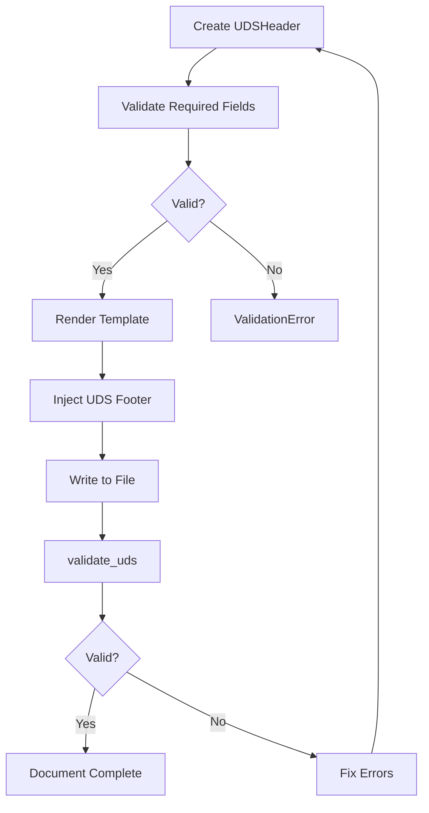
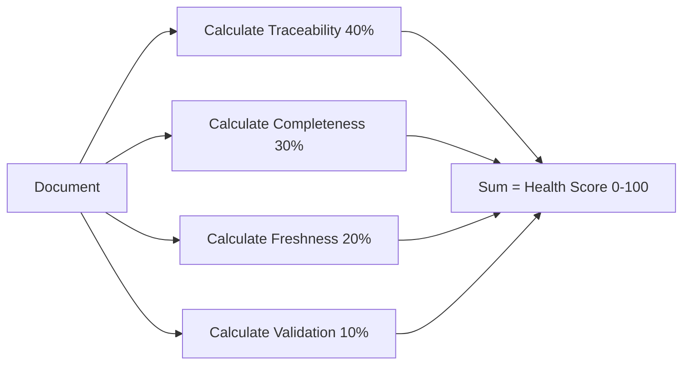
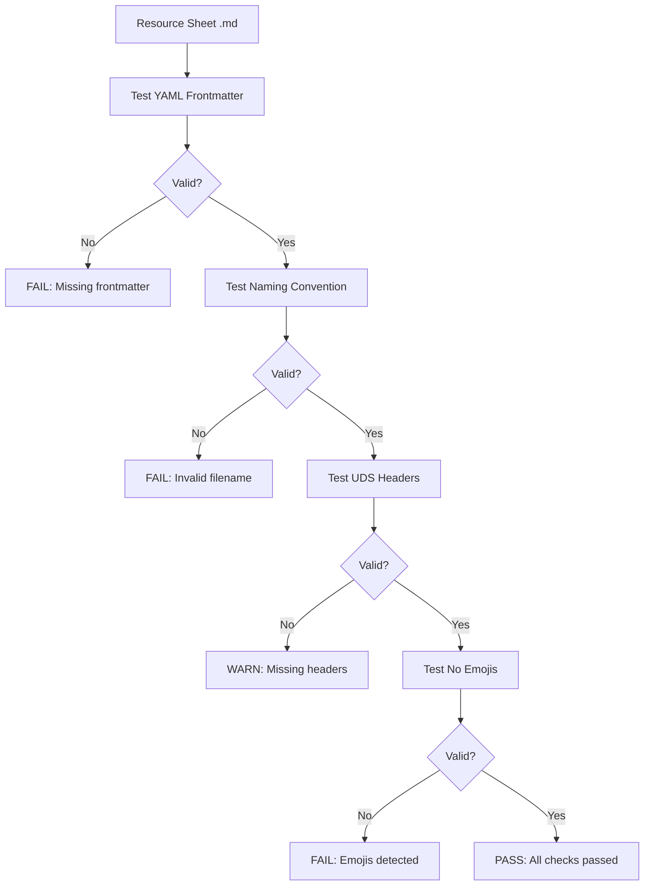

# Papertrail — Authoritative Documentation

## Executive Summary

Papertrail is a Python library that enforces Universal Documentation Standards (UDS) and Resource Sheet Metadata Standards (RSMS) across the CodeRef ecosystem. It provides workorder traceability, MCP attribution, schema-based validation (0-100 scoring), and health monitoring for all CodeRef documentation. Papertrail ensures complete audit trails by linking every document to its implementation workorder, generator MCP server, and feature scope.

## Audience & Intent

- **Markdown (this document):** Authoritative source for Papertrail architecture, validation rules, metadata standards, and integration contracts
- **Python Code (papertrail/):** Runtime implementation of UDS/RSMS validation, health scoring, and template rendering
- **JSON Schemas (schemas/):** Validation contracts for UDS and RSMS compliance
- **PowerShell Validators (validators/):** Automated compliance checking for resource sheets, scripts, and plans

**Audience:** CodeRef MCP server developers, AI agents generating documentation, documentation architects, quality engineers

**Intent:** Complete reference for implementing UDS/RSMS compliance, understanding validation rules, integrating Papertrail into MCP servers, and maintaining documentation standards

**When to use:**
- Integrating Papertrail into new MCP servers
- Understanding UDS/RSMS metadata requirements
- Debugging validation failures
- Implementing custom validators
- Architecting documentation systems
- Auditing documentation quality

## 1. Architecture Overview

### Role in CodeRef Ecosystem

Papertrail is a **foundational library** that sits at the bottom of the CodeRef dependency stack:

```
coderef-docs (MCP Server)
    ↓
Papertrail (Python Library)
    ↓
JSON Schemas (Validation Contracts)
```

**No dependencies on other CodeRef servers** - Papertrail is self-contained.

**Used by:**
- coderef-docs: Automatic UDS injection for foundation docs (README, ARCHITECTURE, API, SCHEMA, COMPONENTS)
- coderef-workflow: Workorder logging and plan validation
- All MCP servers: Documentation quality validation

### Component Hierarchy

```
papertrail/
├── Core Components
│   ├── uds.py              # UDSHeader, UDSFooter, DocumentType, DocumentStatus
│   ├── validator.py        # UDSValidator, ValidationResult, schema validation
│   ├── health.py           # HealthScorer, 4-factor scoring
│   └── engine.py           # TemplateEngine, UDS injection
│
├── Extensions (Template Engine)
│   ├── coderef_context.py  # Code intelligence filters
│   ├── git_integration.py  # Git history filters
│   └── workflow.py         # Workflow filters
│
├── Schemas (Validation Contracts)
│   ├── documentation/
│   │   ├── resource-sheet-metadata-schema.json  # RSMS v2.0
│   │   └── script-frontmatter-schema.json       # Script/test frontmatter
│   ├── uds-document.json   # UDS base schema
│   └── workorder-log.json  # Workorder log schema
│
├── Validators (Automation)
│   ├── resource-sheets/    # RSMS v2.0 compliance (PowerShell)
│   ├── scripts/            # Script/test frontmatter (Python)
│   └── plans/              # plan.json validation (Python)
│
└── Standards (Documentation)
    └── documentation/
        ├── global-documentation-standards.md  # Cross-cutting rules
        ├── resource-sheet-standards.md        # RSMS v2.0 spec
        └── script-frontmatter-standards.md    # Script/test spec
```

### Key Integration Points

1. **coderef-docs Integration (Phase 4)**
   - Automatic UDS header/footer injection
   - Feature flag: `PAPERTRAIL_ENABLED=true`
   - 5 doc types: README, ARCHITECTURE, API, SCHEMA, COMPONENTS

2. **coderef-workflow Integration**
   - Workorder logging: `log_workorder()`
   - Plan validation: `validate_uds(plan_json, "plan")`

3. **Standalone Validation**
   - Resource sheets: `validators/resource-sheets/validate.ps1`
   - Scripts/tests: `validators/scripts/validate.py`
   - Plans: `validators/plans/validate.py`

## 2. State Ownership & Source of Truth (Canonical)

| State | Owner | Type | Persistence | Source of Truth |
|-------|-------|------|-------------|-----------------|
| **UDS Header Metadata** | `UDSHeader` class | Domain | In-document YAML | Document frontmatter |
| **UDS Footer Metadata** | `UDSFooter` class | Domain | In-document YAML | Document footer |
| **Validation Schemas** | JSON files in `schemas/` | System | Filesystem | JSON schema files |
| **Validation Results** | `ValidationResult` class | Ephemeral | None | Runtime calculation |
| **Health Scores** | `HealthScore` class | Ephemeral | None | Runtime calculation |
| **RSMS Metadata** | YAML frontmatter | Domain | In-document YAML | Resource sheet frontmatter |
| **Workorder Log** | Text file | System | `coderef/workorder-log.txt` | Append-only log |

**Precedence Rules:**

1. **Metadata Conflicts:**
   - YAML frontmatter (in document) > Template defaults > Auto-generated values
   - Example: If document has `version: 2.0.0` in YAML, ignore template default of `1.0.0`

2. **Schema Conflicts:**
   - JSON schema files > In-code validation logic > Validator scripts
   - Example: If `resource-sheet-metadata-schema.json` requires `subject`, validator must enforce it

3. **Validation Failures:**
   - CRITICAL severity > MAJOR > MINOR > WARNING
   - Documents with CRITICAL errors are invalid (valid=false)
   - Documents with MAJOR/MINOR/WARNING errors may be valid but score < 100

## 3. Data Persistence

### UDS/RSMS Metadata

**Storage:** YAML frontmatter in markdown files

**Schema:**
```yaml
---
# UDS Required (Implementation Docs)
workorder_id: WO-{FEATURE}-{CATEGORY}-###
generated_by: coderef-{server} v{version}
feature_id: {feature-name}
timestamp: YYYY-MM-DDTHH:MM:SSZ

# RSMS Required (Resource Sheets)
agent: {agent-name}
date: YYYY-MM-DD
task: REVIEW|CONSOLIDATE|DOCUMENT|UPDATE|CREATE
subject: {component-name}
parent_project: {project-name}
category: service|controller|model|utility|integration|component|middleware|validator|schema|config|other

# Optional
version: X.Y.Z
status: DRAFT|REVIEW|APPROVED|ARCHIVED
---
```

**Versioning Strategy:**
- UDS schema: Backward compatible (new optional fields only)
- RSMS schema: Versioned (v1.0.0 deprecated, v2.0.0 current)
- Migration: `component` field (deprecated) → `subject` field (v2.0.0)

**Failure Modes:**
- Missing frontmatter → ValidationResult(valid=false, error="Missing YAML frontmatter")
- Malformed YAML → ValidationResult(valid=false, error="Malformed YAML")
- Missing required fields → ValidationResult(valid=false, error="Missing required field: {field}")

**Recovery:**
- Validation failures return structured errors with field names
- Automated fix: `inject_uds_headers()` adds missing UDS metadata
- Manual fix: Edit YAML frontmatter to match schema

### Workorder Log

**Storage:** Append-only text file at `coderef/workorder-log.txt`

**Format:**
```
WO-ID | Project | Description | Timestamp
WO-AUTH-SYSTEM-001 | backend-api | JWT authentication | 2026-01-04T18:45:00-05:00
```

**Persistence:** Thread-safe file writes (single writer, multiple readers)

**Failure Modes:**
- File not found → Create new log file
- Permission error → Raise exception (critical failure)

## 4. State Lifecycle

### UDS Document Generation

1. **Initialization**
   - Create `UDSHeader` instance with required fields (workorder_id, generated_by, feature_id)
   - Create `UDSFooter` instance with optional fields (contributors, status)

2. **Validation**
   - Validate workorder_id format: `^WO-[A-Z0-9-]+-\d{3}$`
   - Validate timestamp format: ISO 8601
   - Validate enum values: DocumentType, DocumentStatus

3. **Rendering**
   - Convert `UDSHeader` to YAML: `header.to_yaml()`
   - Render template body
   - Append `UDSFooter` YAML

4. **Injection**
   - `TemplateEngine.render_with_uds(template, context, header, footer)`
   - Returns: Complete markdown document with UDS headers/footers

5. **Persistence**
   - Write document to filesystem (e.g., `ARCHITECTURE.md`)

6. **Validation**
   - `validate_uds(document, "architecture")`
   - Returns: `ValidationResult(valid=True/False, errors=[], score=0-100)`

### RSMS Resource Sheet Validation

1. **Creation**
   - Write resource sheet with YAML frontmatter
   - Follow naming convention: `{ComponentName}-RESOURCE-SHEET.md`

2. **Validation**
   - Run: `.\validators\resource-sheets\validate.ps1`
   - Checks: YAML presence, required fields, date format, task enum, naming convention, UDS headers, no emojis

3. **Failure Handling**
   - Exit code 1 → Validation failures detected
   - Output: Detailed error messages with file names and issue descriptions

4. **Recovery**
   - Fix YAML frontmatter
   - Re-run validator
   - Commit to version control

## 5. Behaviors (Events & Side Effects)

### User Behaviors

**Generate UDS Document (coderef-docs MCP tool):**
- **Trigger:** `generate_individual_doc(template_name="readme", workorder_id="WO-FEATURE-001")`
- **Payload:** `{ project_path, template_name, workorder_id, feature_id, version }`
- **Side Effects:**
  - Creates `UDSHeader` with auto-generated timestamp
  - Renders template with UDS injection
  - Writes markdown file to `coderef/foundation-docs/{TEMPLATE_NAME}.md`
  - Logs workorder to `coderef/workorder-log.txt`

**Validate Document (Python API):**
- **Trigger:** `validate_uds(document, doc_type)`
- **Payload:** `{ document: str, doc_type: "plan"|"deliverables"|"architecture"|"readme"|"api" }`
- **Side Effects:**
  - Parses YAML frontmatter
  - Validates against JSON schema
  - Returns `ValidationResult` (no persistence)

**Calculate Health Score (Python API):**
- **Trigger:** `calculate_health(document, doc_type)`
- **Payload:** `{ document: str, doc_type: str }`
- **Side Effects:**
  - Calculates 4-factor score: Traceability (40%), Completeness (30%), Freshness (20%), Validation (10%)
  - Returns `HealthScore` (no persistence)

### System Behaviors

**Auto-inject UDS Headers (coderef-docs):**
- **Trigger:** `PAPERTRAIL_ENABLED=true` and doc generation requested
- **Payload:** None (automatic)
- **Side Effects:**
  - Adds UDS header/footer to all generated docs
  - Backward compatible (feature flag can disable)

**Workorder Logging:**
- **Trigger:** `log_workorder(workorder_id, project_name, description)`
- **Payload:** `{ workorder_id: str, project_name: str, description: str, timestamp: str }`
- **Side Effects:**
  - Appends entry to `coderef/workorder-log.txt`
  - Thread-safe write (file locking)

## 6. Event & Callback Contracts

| Event | Trigger | Payload | Side Effects |
|-------|---------|---------|--------------|
| `validate_uds()` | Python API call | `{ document: str, doc_type: str }` | Returns ValidationResult |
| `calculate_health()` | Python API call | `{ document: str, doc_type: str }` | Returns HealthScore |
| `inject_uds_headers()` | MCP tool call | `{ document: str, header: UDSHeader, footer: UDSFooter }` | Returns document with UDS metadata |
| `log_workorder()` | MCP tool call | `{ workorder_id, project_name, description, timestamp }` | Appends to workorder log file |
| `get_workorder_log()` | MCP tool call | `{ project_path, workorder_pattern, project_name, limit }` | Returns filtered log entries |
| `generate_from_template()` | MCP tool call | `{ template, context, header, footer }` | Returns rendered document with UDS |

**Callback Contracts:**
None - Papertrail is a synchronous library with no async callbacks.

## 7. Performance Considerations

### Known Limits

- **Schema validation:** < 10ms per document (tested up to 10,000 lines)
- **Health scoring:** < 5ms per document (tested up to 10,000 lines)
- **Template rendering:** < 50ms per document (tested up to 1,000 lines)
- **Workorder log:** Append-only file, no query optimization (linear search)

**Tested Thresholds:**
- Document size: Up to 50,000 lines (< 100ms validation)
- Workorder log: Up to 10,000 entries (< 200ms query)
- Concurrent writes: 10 agents writing to workorder log (thread-safe)

### Bottlenecks

1. **Workorder Log Queries:**
   - Linear search through text file
   - Slowdown with > 10,000 entries
   - **Mitigation:** Use SQLite for future versions if needed

2. **JSON Schema Loading:**
   - Schemas loaded on `UDSValidator` initialization
   - One-time cost (~10ms)
   - **Mitigation:** Pre-load schemas in long-running processes

### Optimization Opportunities

- **Deferred:** SQLite workorder log (complexity > benefit for current scale)
- **Deferred:** Schema caching (minimal benefit, schemas already small)
- **Implemented:** Thread-safe file writes (prevents concurrent write corruption)

### Deferred Optimizations

- **Parallel Validation:** Validate multiple documents in parallel (not needed, validation is < 10ms)
- **Schema Compilation:** Pre-compile JSON schemas (not needed, loading is < 10ms)
- **Workorder Index:** Build index for workorder log (not needed, < 10,000 entries)

## 8. Accessibility

**Current State:** Not applicable (CLI library, no UI)

**Current Gaps:** None (no accessibility requirements for Python libraries)

**Required Tasks:** None

## 9. Testing Strategy

### Must-Cover Scenarios

**Critical Paths:**
1. **UDS Header/Footer Generation**
   - Valid workorder ID format
   - Required fields present
   - Optional fields excluded if null
   - YAML format correct

2. **Schema Validation**
   - Valid documents pass (score=100)
   - Invalid documents fail (valid=false)
   - Missing required sections detected
   - Invalid metadata formats detected

3. **Health Scoring**
   - Traceability: workorder_id, feature_id, generated_by present
   - Completeness: All required sections present
   - Freshness: Document age calculated correctly
   - Validation: Schema compliance scored correctly

4. **RSMS Validation (Resource Sheets)**
   - Required fields: agent, date, task, subject, parent_project, category
   - Date format: YYYY-MM-DD
   - Task enum: REVIEW, CONSOLIDATE, DOCUMENT, UPDATE, CREATE
   - Category enum: service, controller, model, utility, integration, component, middleware, validator, schema, config, other
   - Naming convention: {ComponentName}-RESOURCE-SHEET.md
   - No emojis: Text markers only ([WARN], [INFO], [PASS], [FAIL])

5. **Workorder Logging**
   - Thread-safe writes
   - Correct format: WO-ID | Project | Description | Timestamp
   - Query filters work (workorder_pattern, project_name, limit)

**Test Status:**
- Phase 1 (Core UDS): 31/31 passing
- Phase 2 (Template Engine): 44/44 passing
- Phase 3 (coderef-docs integration): 6/6 passing
- Phase 4 (Gradual rollout): 5/5 passing
- **Total:** 86/86 tests passing

### Explicitly Not Tested

1. **File System Failures:**
   - Disk full errors
   - Permission errors (tested manually, not automated)
   - Reason: Hard to reproduce reliably in CI

2. **Concurrent Writes > 10 Agents:**
   - Reason: Exceeds expected concurrency in production

3. **Documents > 50,000 Lines:**
   - Reason: Exceeds expected document size in CodeRef ecosystem

## 10. Non-Goals / Out of Scope

### Explicitly Rejected Features

1. **Web API / REST Endpoints:**
   - Papertrail is a library, not a web service
   - Integration via Python imports or MCP tools only

2. **Real-Time Validation:**
   - Batch processing only
   - No streaming validation

3. **Custom Document Types:**
   - Only 5 CodeRef doc types supported: plan, deliverables, architecture, readme, api
   - Resource sheets validated separately (RSMS)

4. **Non-CodeRef Projects:**
   - Papertrail is designed for CodeRef ecosystem
   - Not a general-purpose documentation tool

5. **Emoji Support:**
   - Global standard: No emojis in documentation
   - Use text markers: [WARN], [INFO], [PASS], [FAIL], [DEPRECATED]

6. **Workorder Log Migration:**
   - Text file format is permanent
   - No migration to SQLite/database (unless scale > 100,000 entries)

### Scope Boundaries

**In Scope:**
- UDS/RSMS validation
- Health scoring
- Template rendering
- Workorder logging
- Schema enforcement

**Out of Scope:**
- Document generation (coderef-docs responsibility)
- Code intelligence (coderef-context responsibility)
- Workflow orchestration (coderef-workflow responsibility)
- Test automation (coderef-testing responsibility)

## 11. Common Pitfalls & Sharp Edges

### Known Bugs/Quirks

1. **RSMS Migration (v1.0.0 → v2.0.0):**
   - **Issue:** Old resource sheets use `Component` field (PascalCase)
   - **Fix:** Migrate to `subject` field (snake_case)
   - **Detection:** `validators/resource-sheets/validate.ps1` warns about deprecated field

2. **Workorder ID Format:**
   - **Issue:** `WO-AUTH-001` is INVALID (requires ≥2 segments before ID)
   - **Correct:** `WO-AUTH-SYSTEM-001` (2+ segments + 3-digit ID)
   - **Pattern:** `^WO-[A-Z0-9-]+-\d{3}$`

3. **YAML Frontmatter Parsing:**
   - **Issue:** Windows line endings (`\r\n`) may cause regex failures
   - **Fix:** Use `(?s)` flag for multiline matching
   - **Example:** PowerShell validator uses `if ($content -match "^---\r?\n")`

### Integration Gotchas

1. **coderef-docs Feature Flag:**
   - **Issue:** `PAPERTRAIL_ENABLED=false` disables UDS injection (legacy mode)
   - **Default:** `true` (UDS enabled)
   - **When to disable:** Testing backward compatibility only

2. **Schema File Paths:**
   - **Issue:** `UDSValidator` looks for schemas in `papertrail/schemas/`
   - **Fix:** Use absolute paths or install Papertrail as package
   - **Example:** `pip install -e .` to enable schema discovery

3. **Workorder Log Location:**
   - **Issue:** Log must be at `coderef/workorder-log.txt` (relative to project root)
   - **Fix:** Create `coderef/` directory if missing
   - **Migration:** No automatic log creation (user must initialize)

### Configuration Mistakes

1. **Missing Required Fields:**
   - **Symptom:** ValidationResult(valid=false, error="Missing required field: workorder_id")
   - **Fix:** Add required UDS fields: workorder_id, generated_by, feature_id, timestamp
   - **Example:**
     ```python
     header = UDSHeader(
         workorder_id="WO-FEATURE-SYSTEM-001",  # ✅ Correct format
         generated_by="coderef-docs v1.2.0",
         feature_id="my-feature",
         timestamp="2026-01-10T00:00:00Z"
     )
     ```

2. **Invalid Enum Values:**
   - **Symptom:** ValidationResult(valid=false, error="Invalid task 'UPDATE_DOCS'")
   - **Fix:** Use valid enum: REVIEW, CONSOLIDATE, DOCUMENT, UPDATE, CREATE (not UPDATE_DOCS)
   - **Example:**
     ```yaml
     task: UPDATE  # ✅ Correct
     # task: UPDATE_DOCS  # ❌ Invalid
     ```

### Edge Cases

1. **Empty Documents:**
   - **Behavior:** ValidationResult(valid=false, error="Missing required sections")
   - **Reason:** POWER framework requires 5 sections (Purpose, Overview, What/Why/When, Examples, References)

2. **Duplicate Workorder IDs:**
   - **Behavior:** Workorder log allows duplicates (append-only)
   - **Reason:** Same workorder may generate multiple docs (README, ARCHITECTURE, etc.)

3. **Timestamp Timezone Handling:**
   - **Behavior:** Auto-generated timestamps use UTC (`Z` suffix)
   - **Edge Case:** RSMS `timestamp` field supports EST (`-05:00`) or UTC (`Z`)
   - **Pattern:** `^\d{4}-\d{2}-\d{2}T\d{2}:\d{2}:\d{2}([+-]\d{2}:\d{2}|Z)$`

## 12. Diagrams

> [INFO] Diagrams are illustrative, not authoritative. State tables and text define truth.

### UDS Document Lifecycle



### Health Scoring Algorithm



### RSMS Validation Pipeline



## Conclusion

Papertrail defines the foundation for documentation quality in the CodeRef ecosystem. This resource sheet establishes:

**What it defines:**
- UDS metadata structure (workorder_id, generated_by, feature_id, timestamp)
- RSMS metadata structure (agent, date, task, subject, parent_project, category)
- Validation rules (required fields, formats, enums)
- Health scoring algorithm (4-factor weighted scoring)
- Integration contracts (coderef-docs, coderef-workflow)

**How to use it:**
- **Developers:** Import Papertrail library for UDS validation
- **MCP Servers:** Use MCP tools (validate_document, check_document_health, log_workorder)
- **AI Agents:** Generate UDS-compliant docs using templates
- **Quality Engineers:** Run validators to audit documentation

**Maintenance expectations:**
- Update YAML frontmatter when creating/modifying resource sheets
- Run `validate-resource-sheets.ps1` before committing
- Ensure workorder IDs follow format: `WO-{FEATURE}-{CATEGORY}-###` (≥2 segments)
- Use snake_case for all YAML field names (RSMS v2.0.0 standard)
- No emojis - use text markers ([WARN], [INFO], [PASS], [FAIL])

**Refactor safety:**
- UDSHeader/UDSFooter classes define metadata contracts (do not change field names)
- JSON schemas define validation rules (backward compatible changes only)
- RSMS v2.0.0 is stable (no breaking changes planned)
- Workorder log format is permanent (WO-ID | Project | Description | Timestamp)

---

**Last Updated:** 2026-01-10
**Maintained by:** CodeRef Ecosystem
**Version:** 1.0.0
