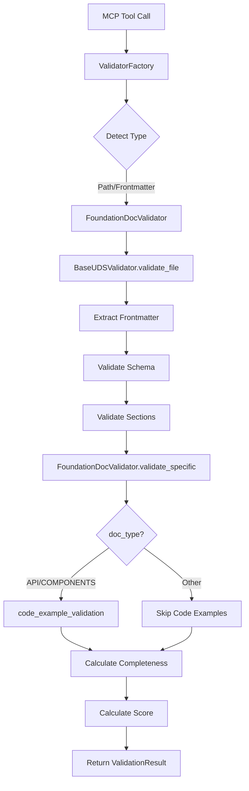

# FoundationDocValidator — Authoritative Documentation

## Executive Summary

FoundationDocValidator is the specialized validator for foundation documentation (README, ARCHITECTURE, API, SCHEMA, COMPONENTS) generated by coderef-docs. It extends BaseUDSValidator to enforce POWER framework section requirements, validate code examples in API/COMPONENTS docs, verify doc_type/filename consistency, and calculate completeness metrics. This document defines the validation contracts, state ownership rules, and integration behaviors that govern all foundation document quality enforcement in the Papertrail ecosystem.

## Audience & Intent

- **Markdown (this document):** Authoritative source for validation behavior, state ownership, contracts, and integration rules
- **Python Code (foundation.py, base.py):** Runtime implementation of validation logic and completeness calculation
- **JSON Schema (foundation-doc-frontmatter-schema.json):** Validation contracts for frontmatter structure and required fields
- **Test Files:** Verification that contracts are correctly enforced

## 1. Architecture Overview

### Role in System
FoundationDocValidator sits in the validation pipeline as a **specialized document validator** that:
- Validates foundation docs generated by coderef-docs MCP server
- Enforces POWER framework section requirements (5 doc types)
- Validates code examples against actual code (via coderef-context)
- Calculates 0-100% completeness metrics
- Integrates with ValidatorFactory for auto-detection

### Component Hierarchy

```
UDSValidator (abstract base)
    ↓
BaseUDSValidator (common UDS validation)
    ↓
FoundationDocValidator (foundation-specific rules)
    ↓
    ├─→ _check_power_framework()
    ├─→ _infer_doc_type_from_filename()
    └─→ validate_specific() [override]
```

### Integration Points

**Upstream Dependencies:**
- **BaseUDSValidator:** Provides _validate_sections(), _calculate_completeness(), code_example_validation()
- **foundation-doc-frontmatter-schema.json:** Defines required frontmatter fields and required_sections per doc_type
- **ValidatorFactory:** Auto-detects and instantiates FoundationDocValidator for foundation docs

**Downstream Consumers:**
- **papertrail/server.py:** MCP tool handlers call validator via ValidatorFactory
- **coderef-docs:** Real-time validation integration (future)
- **Test suite:** Verifies validation contracts

## 2. State Ownership & Source of Truth (Canonical)

| State | Owner | Type | Persistence | Source of Truth |
|-------|-------|------|-------------|-----------------|
| schema_name | FoundationDocValidator | Class constant | None | Python class attribute |
| doc_category | FoundationDocValidator | Class constant | None | Python class attribute |
| POWER_SECTIONS | FoundationDocValidator | Class constant | None | Python list (7 sections) |
| schema | BaseUDSValidator | Instance | Memory | Loaded from JSON schema file |
| required_sections | JSON Schema | Static config | Disk | foundation-doc-frontmatter-schema.json |
| validation_result | Runtime | Computed | None | Returned from validate_file() |
| completeness | Runtime | Computed | None | Calculated by _calculate_completeness() |

### Precedence Rules

**For validation conflicts:**
1. **JSON Schema** defines field requirements (workorder_id, generated_by, feature_id, doc_type)
2. **Python validator** enforces section requirements (POWER framework compliance)
3. **Markdown document** is source of truth for actual content presence

**For section requirements:**
- Schema defines required_sections per doc_type (canonical)
- Validator reads and enforces these requirements dynamically
- Documents must contain all required sections or receive MAJOR errors

## 3. Validation Contracts

### 3.1 Frontmatter Validation (JSON Schema)

**Required Fields (inherited from base-frontmatter-schema.json):**
- `agent`: AI agent that created/updated the document
- `date`: Creation/update date (YYYY-MM-DD)
- `task`: Action performed (CREATE, UPDATE, REVIEW, etc.)

**Foundation-Specific Required Fields:**
- `workorder_id`: Format `WO-{FEATURE}-{CATEGORY}-###` (regex: `^WO-[A-Z0-9-]+-\d{3}$`)
- `generated_by`: MCP server identification (regex: `^coderef-docs`)
- `feature_id`: Kebab-case feature identifier (regex: `^[a-z0-9]+(-[a-z0-9]+)*$`)
- `doc_type`: One of 5 enum values: `readme`, `architecture`, `api`, `schema`, `components`

**Optional Fields:**
- `title`: Document title (1-200 chars)
- `version`: Semantic version (regex: `^\d+\.\d+\.\d+$`)
- `status`: Lifecycle status (enum: DRAFT, REVIEW, APPROVED, DEPRECATED)

### 3.2 Section Validation (POWER Framework)

**Required Sections by doc_type:**

| doc_type | Required Sections | Count |
|----------|-------------------|-------|
| readme | Purpose, Overview, What/Why/When, Examples, References | 5 |
| architecture | System Overview, Key Components, Design Decisions, Integration Points | 4 |
| api | Endpoints, Authentication, Request/Response Examples, Error Codes | 4 |
| schema | Data Models, Field Descriptions, Validation Rules, Relationships | 4 |
| components | Component Catalog, Props/Parameters, Usage Examples, Dependencies | 4 |

**Validation Rules:**
- Section matching is **case-insensitive** (## Examples == ## examples)
- Accepts any markdown heading level (# or ##)
- Missing sections trigger **MAJOR** errors (-20 points per section)
- Completeness calculated as `(present_sections / required_sections) * 100`

### 3.3 Code Example Validation

**Applies to:** API and COMPONENTS doc types only

**API Docs:**
- Extracts HTTP method + path patterns: `(GET|POST|PUT|DELETE|PATCH)\s+(/[\w/{}:-]+)`
- Example: `GET /api/users/{id}`
- Validates against actual endpoints via coderef-context (future MCP integration)
- Currently: Placeholder implementation, graceful degradation if unavailable

**COMPONENTS Docs:**
- Extracts JSX/TSX component patterns: `<(\w+)\s+([^>]+)>`
- Example: `<Button variant="primary">`
- Validates props against actual component definitions (future MCP integration)
- Currently: Placeholder implementation, graceful degradation if unavailable

### 3.4 Filename-DocType Consistency

**Validation:** doc_type in frontmatter must match filename

| Filename | Expected doc_type |
|----------|-------------------|
| README.md | readme |
| ARCHITECTURE.md | architecture |
| API.md | api |
| SCHEMA.md | schema |
| COMPONENTS.md | components |

**Mismatch:** MAJOR error with message: `"doc_type '{actual}' doesn't match filename (expected '{expected}')"`

## 4. State Lifecycle

### Validation Execution Flow

```
1. Initialization
   ├─→ ValidatorFactory.get_validator(file_path)
   ├─→ Factory detects foundation doc (path pattern or frontmatter)
   └─→ FoundationDocValidator() instantiated

2. Schema Loading
   ├─→ BaseUDSValidator.__init__()
   ├─→ _load_schema("foundation-doc-frontmatter-schema.json")
   └─→ _resolve_allof() merges base + foundation schemas

3. File Validation
   ├─→ validate_file(file_path) called
   ├─→ _extract_frontmatter(content)
   ├─→ _validate_against_schema(frontmatter)
   └─→ _validate_sections(frontmatter, content)

4. Foundation-Specific Validation
   ├─→ validate_specific(frontmatter, content, file_path)
   ├─→ _check_power_framework(content) [deprecated, now uses base validator]
   ├─→ code_example_validation() for API/COMPONENTS
   ├─→ _infer_doc_type_from_filename() for consistency check
   └─→ Check status field (warn if DRAFT)

5. Completeness Calculation
   ├─→ _calculate_completeness(frontmatter, content)
   ├─→ Count present sections vs required_sections
   └─→ Return percentage (0-100)

6. Score Calculation
   ├─→ _calculate_score(errors, warnings)
   ├─→ Deduct points: CRITICAL(-50), MAJOR(-20), MINOR(-10), WARNING(-5)
   └─→ Return final score (0-100)

7. Result Assembly
   └─→ Return ValidationResult(valid, errors, warnings, score, completeness)
```

## 5. Behaviors (Events & Side Effects)

### User Behaviors
**None** - Validation is triggered by tool calls, not direct user interaction

### System Behaviors

**validate_file() Trigger:**
- **Event:** MCP tool `validate_document` called with foundation doc path
- **Side Effects:**
  - Reads file from disk
  - Parses YAML frontmatter
  - Validates against JSON schema
  - Checks section presence
  - Calls code_example_validation (if API/COMPONENTS)
  - Calculates completeness percentage
  - Returns ValidationResult

**Graceful Degradation:**
- **Event:** code_example_validation() raises exception
- **Side Effects:**
  - Exception caught in validate_specific()
  - Warning appended: `"Code example validation skipped: {error}"`
  - Validation continues without code example checks
  - Does NOT fail entire validation

**Status Warning:**
- **Event:** frontmatter.status == "DRAFT"
- **Side Effects:**
  - Warning appended: `"Foundation doc status is DRAFT (should be APPROVED when ready)"`
  - Does NOT affect score or validity

## 6. Event & Callback Contracts

| Event | Trigger | Payload | Side Effects |
|-------|---------|---------|--------------|
| validate_file() | MCP tool call | `Path` to .md file | Returns ValidationResult |
| validate_specific() | Called by BaseUDSValidator | `(frontmatter, content, file_path)` | Returns `(errors, warnings)` tuple |
| _check_power_framework() | validate_specific() | `content: str` | Returns `list[str]` of missing sections |
| _infer_doc_type_from_filename() | validate_specific() | `file_path: Path` | Returns `Optional[str]` doc_type |
| code_example_validation() | validate_specific() | `(frontmatter, content, project_path)` | Returns `list[ValidationError]` |

**Contract Guarantees:**
- validate_file() NEVER raises exceptions (catches all errors gracefully)
- validate_specific() MUST return `(errors: list, warnings: list)` tuple
- Missing sections MUST trigger MAJOR errors (not warnings)
- Completeness MUST be calculated if required_sections defined in schema

## 7. Performance Considerations

### Known Limits
- **File Size:** No hard limit, but regex matching degrades with files > 10MB
- **Section Count:** Linear time complexity O(n) where n = number of required sections
- **Code Block Extraction:** O(m) where m = number of code blocks (regex scanning)

### Bottlenecks
- **Regex Section Matching:** `re.search()` called once per required section per doc
- **Schema Loading:** Disk I/O on first instantiation (cached in memory afterward)
- **allOf Resolution:** Manual schema merging on every validator instantiation

### Optimization Opportunities
1. **Cache compiled regex patterns** for section matching (currently recompiled each time)
2. **Lazy load schemas** only when first validation occurs
3. **Memoize _infer_doc_type_from_filename()** results per filename

### Deferred Optimizations
- **Async validation:** Not needed - validation is fast enough for real-time MCP calls
- **Parallel section checking:** Not needed - section count is low (4-5 per doc type)
- **coderef-context caching:** Deferred until MCP integration complete

## 8. Testing Strategy

### Must-Cover Scenarios
1. ✅ Valid foundation doc with all required sections passes (score >= 90)
2. ✅ Missing required section triggers MAJOR error (-20 points)
3. ✅ Case-insensitive section matching works (## Examples == ## examples)
4. ✅ Multiple heading levels accepted (# and ##)
5. ✅ doc_type/filename mismatch triggers MAJOR error
6. ✅ Code example validation called for API/COMPONENTS docs
7. ✅ Graceful degradation when code_example_validation() fails
8. ✅ Completeness calculated correctly (0-100%)
9. ✅ DRAFT status triggers warning (not error)
10. ✅ Invalid workorder_id format triggers CRITICAL error

### Explicitly Not Tested
- **coderef-context MCP integration:** Placeholder implementation, tested separately
- **Large file performance:** No performance tests for files > 1MB
- **Concurrent validation:** Single-threaded only, no race condition tests
- **Schema version migrations:** Out of scope for validator

## 9. Non-Goals / Out of Scope

**Explicitly Rejected:**
- ❌ **Content quality validation:** Validator checks structure, NOT writing quality
- ❌ **Spell checking:** Use external tools (grammarly, vale, etc.)
- ❌ **Link validation:** Use link checkers, not validator
- ❌ **Image validation:** Out of scope for text-based validator
- ❌ **Markdown linting:** Use markdownlint, not validator
- ❌ **Custom section ordering:** Sections can appear in any order
- ❌ **Section content length validation:** No minimum/maximum word counts

**Future Considerations (Not Now):**
- Real-time coderef-context MCP integration (placeholder exists)
- Pattern validation for foundation docs (currently only for standards)
- Duplicate section detection
- Section hierarchy validation (## vs ###)

## 10. Common Pitfalls & Sharp Edges

### Known Bugs/Quirks
1. **Regex Escaping:** Section names with regex metacharacters (e.g., `What?`) require escaping via `re.escape()` - HANDLED
2. **Case Sensitivity:** Schema field names are case-sensitive (doc_type not Doc_Type) - DOCUMENTED
3. **allOf Resolution:** Manual schema merging doesn't handle nested $ref - LIMITATION

### Integration Gotchas
1. **ValidatorFactory Dependency:** Must import from factory, not directly instantiate
2. **Schema Path:** Validator expects `schemas/documentation/` relative to package root
3. **Graceful Degradation:** code_example_validation() failures are WARNINGS, not errors
4. **Completeness Null:** If no required_sections in schema, completeness = None (not 0)

### Configuration Mistakes
1. **Wrong Schema Path:** Validator crashes if `schemas_dir` doesn't exist - NO FALLBACK
2. **Missing Schema File:** FileNotFoundError if `foundation-doc-frontmatter-schema.json` not found
3. **Invalid JSON Schema:** Silent failure if schema doesn't validate against Draft-07

### Edge Cases
1. **Empty Document:** If no frontmatter, returns CRITICAL error immediately
2. **Malformed YAML:** yaml.YAMLError caught, returns CRITICAL error
3. **No doc_type:** Section validation skipped (no required_sections to check)
4. **File Path None:** code_example_validation() skips project_path logic gracefully

## 11. Diagrams

### Validation Pipeline



> **Maintenance Rule:** Diagrams are **illustrative**, not authoritative. State tables and text define truth.

## 12. Validation Error Reference

### Error Severities

| Severity | Deduction | When Triggered |
|----------|-----------|----------------|
| CRITICAL | -50 | Missing frontmatter, invalid YAML, schema type errors |
| MAJOR | -20 | Missing required section, doc_type mismatch, invalid workorder_id |
| MINOR | -10 | (Not used by FoundationDocValidator) |
| WARNING | -5 | (Not used by FoundationDocValidator) |

### Common Error Messages

**MAJOR Errors:**
- `"Missing required {doc_type} section: {section_name}"`
- `"doc_type '{actual}' doesn't match filename (expected '{expected}')"`

**Warnings:**
- `"Missing recommended POWER framework sections: {sections}"` (deprecated)
- `"Foundation doc status is DRAFT (should be APPROVED when ready)"`
- `"Code example validation skipped: {error}"`

## 13. Integration with CodeRef Ecosystem

### coderef-docs Integration
**Status:** Planned, not yet implemented

**Contract:**
- coderef-docs calls `validate_document()` MCP tool after generating foundation doc
- If validation score < 90, coderef-docs logs warning but DOES NOT block generation
- Validation result included in generation metadata

### coderef-context Integration
**Status:** Placeholder implemented, MCP calls pending

**Contract:**
- FoundationDocValidator calls `coderef_query(query_type='endpoints')` for API docs
- FoundationDocValidator calls `coderef_query(query_type='components')` for COMPONENTS docs
- If coderef-context unavailable, validation degrades gracefully (warning only)

### ValidatorFactory Registration

**Path Patterns (Highest Priority):**
- `.*/coderef/foundation-docs/README\.md$` → FoundationDocValidator
- `.*/coderef/foundation-docs/ARCHITECTURE\.md$` → FoundationDocValidator
- `.*/coderef/foundation-docs/API\.md$` → FoundationDocValidator
- `.*/coderef/foundation-docs/SCHEMA\.md$` → FoundationDocValidator
- `.*/coderef/foundation-docs/COMPONENTS\.md$` → FoundationDocValidator
- `.*/README\.md$` → FoundationDocValidator (root README)

**Frontmatter Detection (Lower Priority):**
- If `doc_type` in [readme, architecture, api, schema, components] → FoundationDocValidator
- If `generated_by` starts with "coderef-docs" → FoundationDocValidator

## Conclusion

FoundationDocValidator is the **authoritative validator** for all foundation documentation in the CodeRef ecosystem. It enforces POWER framework compliance, validates code examples, calculates completeness metrics, and ensures consistency between filenames and doc_types. This document defines the canonical validation contracts that govern foundation doc quality enforcement.

**Maintenance Expectations:**
- Update required_sections in schema when POWER framework evolves
- Implement coderef-context MCP integration when ready
- Add new doc types to enum if foundation docs expand beyond 5 types
- Keep test coverage at 100% for all validation contracts

**How to Use This Doc:**
- **For Implementation:** Reference validation contracts and error messages
- **For Integration:** Follow MCP tool contracts and graceful degradation rules
- **For Testing:** Use must-cover scenarios as minimum test suite
- **For Refactoring:** Preserve all state ownership rules and contracts

---

**Last Updated:** 2026-01-13
**Maintained By:** Papertrail Team
**Version:** 1.0.0
**Status:** APPROVED
